:nosearch:

========
Produção
========

.. _other_Flex_Manufacturing:

Flex Manufacturing
==================
O módulo de **Produção** do Odoo é bastante sólido e uma excelente opção para empresas que têm um processo estanque e
bastante repetitivo no seu método produtivo. E nisto incluem-se os processos de subcontratação regulares. É possível ter
vários automatismos que facilitam e ajuda a gestão da sua empresa.

No entanto em algumas empresas, nomeadamente as que fazem produtos à medida, é necessário ter alguma flexibilização e
também recorrer a subcontratados de forma não regular. Para esses casos a **Exo Software** desenvolveu esta solução,
assim gasta menos tempo em configurações constante e mais tempo a servir os seus clientes.

.. important::
    Esta app apesar de funcionar como uma só, está dividida em 2 módulos para que tanto os clientes Community como
    Enterprise possam, usufruir da sua funcionalidade

    O módulo **Flex Manufacturing - Accounting** obriga à existência do módulo de **Contabilidade** do Odoo, pelo que
    só está disponível para clientes Enterprise

    Os clientes Community apenas poderão ter acesso à parte funcional da app sem os acrescentos contabilísticos

.. raw:: html

    

        ─── ✦ ───
    

Pré-Configurações
-----------------
Na app de **Inventário** vá ao menu de **Configuração** e selecione a opção **Configurações**

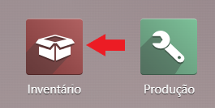

Na secção **Armazém** ative as opções:

- **Localizações de Armazenamento**, vai permitir especificar as localizações do seu stock
- **Rotas Multi-Etapa**, vai permitir que a sua produção seja pelo menos de 2 etapas

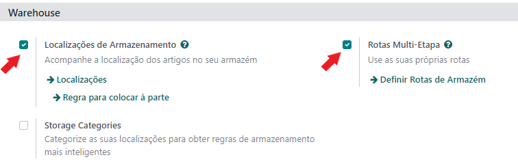

Faça a configuração do seu armazém, pode fazê-lo seguindo a opção **Definir Rotas de Armazém** e abra o armazém, em
seguida mude a opção de **Produção** pelo menos para 2 passos

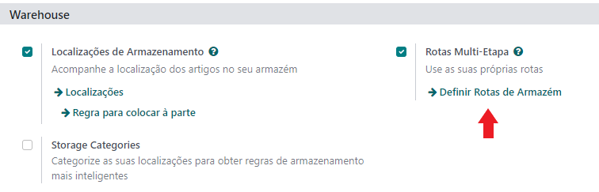

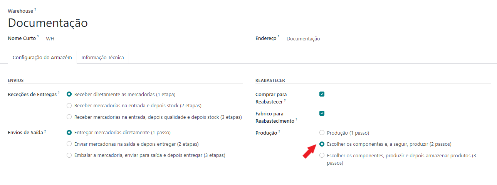

.. tip::
    Se a sua recolha de componentes o permitir legalmente, cancele o documento fiscal nesta fase

Faça a configuração das suas localizações, pode fazê-lo seguindo a opção **Localizações** e crie uma nova com a
configuração abaixo (o nome pode ser o que desejar)

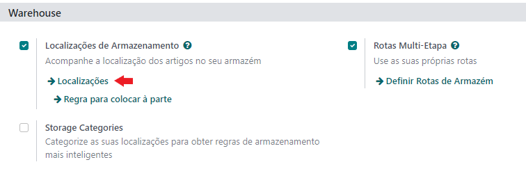

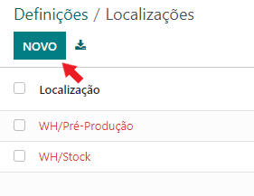

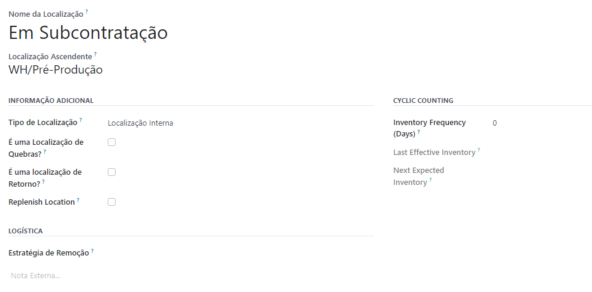

Esta vai ser a sua localização de subcontratação, é importante para que possa distinguir o que está nos seus
fornecedores, do que está na sua empresa.

Na app de **Produção** vá ao menu de **Configuração** e selecione a opção **Definições**

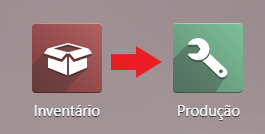

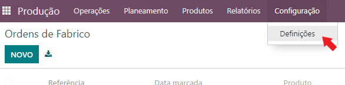

Na secção **Operações** ative a opção **Ordens de Trabalho**

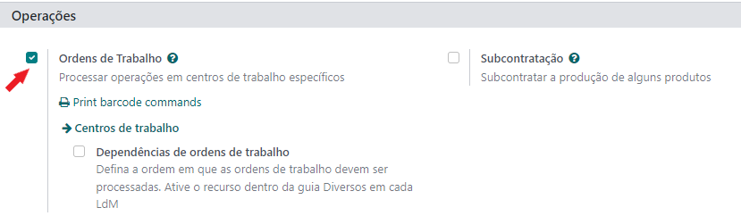

Configurações
-------------
.. important::
    Esta app não está disponível na loja Odoo, para ter acesso à mesma terá de pedir aos nossos serviços que façam a sua
    instalação e ativação na sua base de dados

    Depois pode começar a seguir os passos que se seguem para a utilizar

Na app de **Produção** vá ao menu de **Configuração** e selecione a opção **Definições**

Na secção **Operações** ative a opção **Ordens de Produção c/ Subcontratação**

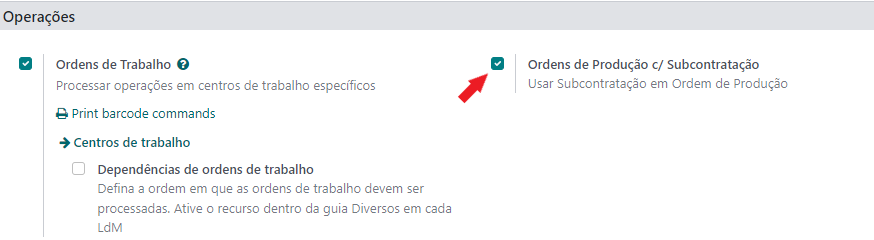

Na app de **Produção** vá ao menu de **Configuração** e selecione a opção **Centros de Trabalho** e crie os centros de
trabalho internos que precisa e, um para cada um dos fornecedores de subcontratação.

.. important::
    Na confifuração dos **centros de trabalho internos** precisa de ter a etiqueta **Internal**

    .. image:: manufacturing/v16_manufacturingSettings06.png
        :align: center

    Na confifuração dos **centros de trabalho externos** precisa de ter a etiqueta **External**

    .. image:: manufacturing/v16_manufacturingSettings07.png
        :align: center

    .. danger::
        Não pode utilizar estas duas etiquetas em conjunto

Na app de **Inventário** vá ao menu de **Configuração** e selecione a opção :menuselection:`Gestão de armazém --> Tipos de Operações`

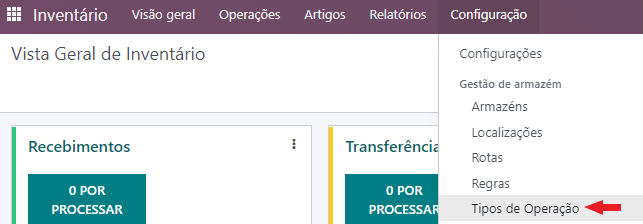

.. important::
    Edite as Operações de subcontratação para utilizarem a localização de **Em Subcontratação** (ou com o nome que
    escolheu dar)criada anteriormente, coloque também a opção inversa no **Tipo de Retorno**

    **Operação de Envios de Subcontratação**

    .. image:: manufacturing/v16_inventorySettings09.png
       :align: center

    **Operação de Recebimentos de Subcontratação**

    .. image:: manufacturing/v16_inventorySettings10.png
       :align: center

    .. danger::
        Não desative a emissão de documento fiscal, como se tratam de transportes de ativos próprios é o responsável
        pela comunicação e possível emissão das guias de transporte de ativos em ambas as direções

    .. seealso::
        :ref:`Guias de ativos próprios <fiscal_documents_transportationDocs>`

        :doc:`Registo de Séries Documentais <../invoicing/series_registration>`

Na criação do `artigo <https://www.odoo.com/documentation/17.0/pt_BR/applications/inventory_and_mrp/inventory.html>`_,
sua **Lista de Materiais** e artigos componentes verifique as seguintes situações:

- Os componentes que são subcontratação têm de ser **Serviços**
- É importante que a Lista de Materiais esteja como **Fabricar este Produto** e a **Dependência de Operações** esteja ativa

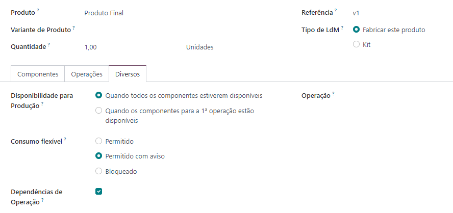

- Nas operações da Lista de Materiais tem de:

    - Atribuir ao Centro de Trabalho do Subcontratado principal, mas só porque o Odoo obriga a preencher este campo
    - Ativar a opção **Subcontratação** da aba Subcontratação
    - Adicionar os Fornecedores da Subcontratação com respetivos centros de trabalho, artigo de serviço e custo Unitário

    .. image:: manufacturing/v16_BoM02.png
       :align: center

    - Ter sempre uma operação interna para finalização, que deve estar bloqueada pela conclusão das outras

    .. image:: manufacturing/v16_BoM03.png
       :align: center

    - Dar o Consumo dos componentes apenas na fase final, caso contrário terá de criar artigos intermédios

    .. image:: manufacturing/v16_BoM04.png
       :align: center

Utilização
----------
Crie uma nova Ordem de Produção, baseada na Lista de Materiais que criou e carregue em **CONFIRMAR**

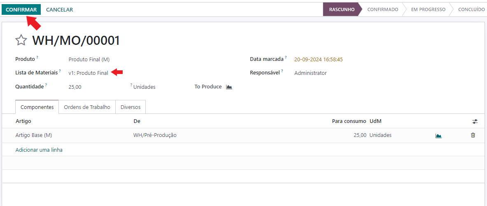

Como a escolha dos passos de produção tem pelo menos 2 passos, a **Recolha Componentes** é obrigatória, complete-a para
poder avançar com o processo

Depois de completa a recolha dos componentes, vão estar disponíveis as opções de subcontratar ou produzir, conforme as
opções de bloqueio de operações que escolheu na Lista de Materiais

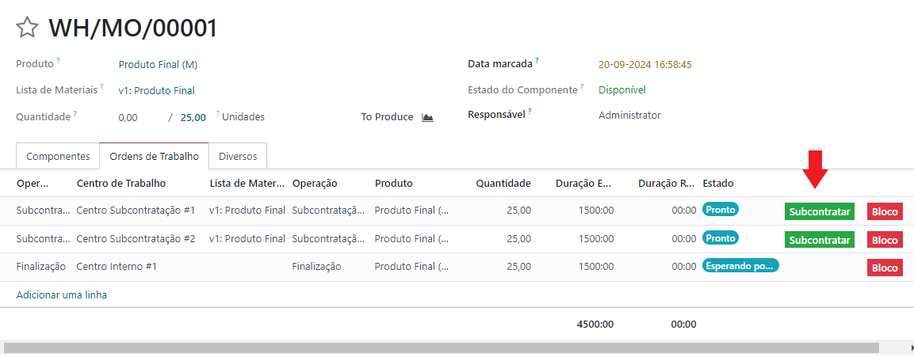

.. tip::
    Desde que essas ações estejam disponíveis ao mesmo tempo pode optar por subcontratar operações pela ordem que
    preferir

    Como estas operações são subcontratadas e não feitas internamente, a vista de tablet/chão de fábrica foi ocultada

.. tip::
    Se na operação tiver inserido também um centro de trabalho interno na lista de fornecedores, pode mudar uma
    subcontratação para produção interna

    Se numa operação que inicialmente era de produção interna ativar e configurar um fornecedor externo com centro de
    trabalho externo, pode passar uma operação interna para externa e subcontratar

    .. image:: manufacturing/v16_FMie01.png
       :align: center

    .. image:: manufacturing/v16_FMie02.png
       :align: center

    Esta funcionalidade foi inserida para que se existirem necessidades imediatas de alteração não tenha de anular a OP
    e refazer todo o processo, mas possa modificar em tempo real o processo de produção para fazer face às necessidades

Ao carregar no botão de subcontratação é feita uma verificação se existe uma compra em rascunho ao fornecedor:

- Se existir, essa mesma compra vai ser atualizada
- Se não existir, vai criar uma nova

Ao mesmo tempo é criado um envio de subcontratação em rascunho com os artigos a enviar

.. tip::
    Por defeito todos os componentes a consumir são adicionados a este envio, mas pode retirar alguns deles, daí ser
    criado em rascunho

.. note::
    Dependendo do seu fluxo de trabalho, pode usar as apps do Odoo (Compras e Inventário), ou pode fazer tudo na app de
    Produção usando o menu **Subcontratação** que criamos para facilitar a consulta

    Quando abre estes menus de subcontratação, os pedidos vão estar agrupados por Ordens de Produção

    .. image:: manufacturing/v16_FM03.png
       :align: center

Ao confirmar a compra, vai ser criada no movimento de inventário que estava em rascunho, uma tarefa para o comprador

O objetivo desta tarefa é que o comprador como responsável pelo acordo com o fornecedor dê as indicações de quando deve
ser feito o envio dos materiais para que o responsável do inventário esteja informado de quando fazer esse envio

A seguir carregue no botão **MARCAR COMO A FAZER**

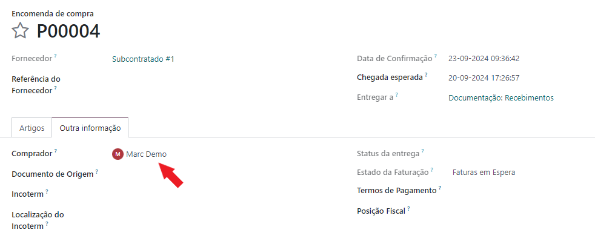

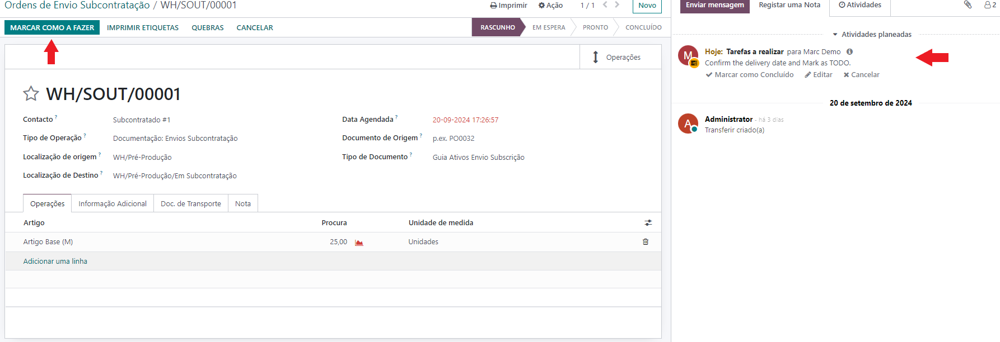

Por motivos de rastreabilidade, implementamos uma verificação manual da disponibilidade de componentes que estavam
reservados para produção e que agora vão para subcontratação.

Para o fazer:

- Carregue no gráfico de disponibilidade da **Procura**
- Remova a reserva da ordem de produção
- Retorne à ordem de envio e carregue em **VERIFICAR DISPONIBILIDADE**
- Carregue em **SET QUANTITIES** e **VALIDAR** para confirmar o envio

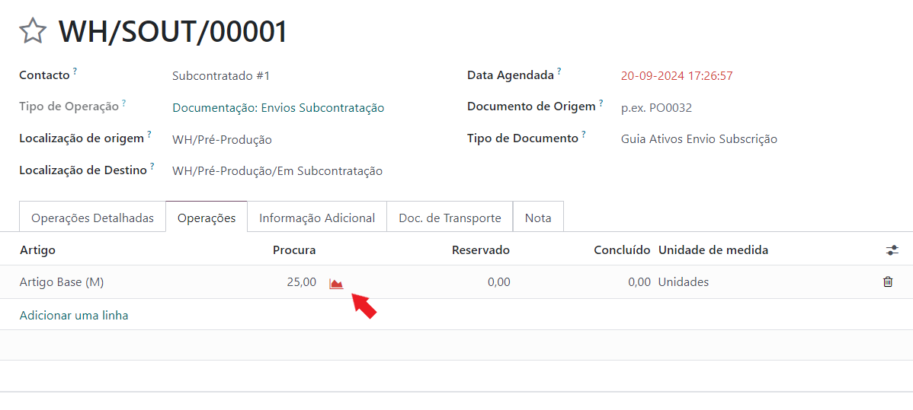

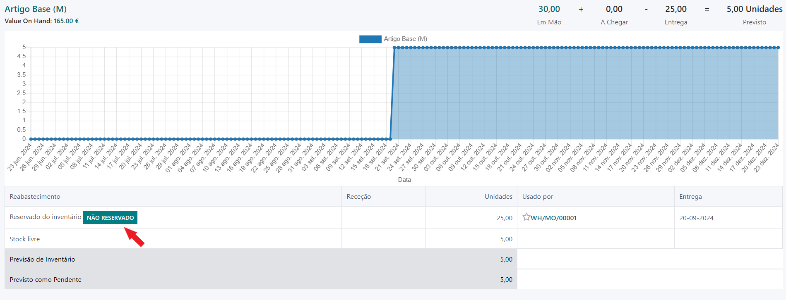

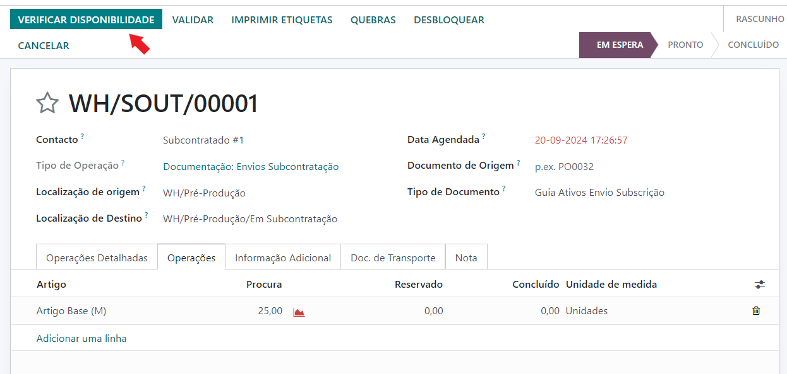

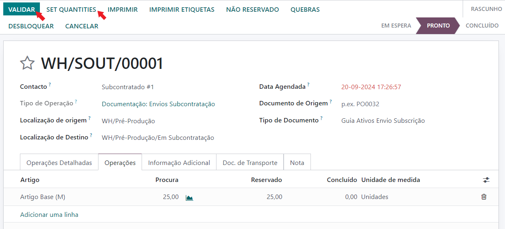

Este processo vai colocar os componentes no armazém de **Em Subcontratação** (ou o nome que escolher dar), até que
esteja pronto para os receber

Ao confirmar o envio dos componentes para subcontratação, vai ser gerada a guia para o recebimento dos mesmos, com uma
tarefa para o comprador para validar os dados, nomeadamente data esperada do recebimento, conforme acordado com o
fornecedor

Quando a tiver atualizado carregue em **MARCAR COMO A FAZER**

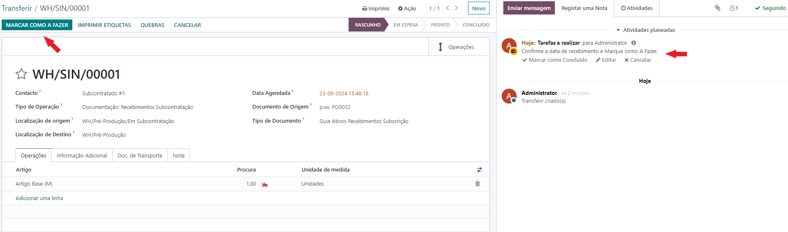

Carregue em **SET QUANTITIES** e **VALIDAR** confirmar o recebimento. Aloque os componentes recebidos à OP original e em
seguida, volte à OP para concluir o processo de subcontratação

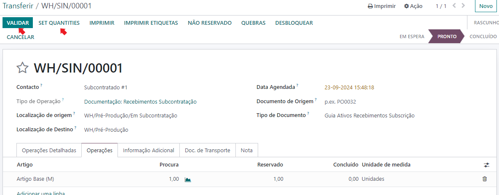

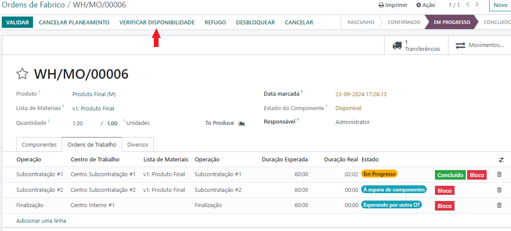

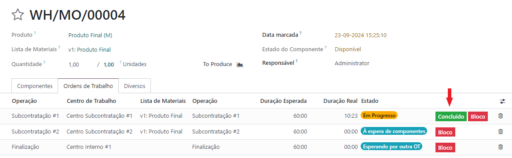

Complete a OP normalmente com a operação interna e dê os consumos dos componentes utilizados. Quando concluir a OP é
gerado o relatório de **Avaliação**, bem como a **Análise de Custos** se tiver a app **Contabilidade** instalada

**Avaliação**

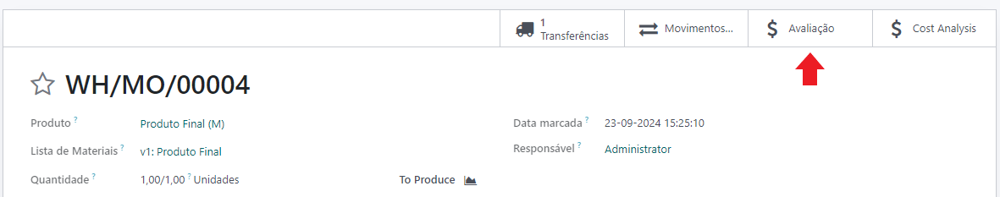

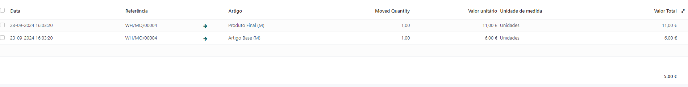

**Análise de Custos**

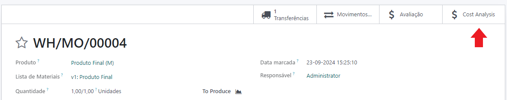

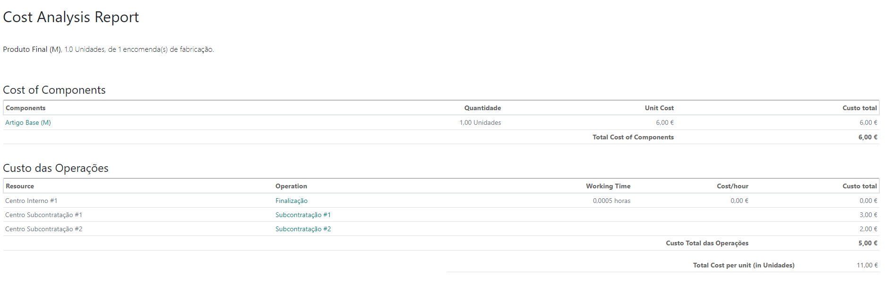
