:show-content:

========
Produção
========

.. _other_MRP_Contract_Manufacturing:

MRP Contract Manufacturing
==========================
Há empresas que fabricam por conta de terceiros: o cliente é o dono da mercadoria, fornece parte ou a totalidade dos
componentes, e o que sai da produção continua a ser dele. É o inverso da subcontratação nativa do Odoo, onde é a sua
empresa que contrata alguém para produzir.

Esta app garante que a propriedade do cliente atravessa todo o fluxo de fabrico, desde a receção dos componentes até ao
produto acabado. O que é do cliente nunca entra no valor do seu inventário, e a fatura da encomenda liquida apenas o
serviço de industrialização, não o valor do produto.

.. important::
    Esta app não está disponível na loja Odoo. Para ter acesso à mesma, terá de solicitar a sua instalação e ativação à
    **Exo Software**.

.. raw:: html

    

        ─── ✦ ───
    

Pré-Configurações
-----------------
A instalação da app trata sozinha de tudo o que o fluxo precisa, não tem configurações prévias a fazer. Ainda assim vale
a pena saber o que ficou preparado.

Na app de **Inventário** vá ao menu de **Configuração** e selecione a opção **Definições**. Na secção
**Rastreabilidade** encontra a opção **Remessa** já ativa, que é o que permite ao Odoo guardar o dono de cada artigo em
stock.

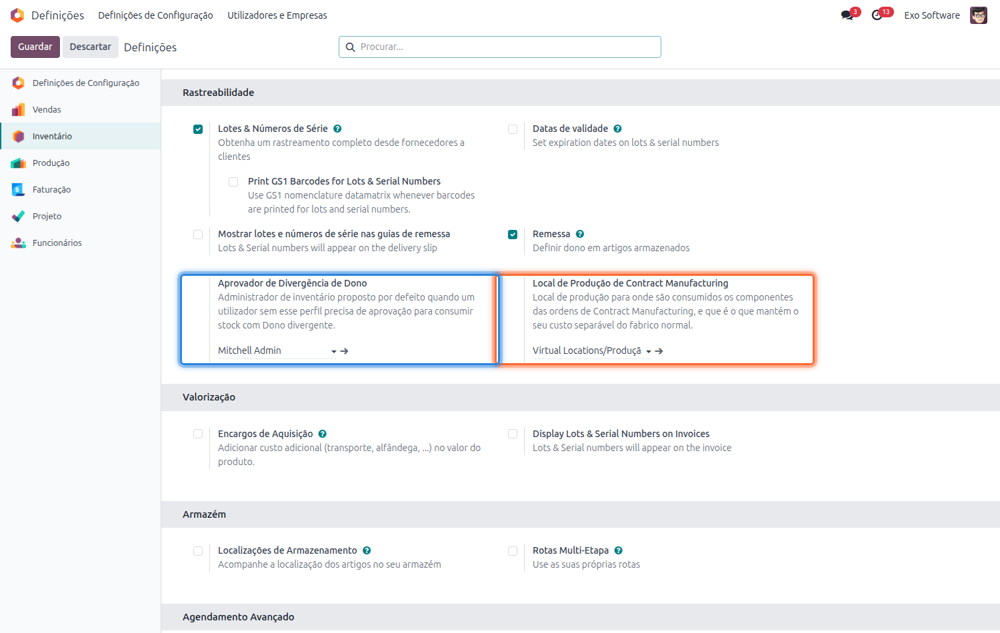

.. warning::
    Enquanto a app estiver instalada não é possível desativar a opção **Remessa**. Sem propriedade de stock por
    terceiros nada neste fluxo se sustenta, pelo que a tentativa de a desligar é recusada com um aviso.

Imediatamente abaixo fica o campo **Aprovador de Divergência de Dono**, onde deve indicar o administrador de inventário a quem os
pedidos de aprovação são propostos por defeito. Volte a este campo depois de decidir quem assume essa responsabilidade,
:ref:`mais à frente nesta página explica-se para que serve <mrp_contract_manufacturing_owner_mismatch_approver>`.

A app cria também uma localização de produção dedicada, **Produção CM**, por cada empresa da sua base de dados. É para
aqui que vão os consumos das ordens de fabrico por conta de terceiros, e é o que lhe permite separar estes custos da sua
produção normal no fecho do período.

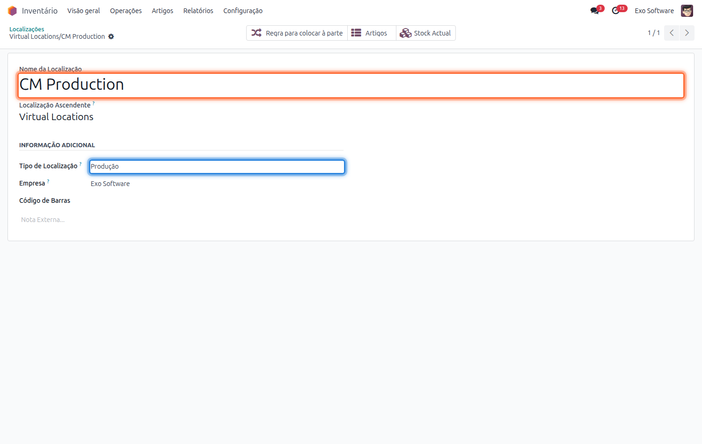

E cria um tipo de operação de fabrico dedicado, **Contract Manufacturing**, por cada armazém, com sequência própria.
Encontra-o na app de **Inventário**, menu de **Configuração**, opção :menuselection:`Gestão de armazém --> Tipos de
Operações`.

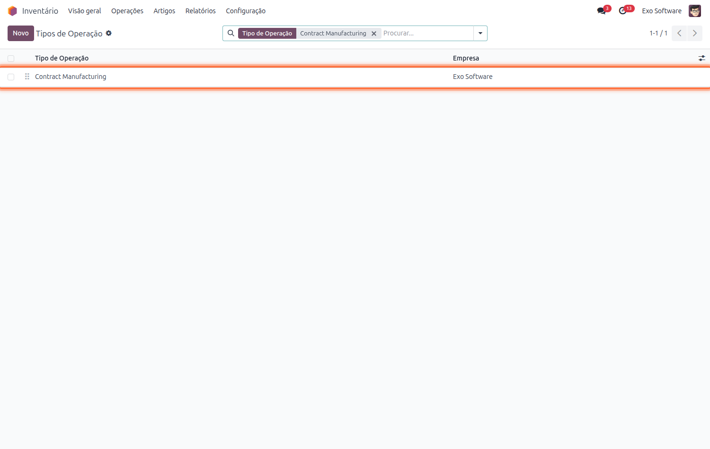

.. tip::
    O tipo de operação é imposto pela Lista de Materiais, em todas as vias de criação da ordem: manual, gerada a partir
    da encomenda de venda, ou por reabastecimento. Uma Lista de Materiais de Contract Manufacturing traz o tipo
    dedicado, e uma lista regular repõe o tipo de fabrico do armazém, sem precisar de o declarar. Como a numeração segue
    a sequência do tipo de operação, as ordens por conta de terceiros ficam também numeradas à parte.

Configurações
-------------
Toda a configuração vive na **Lista de Materiais**. Na app de **Produção** vá ao menu de **Artigos** e selecione a opção
**Listas de Materiais**, abra a lista do artigo que produz para o cliente e ative a opção **Contract Manufacturing**.
O campo **Dono** passa a ser obrigatório: indique aí o cliente dono da mercadoria.

Na tabela de componentes assinale, na coluna **Fornecido pelo Cliente**, as linhas dos componentes que o cliente lhe
entrega. As restantes seguem o fluxo normal do Odoo, sem qualquer alteração.

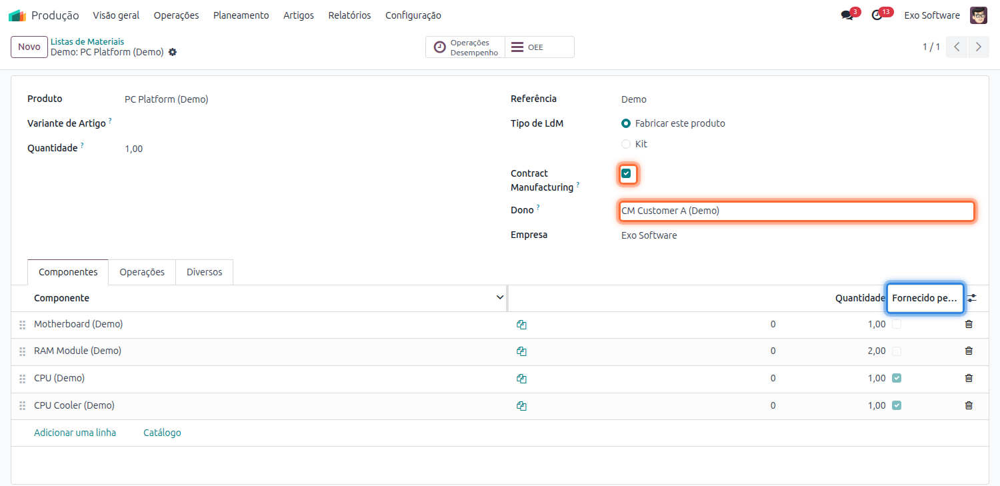

.. important::
    Se um artigo pode ser vendido das duas maneiras, por conta de terceiros e como venda normal, configure-lhe sempre
    pelo menos uma Lista de Materiais **sem Dono**. Caso contrário, e existindo só a lista de fabrico por conta de
    terceiros, o Odoo pode escolhê-la em silêncio numa venda normal por ser a única disponível.

.. note::
    Uma Lista de Materiais por conta de terceiros pode não ter nenhum componente marcado como fornecido pelo cliente.
    Corresponde ao caso em que a sua empresa fornece todos os materiais e, apesar disso, o produto final pertence ao
    cliente.

    As Listas de Materiais do tipo **Kit** não são suportadas, porque explodem na própria venda e não geram ordem de
    fabrico.

Para que os custos do serviço fiquem apurados por cliente, abra o separador **Diversos** e preencha o campo **Projeto**
com o projeto cuja conta analítica quer usar.

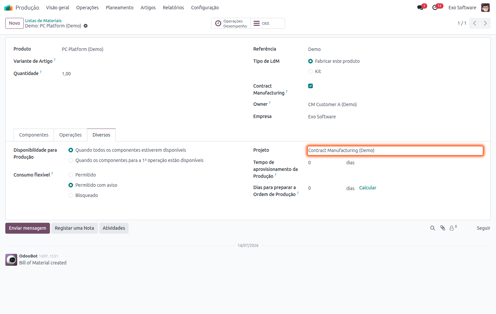

.. important::
    Sem projeto na Lista de Materiais, e sem custo por hora nos centros de trabalho, o apuramento analítico sai a zeros.
    São as duas condições obrigatórias para a última secção desta página funcionar.

.. note::
    Para que os prazos de entrega dos componentes que o cliente fornece sejam considerados, esse cliente tem de existir
    como **fornecedor** do componente, na lista de fornecedores do artigo. É semanticamente estranho, mas é o mecanismo
    nativo do Odoo para prazos de aprovisionamento. Na ausência de prazo, assume-se entrega imediata.

Utilização
----------
Na encomenda de venda escolha, na coluna **BoM** da linha, a Lista de Materiais por conta de terceiros. É esta escolha
que declara o serviço: campo em branco significa venda normal.

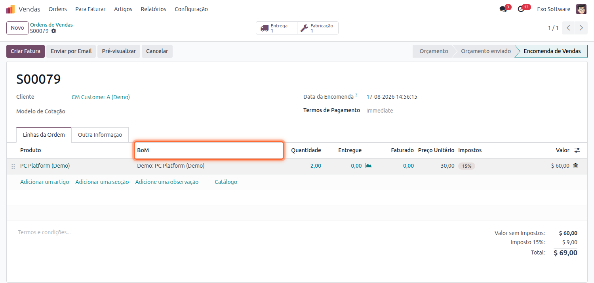

.. tip::
    Só lhe são propostas Listas de Materiais sem Dono, ou cujo Dono seja o cliente da encomenda. Se trocar o cliente,
    a lista escolhida é limpa quando deixa de servir, para que faça nova escolha sem que a gravação seja recusada. Uma
    lista sem Dono mantém-se, porque serve qualquer cliente.

.. important::
    Apesar de não ser obrigatório, é altamente recomendável que utilize a rota **Make to Order (MTO)** na venda deste
    tipo de artigos, isto irá garantir que a ligação total entre documentos é mantida.

    .. image:: manufacturing/v18_cm_mto_route.png
       :align: center

    Caso não o faça, o pedido é enviado para o mapa de **Reabastecimento**, onde terá posteriormente de ter cuidado e
    voltar a selecionar a Lista de Materiais correta antes de mandar produzir. Se não o fizer corre o risco de usar a
    Lista de Materiais sem dono e perder toda a funcionalidade desta app.

Se usou a rota MTO, ao confirmar a encomenda é criada a ordem de fabrico, já com o cliente no campo **Dono**, herdado da
Lista de Materiais. É este valor que segue para os movimentos dos componentes e para o produto acabado.

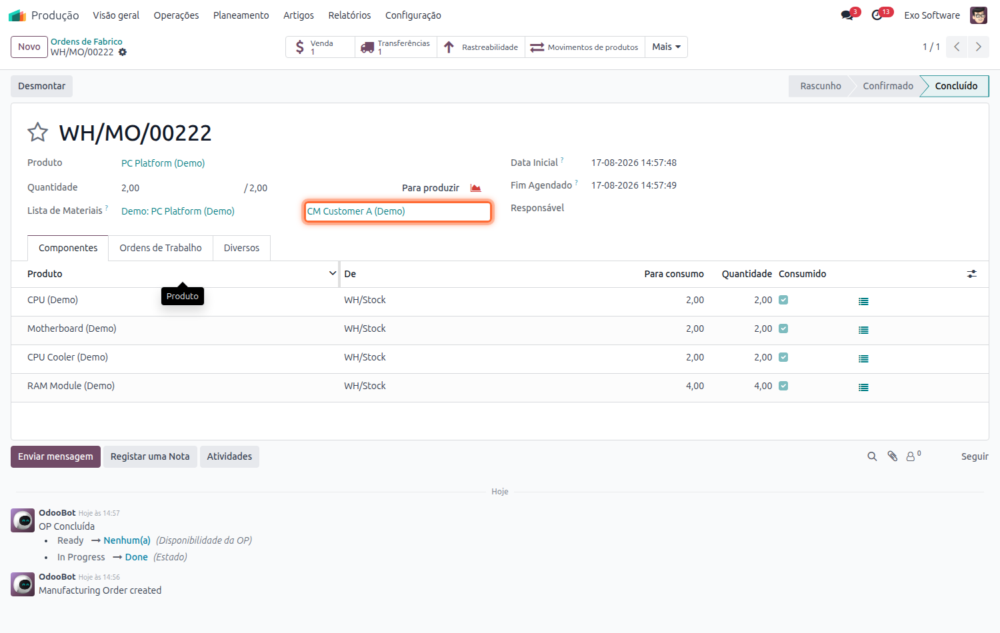

Para os componentes que o cliente fornece e que não tem em stock, a confirmação da ordem cria uma transferência de
entrada a partir da localização de fornecedor desse cliente, com a ordem de fabrico como **Documento de Origem**. Estes
componentes nunca geram compra.

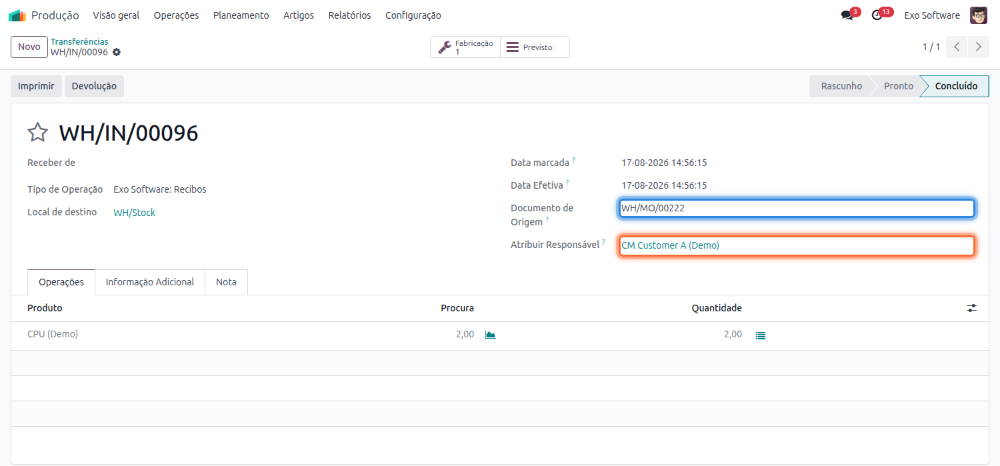

.. tip::
    A ligação entre a ordem de fabrico e a receção que a alimenta permite-lhe abrir uma a partir da outra, e acompanhar
    num único sítio o que falta receber para poder produzir.

A reserva dos componentes fornecidos pelo cliente usa apenas stock desse mesmo dono. Havendo em armazém o mesmo
componente de dois clientes diferentes, uma ordem nunca vai consumir o do outro.

Se, ao concluir a ordem, algum componente consumido não pertencer ao dono da ordem, o Odoo não deixa passar em silêncio.

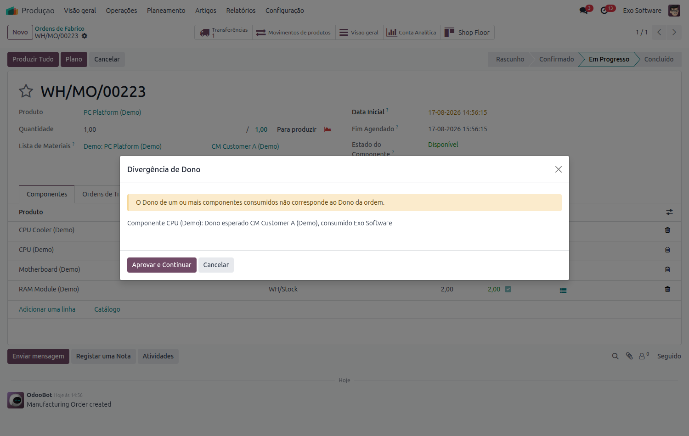

.. _mrp_contract_manufacturing_owner_mismatch_approver:

O que acontece a seguir depende do seu perfil:

.. list-table::
   :header-rows: 1

   * - Perfil
     - Comportamento
   * - Administrador de Inventário
     - Aprova e continua de imediato. A decisão e o detalhe da divergência ficam registados no histórico do documento.
   * - Restantes utilizadores
     - Escolhem o administrador a quem pedem aprovação. É criada uma atividade para essa pessoa e a conclusão da ordem
       fica bloqueada até a atividade ser fechada por um administrador de inventário.

.. important::
    Quando o que foi consumido é stock da sua empresa em vez do que o cliente devia ter fornecido, a aprovação faz mais
    do que deixar passar: a sua empresa cede a propriedade daquela quantidade ao cliente. É gerado, na localização de
    onde os componentes saíram, um registo de inventário que dá baixa do artigo como seu e o volta a dar entrada como
    sendo do cliente.

    Assim o seu stock é efetivamente abatido sem ter de esperar pela entrega do cliente, e a transferência de entrada
    que alimenta a ordem passa a avisar que aquela quantidade, quando chegar, deve ser recebida como propriedade da sua
    empresa.

    O tratamento comercial do componente cedido e nunca reposto pelo cliente fica fora do âmbito da app e deve ser
    acordado caso a caso entre a sua empresa e o seu cliente.

Concluída a ordem, o produto acabado entra em stock como propriedade do cliente e não é valorizado. A entrega dá baixa
da consignação sem impacto patrimonial, e a fatura liquida apenas o serviço.

.. warning::
    Cancelar a encomenda de venda **não** cancela a ordem de fabrico. É comportamento nativo do Odoo, e pode ser
    alterado na configuração da regra da rota de reabastecimento, ativando a propagação de cancelamento.

.. note::
    Numa ordem parcial, gerada quando conclui menos do que a quantidade pedida, o Dono, o tipo de operação e a
    localização de produção acompanham a ordem de origem.

Apuramento dos custos
---------------------
Na app de **Produção** vá ao menu de **Relatórios** e selecione a opção **Items Analíticos**, ou consulte-os pela app de
**Contabilidade**. Filtre pelo período e pela conta analítica do cliente.

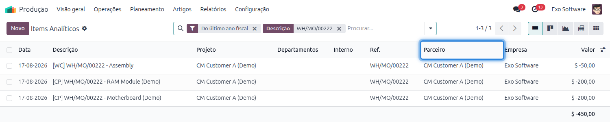

Só aparece aqui o que a sua empresa efetivamente suportou:

- a mão de obra, com o prefixo ``[CT]``, valorizada pelo custo por hora dos centros de trabalho
- os componentes que a sua empresa forneceu, com o prefixo ``[CP]`` seguido da ordem de fabrico e do componente

Os componentes propriedade do cliente não representam custo seu e não geram qualquer linha, em nenhum cenário. Todas as
linhas partilham a ordem de fabrico na coluna **Ref.** e o cliente na coluna **Parceiro**, o que lhe permite agrupar o
apuramento por cliente sem abrir mais nenhum documento.

.. note::
    A valorização de inventário mantém-se **manual**, por exigência das regras do SNC. Os movimentos de stock continuam
    a criar as camadas de valorização com o valor dos seus componentes, mas nenhum lançamento contabilístico é gerado
    automaticamente: o apuramento do período é lançado pela Contabilidade a partir dessas camadas e destes items
    analíticos.

Para acompanhar o que está em armazém e de quem é, use os relatórios nativos de Inventário. A coluna **Dono** distingue
o stock de cada cliente do stock da sua empresa.

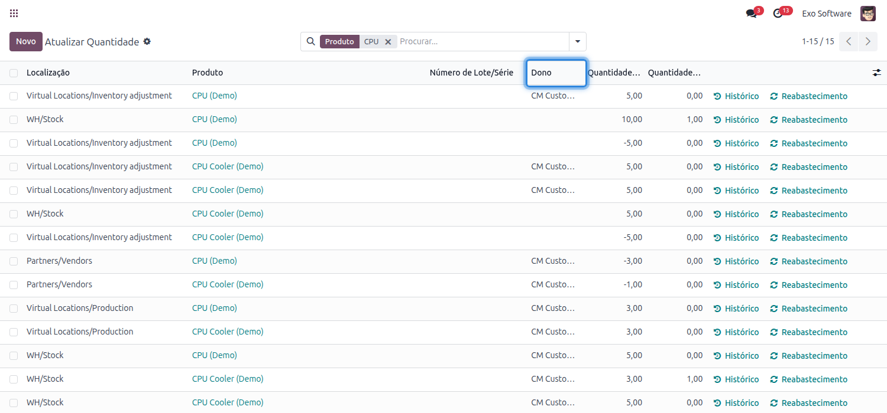

.. _other_Flex_Manufacturing:

Flex Manufacturing
==================
O módulo de **Produção** do Odoo é bastante sólido e uma excelente opção para empresas que têm um processo estanque e
bastante repetitivo no seu método produtivo. E nisto incluem-se os processos de subcontratação regulares. É possível ter
vários automatismos que facilitam e ajuda a gestão da sua empresa.

No entanto em algumas empresas, nomeadamente as que fazem produtos à medida, é necessário ter alguma flexibilização e
também recorrer a subcontratados de forma não regular. Para esses casos a **Exo Software** desenvolveu esta solução,
assim gasta menos tempo em configurações constante e mais tempo a servir os seus clientes.

.. important::
    Esta app apesar de funcionar como uma só, está dividida em 2 módulos para que tanto os clientes Community como
    Enterprise, possam usufruir da sua funcionalidade

    O módulo **Flex Manufacturing - Accounting** obriga à existência do módulo de **Contabilidade** do Odoo, pelo que
    só está disponível para clientes Enterprise

    Os clientes Community apenas poderão ter acesso à parte funcional da app sem os acrescentos contabilísticos

.. raw:: html

    

        ─── ✦ ───
    

Pré-Configurações
-----------------
Na app de **Inventário** vá ao menu de **Configuração** e selecione a opção **Configurações**

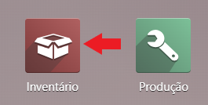

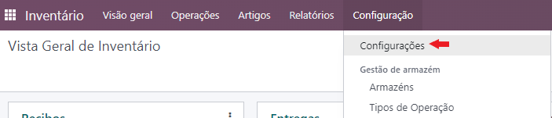

Na secção **Armazém** ative as opções:

- **Localizações de Armazenamento**, vai permitir especificar as localizações do seu stock
- **Rotas Multi-Etapa**, vai permitir que a sua produção seja pelo menos de 2 etapas

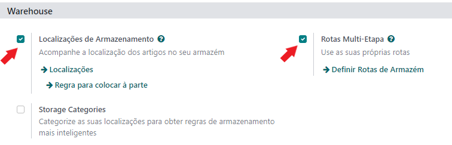

Faça a configuração do seu armazém, pode fazê-lo seguindo a opção **Definir Rotas de Armazém** e abra o armazém, em
seguida mude a opção de **Produção** pelo menos para 2 passos

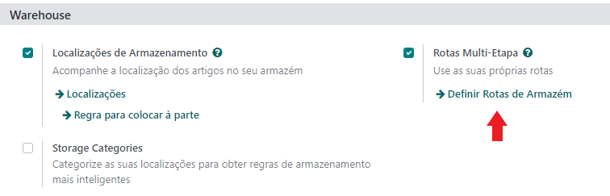

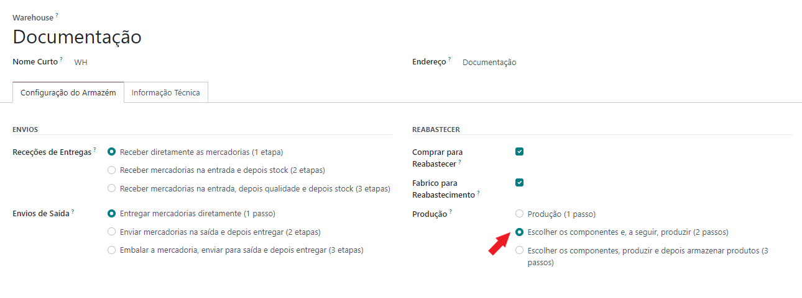

.. tip::
    Se a sua recolha de componentes o permitir legalmente, cancele o documento fiscal nesta fase

Faça a configuração das suas localizações, pode fazê-lo seguindo a opção **Localizações** e crie uma nova com a
configuração abaixo (o nome pode ser o que desejar)

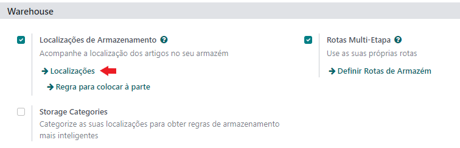

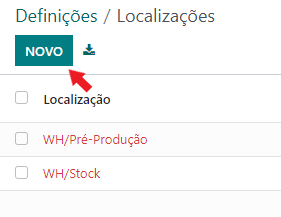

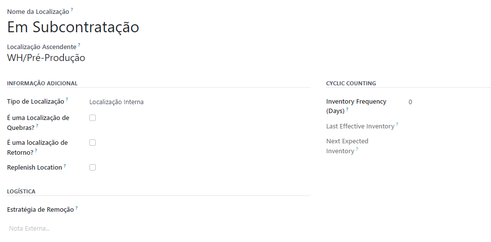

Esta vai ser a sua localização de subcontratação, é importante para que possa distinguir o que está nos seus
fornecedores, do que está na sua empresa.

Na app de **Produção** vá ao menu de **Configuração** e selecione a opção **Definições**

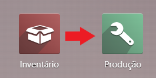

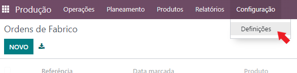

Na secção **Operações** ative a opção **Ordens de Trabalho**

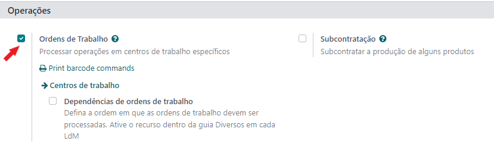

Configurações
-------------
.. important::
    Esta app não está disponível na loja Odoo, para ter acesso à mesma terá de pedir aos nossos serviços que façam a sua
    instalação e ativação na sua base de dados

    Depois pode começar a seguir os passos que se seguem para a utilizar

Na app de **Produção** vá ao menu de **Configuração** e selecione a opção **Definições**

Na secção **Operações** ative a opção **Ordens de Produção c/ Subcontratação**

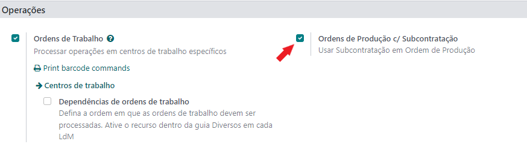

Na app de **Produção** vá ao menu de **Configuração** e selecione a opção **Centros de Trabalho** e crie os centros de
trabalho internos que precisa e, um para cada um dos fornecedores de subcontratação.

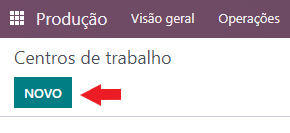

.. important::
    Na confifuração dos **centros de trabalho internos** precisa de ter a etiqueta **Internal**

    .. image:: manufacturing/v16_manufacturingSettings06.png
        :align: center

    Na confifuração dos **centros de trabalho externos** precisa de ter a etiqueta **External**

    .. image:: manufacturing/v16_manufacturingSettings07.png
        :align: center

    .. danger::
        Não pode utilizar estas duas etiquetas em conjunto

Na app de **Inventário** vá ao menu de **Configuração** e selecione a opção :menuselection:`Gestão de armazém --> Tipos de Operações`

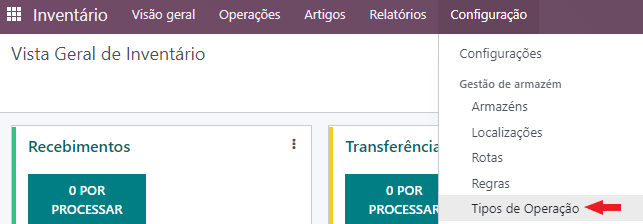

.. important::
    Edite as Operações de subcontratação para utilizarem a localização de **Em Subcontratação** (ou com o nome que
    escolheu dar)criada anteriormente, coloque também a opção inversa no **Tipo de Retorno**

    **Operação de Envios de Subcontratação**

    .. image:: manufacturing/v16_inventorySettings09.png
       :align: center

    **Operação de Recebimentos de Subcontratação**

    .. image:: manufacturing/v16_inventorySettings10.png
       :align: center

    .. danger::
        Não desative a emissão de documento fiscal, como se tratam de transportes de ativos próprios é o responsável
        pela comunicação e possível emissão das guias de transporte de ativos em ambas as direções

    .. seealso::
        :ref:`Guias de transporte <fiscal_documents_transportationDocs>`

        :doc:`Registo de Séries Documentais <../invoicing/series_registration>`

Na criação do `artigo <https://www.odoo.com/documentation/18.0/pt_BR/applications/inventory_and_mrp/inventory/product_management/configure.html>`_,
sua **Lista de Materiais** e artigos componentes verifique as seguintes situações:

- Os componentes que são subcontratação têm de ser **Serviços**
- É importante que a Lista de Materiais esteja como **Fabricar este Produto** e a **Dependência de Operações** esteja ativa

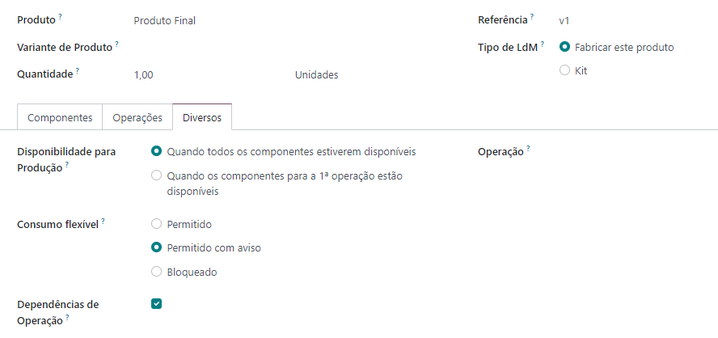

- Nas operações da Lista de Materiais tem de:

    - Atribuir ao Centro de Trabalho do Subcontratado principal, mas só porque o Odoo obriga a preencher este campo
    - Ativar a opção **Subcontratação** da aba Subcontratação
    - Adicionar os Fornecedores da Subcontratação com respetivos centros de trabalho, artigo de serviço e custo Unitário

    .. image:: manufacturing/v16_BoM02.png
       :align: center

    - Ter sempre uma operação interna para finalização, que deve estar bloqueada pela conclusão das outras

    .. image:: manufacturing/v16_BoM03.png
       :align: center

    - Dar o Consumo dos componentes apenas na fase final, caso contrário terá de criar artigos intermédios

    .. image:: manufacturing/v16_BoM04.png
       :align: center

Utilização
----------
Crie uma nova Ordem de Produção, baseada na Lista de Materiais que criou e carregue em **CONFIRMAR**

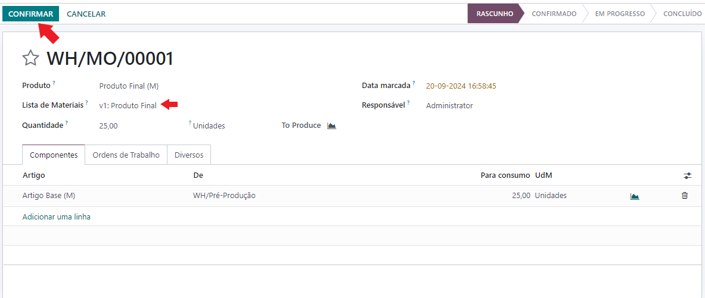

Como a escolha dos passos de produção tem pelo menos 2 passos, a **Recolha Componentes** é obrigatória, complete-a para
poder avançar com o processo

Depois de completa a recolha dos componentes, vão estar disponíveis as opções de subcontratar ou produzir, conforme as
opções de bloqueio de operações que escolheu na Lista de Materiais

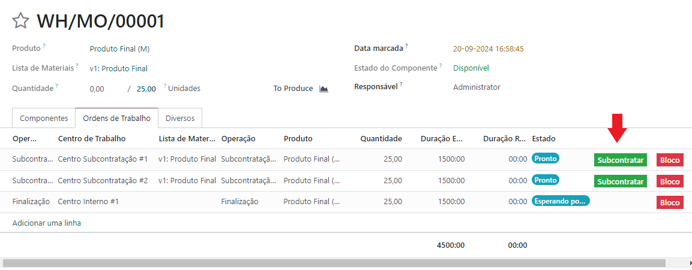

.. tip::
    Desde que essas ações estejam disponíveis ao mesmo tempo pode optar por subcontratar operações pela ordem que
    preferir

    Como estas operações são subcontratadas e não feitas internamente, a vista de tablet/chão de fábrica fica oculta

.. tip::
    Se na operação tiver inserido também um centro de trabalho interno na lista de fornecedores, pode mudar uma
    subcontratação para produção interna

    Se numa operação que inicialmente era de produção interna, ativar e configurar um fornecedor externo com centro de
    trabalho externo, pode passar uma operação interna para externa e subcontratar

    .. image:: manufacturing/v16_FMie01.png
       :align: center

    .. image:: manufacturing/v16_FMie02.png
       :align: center

    Esta funcionalidade foi inserida para que, se existirem necessidades imediatas de alteração, não tenha de anular a OP
    e refazer todo o processo. Podendo antes modificar em tempo real o processo de produção e face às necessidades

Ao carregar no botão de subcontratação é feita uma verificação se existe uma compra em rascunho ao fornecedor:

- Se existir, essa mesma compra vai ser atualizada
- Se não existir, vai criar uma nova

Ao mesmo tempo é criado um envio de subcontratação em rascunho com os artigos a enviar

.. tip::
    Por defeito todos os componentes a consumir são adicionados a este envio, mas pode retirar alguns deles, daí ser
    criado em rascunho

.. note::
    Dependendo do seu fluxo de trabalho, pode usar as apps do Odoo (Compras e Inventário), ou pode fazer tudo na app de
    Produção usando o menu **Subcontratação** que criamos para facilitar a consulta

    Quando abre estes menus de subcontratação, os pedidos vão estar agrupados por Ordens de Produção

    .. image:: manufacturing/v16_FM03.png
       :align: center

Ao confirmar a compra, vai ser criada no movimento de inventário que estava em rascunho, uma tarefa para o comprador

O objetivo desta tarefa é que o comprador como responsável pelo acordo com o fornecedor, dê as indicações de quando deve
ser feito o envio dos materiais, para que o responsável do inventário esteja informado de quando fazer esse envio

A seguir carregue no botão **MARCAR COMO A FAZER**

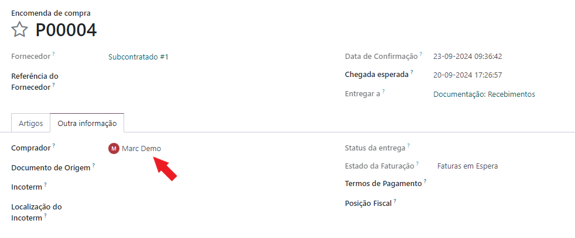

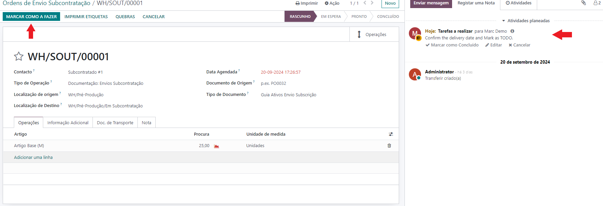

Por motivos de rastreabilidade, implementamos uma verificação manual da disponibilidade de componentes que estavam
reservados para produção e que agora vão para subcontratação.

Para o fazer:

- Carregue no gráfico de disponibilidade da **Procura**
- Remova a reserva da ordem de produção
- Retorne à ordem de envio e carregue em **VERIFICAR DISPONIBILIDADE**
- Carregue em **SET QUANTITIES** e **VALIDAR** para confirmar o envio

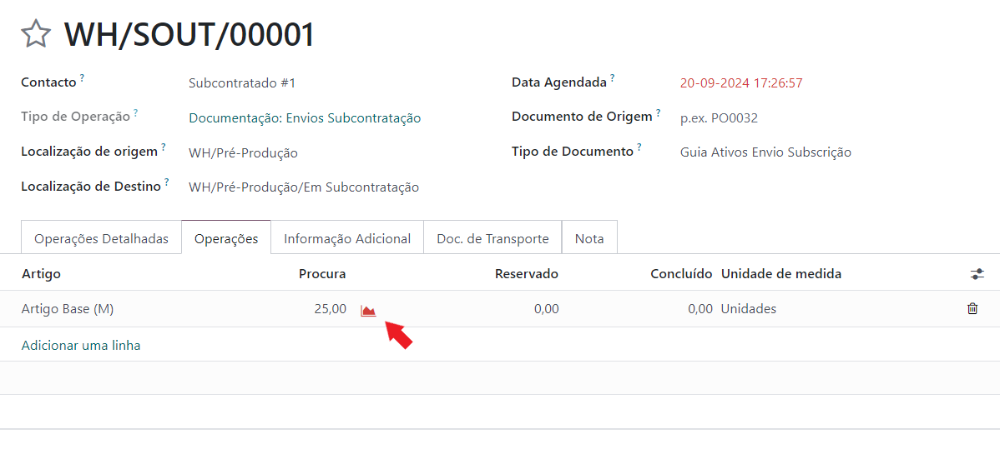

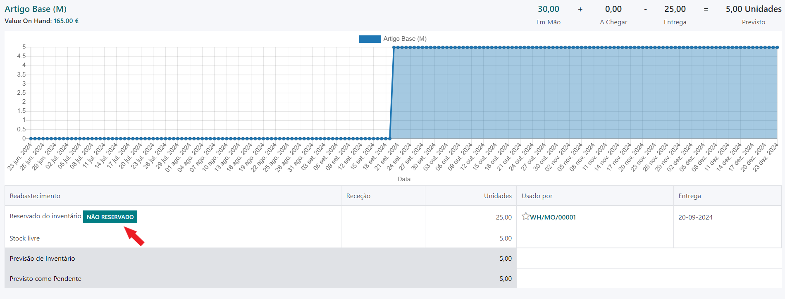

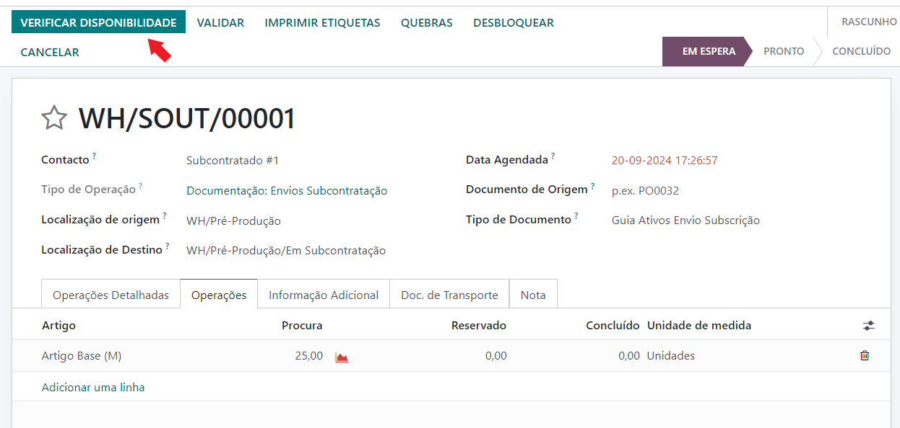

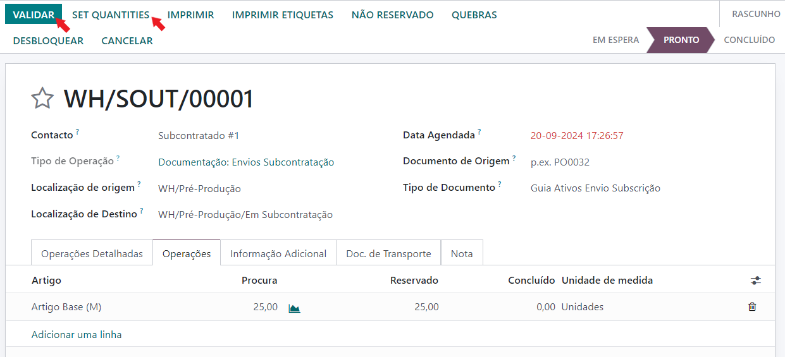

Este processo vai colocar os componentes no armazém de **Em Subcontratação** (ou o nome que escolher dar), até que
esteja pronto para os receber

Ao confirmar o envio dos componentes para subcontratação, vai ser gerada a guia para o recebimento dos mesmos, com uma
tarefa para o comprador para validar os dados, nomeadamente data esperada do recebimento, conforme acordado com o
fornecedor

Quando a tiver atualizado carregue em **MARCAR COMO A FAZER**

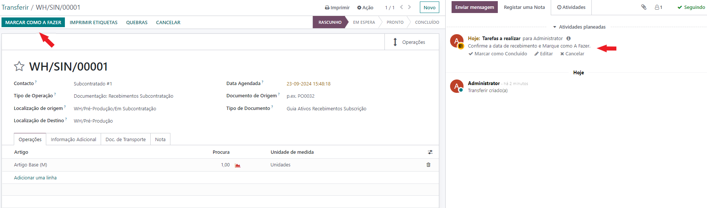

Carregue em **SET QUANTITIES** e **VALIDAR** para confirmar o recebimento. Aloque os componentes recebidos à OP original
e em seguida, volte à OP para concluir o processo de subcontratação

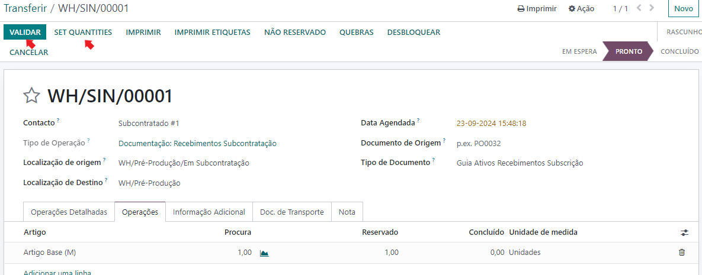

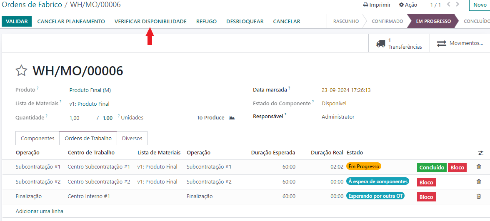

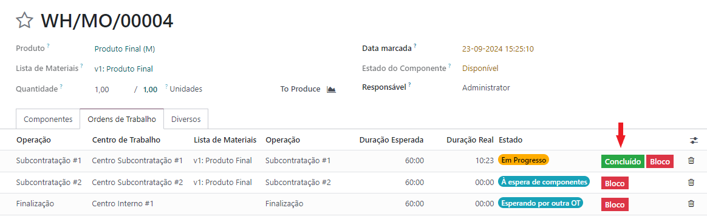

**Repita os passos anteriores sempre que tenha uma operação de subcontratação**

Complete a OP normalmente com a operação interna e dê os consumos dos componentes utilizados.

Quando concluir a OP é gerado o relatório de **Avaliação**, bem como a **Análise de Custos** se tiver a app
**Contabilidade** instalada

**Avaliação**

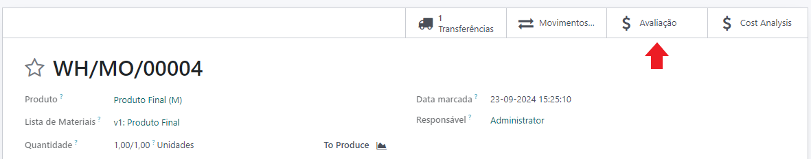

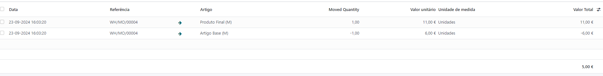

**Análise de Custos**

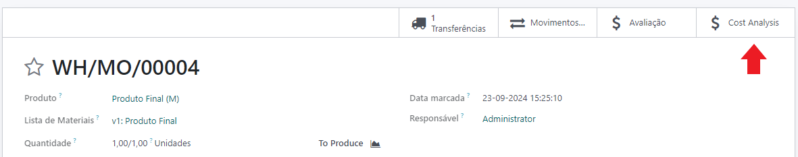

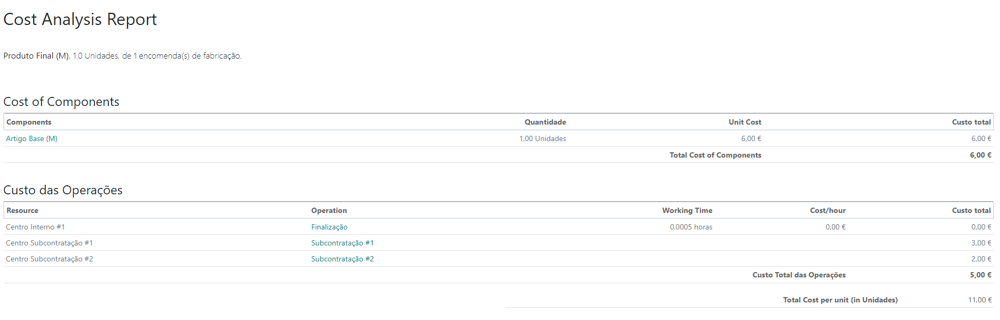

.. raw:: html

    

        ─── ✦ ───
    

