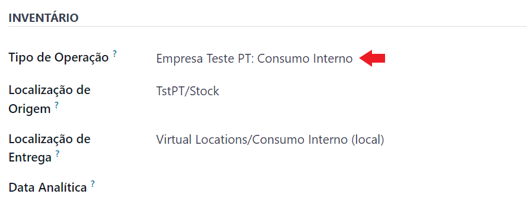
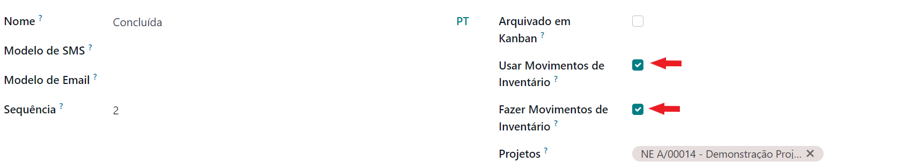
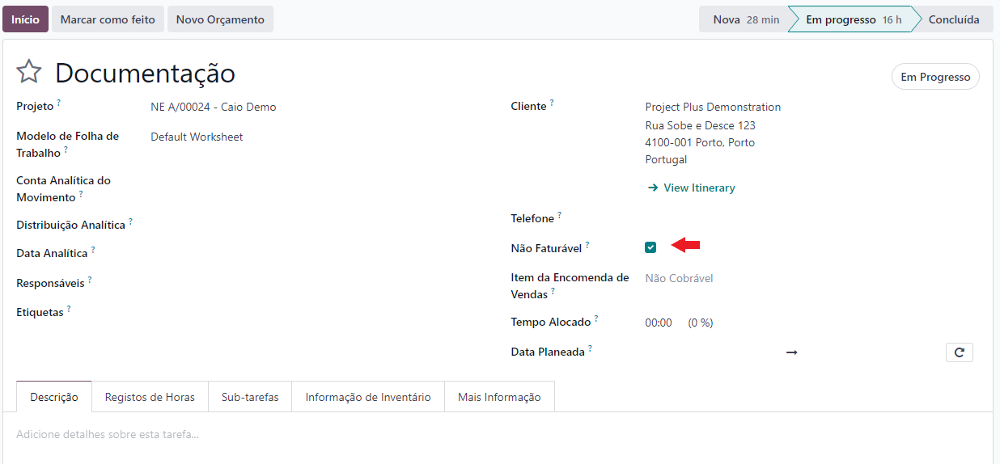
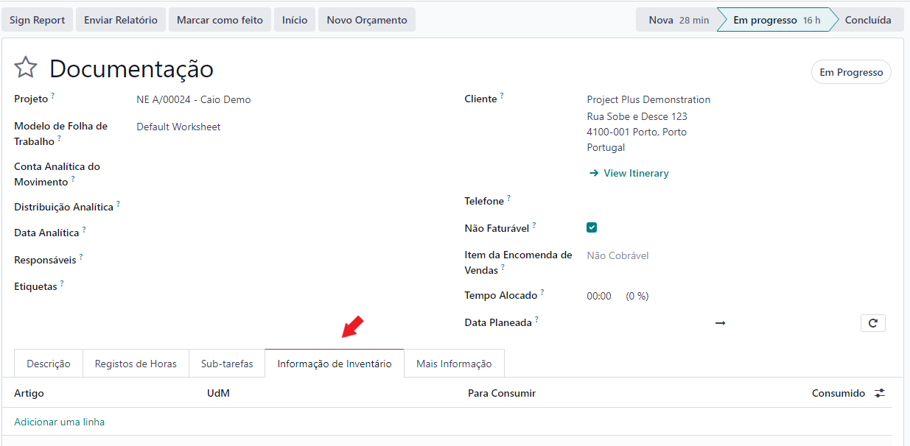
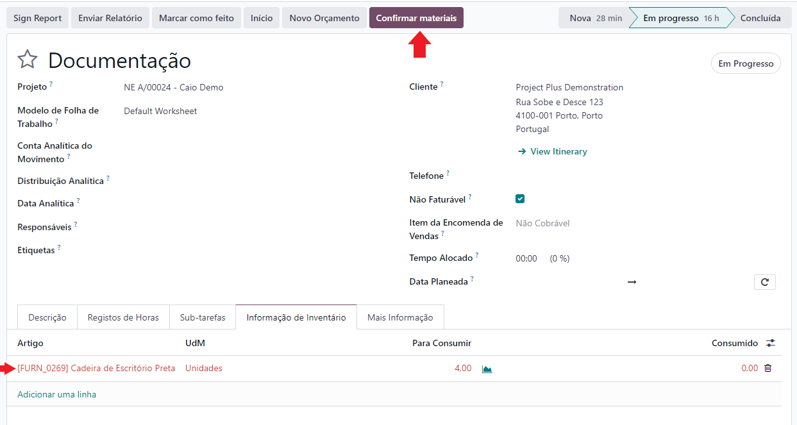
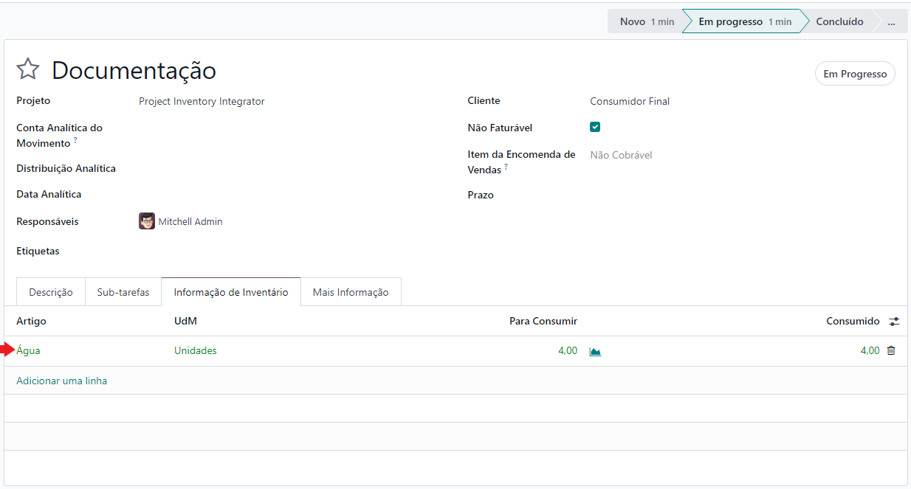
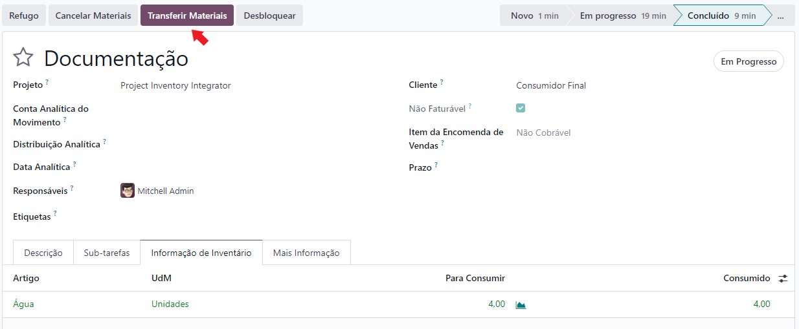
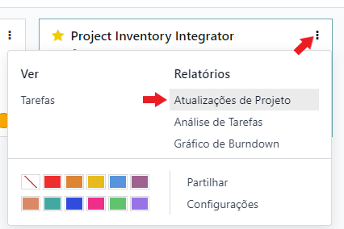
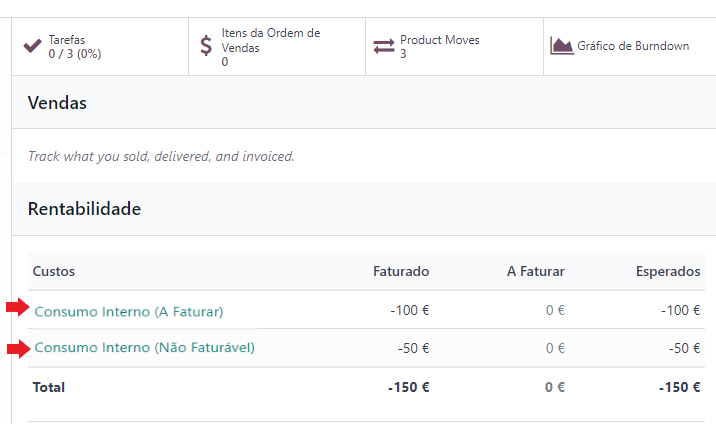

:show-content:

=======
Projeto
=======

.. _otherApps_Project_Inventory_Integrator:

Project Inventory Integrator
============================

Embora o Odoo já tenha uma integração nativa de inventário em projetos, essa integração obriga a tentativa de faturação
desses artigos.

Ou seja, não permite consumo de artigos numa substituição de outros **Em Garantia**, ou de componentes gastos como parte
de um serviço prestado. Pelo que, na vista agregadora do projeto, não é feita a distinção dos custos destes cenários, o
que é essencial para diversos negócios.

.. raw:: html

    

        ─── ✦ ───
    

Configuração
------------

.. important::
    Esta app não está disponível na loja Odoo, para ter acesso à mesma terá de pedir aos nossos serviços que façam a sua
    instalação e ativação na sua base de dados

    Também vai precisar de conhecer o processo para registar devidamente **Consumo Interno no Odoo**,
    `aprenda como numa formação com os nossos consultores <https://exosoftware.pt/en/appointment>`_

    Depois pode começar a seguir os passos que se seguem para a utilizar

Nas configurações do projeto deve preencher os campos associados a **Inventário**, sugerimos as seguintes configurações:

- No **Tipo de Operação** use a operação de **Consumo Interno** ensinada pela Exo Software, se estiver bem configurada as próximas duas devem preencher corretamente
- Na **Localização de Origem** use a sua localização normal de **Stock**
- Na **Localização de Entrega** use a localização de **Consumo Interno** ensinada pela Exo Software

.. important::
    Desative a opção nativa de Produtos em Tarefas do Odoo

    .. image:: project/v17_piiConfiguration02.png
       :align: center

Edite as etapas do projeto, ou garanta que o projeto tem acesso a etapas já configuradas, para habilitar **registo de consumo**
e **consumo efetivo** de artigos em tarefas

- Nas etapas em que deseja fazer **registo de consumo** de artigos ative a opção **Usar Movimentos de Inventário**

- Nas etapas em que deseja fazer **consumo efetivo** de artigos ative a opção **Usar Movimentos de Inventário** seguida de **Fazer Movimentos de Inventário**

Utilização
----------

Nas tarefas dos projetos, vai reparar num novo campo **Não Faturável**, este campo por defeito está ativo e tem as
seguintes opções:

- **Ativo**, o consumo de componentes não vai ser cobrado ao cliente e apenas se vai fazer o registo do custo no projeto
- **Inativo**, vai ser registado custo do consumo de componentes no projeto e vai ser criada uma fatura ao cliente

.. important::
    Esta app não mexe com o registo de horas no projeto, para isso deve utilizar a metodologia normal do Odoo, quando
    não faturável deixar o campo **Item da Nota de Encomenda** vazio, da tarefa ou nas linhas de **Registos de Horas**

    .. image:: project/v17_piiHowTo02.png
        :align: center

Também vai reparar que sempre que uma tarefa chega a uma etapa onde é possível fazer **registo de consumos**, vai ter
acesso a uma nova aba **Informação de Inventário**

Nesta aba vai poder registar os consumos internos a decorrer nesta tarefa

Quando insere produtos e quantidades a consumir, a linha fica a vermelho à espera que confirme a disponibilidade de
materiais, carregue no botão dedicado para o efeito:

- Se existir stock para satisfazer esse consumo a linha fica a verde e o botão desaparece, confirmando a reserva
- Se não existir stock suficiente, a linha mantém-se a vermelho

Quando uma tarefa passa para uma etapa configurada como **consumo efetivo** de artigos, vai ter acesso a mais 4 botões:

- **Refugo**, para dar quebras de artigos
- **Cancelar Materiais**, cancela o movimento de materiais
- **Transferir Materiais**, para dar o consumo efetivo dos artigos
- **Desbloquear** ou **Bloquear**, permite ou não alterações ao movimento de stock

Carregue no botão **Transferir Materiais** e efetive o consumo dos artigos que constam na aba **Informação de Inventário**

Neste momento também ganha acesso a novos smart buttons **Fatura** e **Movimentos de Produtos**

Dependendo se é **Não Faturável** ou **Faturável** tem acesso a 1 ou aos 2 smart buttons respetivamente

.. note::
    Se o pisco **Não Faturável** não estiver ativo, é neste momento que é criada uma fatura em rascunho

.. tip::
    É ainda possível fazer alterações aos consumos enquanto a fatura não for confirmada

    Para o fazer mude a tarefa para uma etapa de **registo de consumo**

.. danger::
    Depois de confirmada a fatura, já não pode fazer alterações aos consumos para cumprir com as normativas da AT em
    Portugal

    Nestes casos se quiser acrescentar mais consumos terá de fazer uma nova tarefa, se quiser diminuir consumos terá de
    fazer uma nota de crédito com a respetiva devolução

Quando for verificar as **Atualizações do Projeto**, vai poder ver os custos devidamente divididos pelas rubricas,
**Faturável** e **Não Faturável**

.. _otherApps_Project_Helpdesk_Integrator:

Project Helpdesk Integrator
===========================

Documentação em breve
