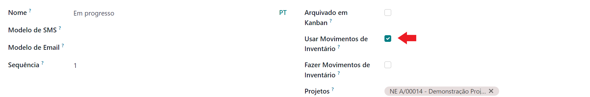
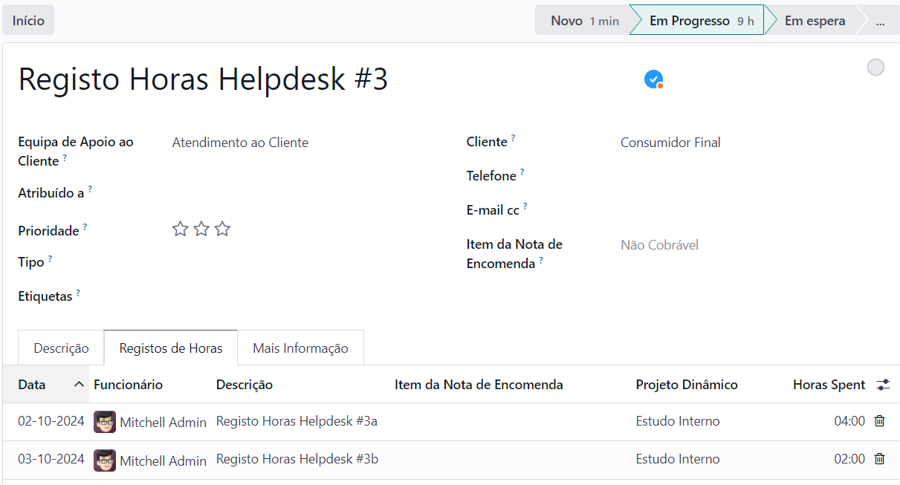
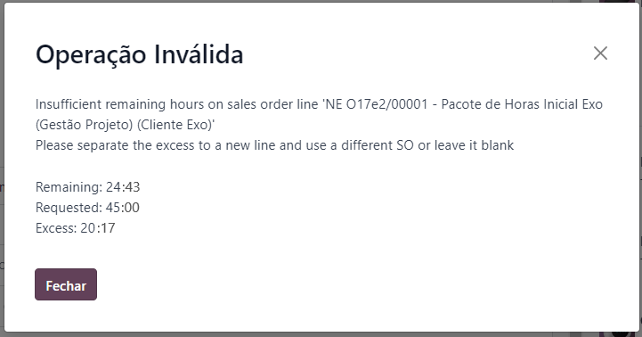

:show-content:

=======
Projeto
=======

.. _otherApps_Project_Inventory_Integrator:

Project Inventory Integrator
============================

Embora o Odoo já tenha uma integração nativa de inventário em projetos, essa integração obriga a tentativa de faturação
desses artigos.

Ou seja, não permite consumo de artigos numa substituição de outros **Em Garantia**, ou de componentes gastos como parte
de um serviço prestado. Pelo que, na vista agregadora do projeto, não é feita a distinção dos custos destes cenários, o
que é essencial para diversos negócios.

.. raw:: html

    

        ─── ✦ ───
    

Configuração
------------

.. important::
    Esta app não está disponível na loja Odoo, para ter acesso à mesma terá de pedir aos nossos serviços que façam a sua
    instalação e ativação na sua base de dados

    Também vai precisar de conhecer o processo para registar devidamente **Consumo Interno no Odoo**,
    `aprenda como numa formação com os nossos consultores <https://exosoftware.pt/en/appointment>`_

    Depois pode começar a seguir os passos que se seguem para a utilizar

Nas configurações do projeto deve preencher os campos associados a **Inventário**, sugerimos as seguintes configurações:

- No **Tipo de Operação** use a operação de **Consumo Interno** ensinada pela Exo Software, se estiver bem configurada as próximas duas devem preencher corretamente
- Na **Localização de Origem** use a sua localização normal de **Stock**
- Na **Localização de Entrega** use a localização de **Consumo Interno** ensinada pela Exo Software

.. image:: project/v17_piiConfiguration01.png
   :align: center

.. important::
    Desative a opção nativa de Produtos em Tarefas do Odoo

    .. image:: project/v17_piiConfiguration02.png
       :align: center

Edite as etapas do projeto, ou garanta que o projeto tem acesso a etapas já configuradas, para habilitar **registo de consumo**
e **consumo efetivo** de artigos em tarefas

- Nas etapas em que deseja fazer **registo de consumo** de artigos ative a opção **Usar Movimentos de Inventário**

- Nas etapas em que deseja fazer **consumo efetivo** de artigos ative a opção **Usar Movimentos de Inventário** seguida de **Fazer Movimentos de Inventário**

Utilização
----------

Nas tarefas dos projetos, vai reparar num novo campo **Não Faturável**, este campo por defeito está ativo e tem as
seguintes opções:

- **Ativo**, o consumo de componentes não vai ser cobrado ao cliente e apenas se vai fazer o registo do custo no projeto
- **Inativo**, vai ser registado custo do consumo de componentes no projeto e vai ser criada uma fatura ao cliente

.. image:: project/v17_piiHowTo01.png
   :align: center

.. important::
    Esta app não mexe com o registo de horas no projeto, para isso deve utilizar a metodologia normal do Odoo, quando
    não faturável deixar o campo **Item da Nota de Encomenda** vazio, da tarefa ou nas linhas de **Registos de Horas**

    .. image:: project/v17_piiHowTo02.png
        :align: center

Também vai reparar que sempre que uma tarefa chega a uma etapa onde é possível fazer **registo de consumos**, vai ter
acesso a uma nova aba **Informação de Inventário**

Nesta aba vai poder registar os consumos internos a decorrer nesta tarefa

Quando insere produtos e quantidades a consumir, a linha fica a vermelho à espera que confirme a disponibilidade de
materiais, carregue no botão dedicado para o efeito:

- Se existir stock para satisfazer esse consumo a linha fica a verde e o botão desaparece, confirmando a reserva
- Se não existir stock suficiente, a linha mantém-se a vermelho

.. image:: project/v17_piiHowTo05.png
   :align: center

Quando uma tarefa passa para uma etapa configurada como **consumo efetivo** de artigos, vai ter acesso a mais 4 botões:

- **Refugo**, para dar quebras de artigos
- **Cancelar Materiais**, cancela o movimento de materiais
- **Transferir Materiais**, para dar o consumo efetivo dos artigos
- **Desbloquear** ou **Bloquear**, permite ou não alterações ao movimento de stock

Carregue no botão **Transferir Materiais** e efetive o consumo dos artigos que constam na aba **Informação de Inventário**

.. image:: project/v17_piiHowTo06.png
   :align: center

Neste momento também ganha acesso a novos smart buttons **Fatura** e **Movimentos de Produtos**

Dependendo se é **Não Faturável** ou **Faturável** tem acesso a 1 ou aos 2 smart buttons respetivamente

.. image:: project/v17_piiHowTo07.png
   :align: center

.. note::
    Se o pisco **Não Faturável** não estiver ativo, é neste momento que é criada uma fatura em rascunho

.. tip::
    É ainda possível fazer alterações aos consumos enquanto a fatura não for confirmada

    Para o fazer mude a tarefa para uma etapa de **registo de consumo**

.. danger::
    Depois de confirmada a fatura, já não pode fazer alterações aos consumos para cumprir com as normativas da AT em
    Portugal

    Nestes casos se quiser acrescentar mais consumos terá de fazer uma nova tarefa, se quiser diminuir consumos terá de
    fazer uma nota de crédito com a respetiva devolução

Quando for verificar as **Atualizações do Projeto**, vai poder ver os custos devidamente divididos pelas rubricas,
**Faturável** e **Não Faturável**

.. image:: project/v17_piiHowTo09.png
   :align: center

.. TODO : correções JS ao ver Atualizações do Projeto e fazer o Dashboard que está com o Eduardo

.. _otherApps_Project_Helpdesk_Integrator:

Project Helpdesk Integrator
===========================
Nativamente o Odoo não integra as horas registadas em **Apoio ao Cliente** nos consumos de **Projetos**. O que faz
sentido se assumirmos que o apoio ao cliente normalmente é gratuíto, ou que existem serviços diferentes para registo de
horas em Apoio ao Cliente e Projetos/Field Service

No entanto, pela natureza única de algumas empresas de Serviços, podem ser utilizados os mesmos pacotes de horas para
ambas as situações. Ou para os casos em que quer ter toda a informação de um cliente associada ao mesmo projeto e
benefeciar das análises do projeto do Odoo. Para esses casos existe esta app.

.. raw:: html

    

        ─── ✦ ───
    

.. important::
    Esta app não está disponível na loja Odoo, para ter acesso à mesma terá de pedir aos nossos serviços que façam a sua
    instalação e ativação na sua base de dados

    Depois pode começar a seguir os passos que se seguem para a utilizar

Configurações
-------------
Na app de **Projeto** vá ao menu :menuselection:`Configuração --> Configurações` e na secção **Gestão de Tempo** ative
a opção **Registos de Horas**

.. image:: project/v17_phiConfiguration01.png
   :align: center

.. tip::
    Se quer ter consumos de tempo ou faturação em Projetos, garanta que nas configurações de cada projeto tem ativas as
    opções **Registos de Horas** e **Faturável**.

    Assim pode registar horas e ao mesmo tempo ter linhas de notas de encomenda associadas a tarefas, para faturação ou
    consumo de tempo, conforme qualificação do artigo do tipo serviço associado

    .. image:: project/v17_phiConfiguration04.png
       :align: center

    .. image:: project/v17_phiConfiguration05.png
       :align: center

Na app de **Apoio ao Cliente** pode configurar uma ou mais equipas de apoio ao cliente acedendo ao menu
:menuselection:`Configuração --> Equipas do Apoio ao Cliente`

.. image:: project/v17_phiConfiguration07.png
   :align: center

Para que possa registar e faturar tempos registados a clientes, nas definições de cada equipa terá de ter ativas as
opções:

- **Registos de Horas**
- **Cobrança de Tempo**

Com esta app instalada passa a ter à sua disponibilidade mais uma opção **Projeto Dinâmico**:

- Para as equipas de Apoio ao Cliente que queira manter com o comportamento nativo do Odoo, não ative a opção
- Para as equipas de Apoio ao Cliente onde pretenda reportar os registos de horas em projetos, ative a opção

.. tip::
    O campo **Custo Hora** dos funcionários que pode encontrar na aba **Definições de Recursos Humanos** deve ser
    preenchido, se quer que o custo efetivo do tempo dos funcionários seja reportado nas **Atualizações de Projeto**

    .. image:: project/v17_phiConfiguration10.png
       :align: center

.. seealso::

    .. raw:: html

        

            <a href="https://documentation.exosoftware.pt/pt_PT/applications/other_apps/sales#hide-so-line-timesheet" target="_blank">Consulte a nossa app <b>Hide SO Line Timesheet</b> se quiser ainda mais funcionalidades</a>
        

Utilização
----------
.. important::
    Uma das lacunas do Odoo é que, quando vende um serviço que cria uma tarefa, não pode escolher a que projeto essa
    tarefa é alocada, e é sempre usado um projeto template.

    Por esse motivo, é altamente recomendado que tenha um projeto para receber tarefas resultantes de Vendas, chamemos a
    esse projeto **Tarefas a Distribuir** (apesar de lhe poder chamar o que desejar)

    Desta forma quando estas tarefas são criadas, vão todas para o projeto **Tarefas a Distribuir** e pode depois
    direcioná-las para o projeto mais indicado.

    O smart button de **Projeto** da Nota de Encomenda é agora dinâmico pelo que não se preocupe

Garanta que o produto tem:

- **Tipo de Artigo**, está selecionado como Serviço
- **Criar na Ordem**, está selecionado como Tarefa
- **Projeto**, está selecionado o projeto criado anteriormente (**Tarefas a Distribuir**)

Depois de feita a venda desse artigo, pode ir ao projeto **Tarefas a Distribuir** e mudar o projeto a que a tarefa está
associada

O campo **Horas Alocadas** do projeto pode ser só de leitura e computado de forma automática, para tal ative o visto

.. note::
    O cálculo vai ser a soma das horas alocadas em todas as tarefas do projeto, que não têm uma tarefa pai

Na aba **Registos de Horas** de cada ticket do **Apoio ao Cliente**, pode acrescentar duas colunas que são bastante
úteis (a visualização de colunas costuma ser guardada por utilizador, pelo que só deverá ter de o fazer uma vez):

- **Item da Nota de Encomenda**, vai permitir selecionar que linha de NE vai ser usada para o consumo do tempo
- **Projeto Dinâmico**, projeto ao qual vai reportar o custo do funcionário para o tempo registado

Com a combinação dos 2 campos pode reproduzir os seguintes cenários, linha a linha do registo de horas:

- Ticket de cliente em que todos os registos de horas são debitados ao cliente

- Ticket de cliente em que alguns registos de horas são debitados ao cliente mas outros têm reporte a projetos internos

- Ticket de cliente em que nenhum registo de horas é debitado ao cliente

.. note::
    Na coluna de **Projeto Dinâmico**, vai ver todos os **projetos do cliente** e todos os **projetos internos**

    **Projetos do Clientes**, são aqueles que o campo cliente do projeto está preenchido pelo mesmo cliente do ticket

    **Projetos Internos**, são aqueles que o campo do cliente do projeto está vazio

    Se deixar o campo **Projeto Dinâmico** vazio, ao gravar, vai usar o projeto da equipa de apoio ao cliente

Para facilitar o controlo do registo de tempos que tanto pode vir de tarefas como de tickets de apoio ao cliente , foi
introduzida uma nova funcionalidade. Se tentar registar horas que vão ultrapassar a disponibilidade de **Horas Restantes**
da NE, vai receber um alerta e a sugestão de dividir os tempos em mais linhas

Neste aviso vão ser exibidas as horas restantes na linha da NE, o valor que está a tentar registar e o saldo excedente

Sugere-se que ao separar passe o excedente para uma nova linha, onde pode usar outra linha de NE, ou deixar em vazio
até que uma nova com horas restantes esteja disponível

.. TODO : Fazer um novo dashboard para a vista desta app e agregar multiplos projetos do mesmo cliente
