:show-content:

======
Vendas
======

.. _odoo_process_quotation_revisions:

Portugal - Sale Order Revisions
===============================
Por limitações impostas pela AT não é possível utilizar a ferramenta nativa do Odoo de edição de documentos fiscais já
confirmados

Por esse motivo, e usando como base uma app OCA, a Exo Software fez os ajustes para que a funcionalidade se integre nas
regras portuguesas

.. important::
    Esta app não está disponível na loja Odoo, para ter acesso à mesma terá de pedir aos nossos serviços que façam a sua
    instalação e ativação na sua base de dados

.. seealso::
    Conheça a app OCA que serve de base a esta funcionalidade `Sale Order Revisions <https://github.com/OCA/sale-workflow/tree/17.0/sale_order_revision>`_

.. raw:: html

    

        ─── ✦ ───
    

Configuração
------------
Esta app usa a sequência original do Odoo para Orçamentos, como tal para que possa ser devidamente utilizada, deve
configurar essa sequência para o formato que pretende utilizar

Na app **Configurações** garanta que tem o **Modo de Programador** ativo

.. image:: ../../install/initial_configuration/v17_appSettings.png
   :align: center

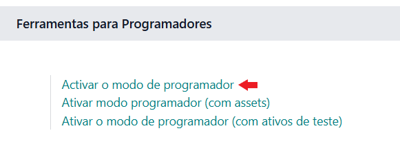

Em seguida vá ao menu :menuselection:`Técnico --> Sequências & Identificadores --> Sequências`

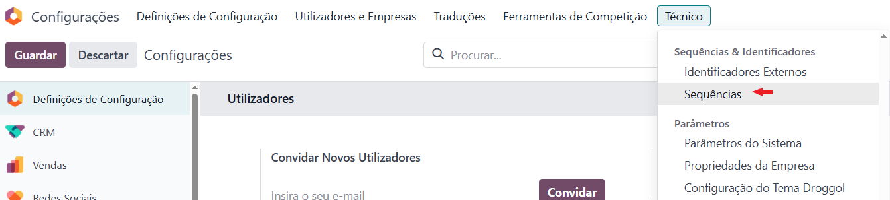

Procure o **Código da Sequência** *sale.order* e entre no mesmo para o configurar

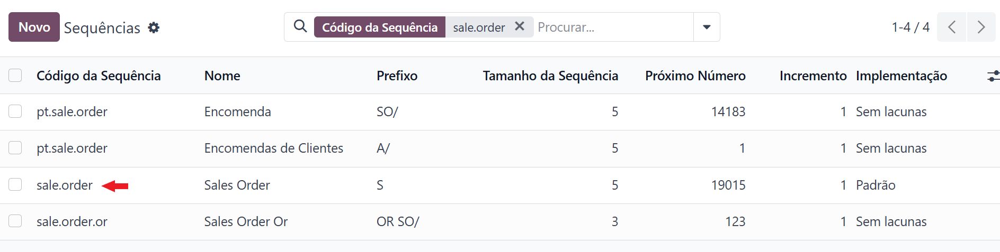

Como esta sequência não é comunicada à AT, tem mais liberdade do que normal para a sua configuração, podendo usar um
Prefixo com os códigos que vè na secção de Legenda

No entanto, sugerimos que seja coerente e use apenas um Prefixo simples e que este seja diferente do usado para
Orçamentos e Notas Encomenda.

Lembramos que não serão acrescentados os Prefixos exigidos pela AT nesta sequência pelo que se deseja incluí-los terá
de os colocar aqui

.. danger::
    Não utilize um sufixo, pois a app vai acrescentar um sufixo baseado na versão do Orçamento

Utilização
----------
Documentação em breve

..
    Com a instalação desta app os seus orçamentos passarão a ter um novo aspeto, onde vai ser a numeração da sequência que configurou bem como um novo campo com a numeração oficial do documento comunicado à AT

    A utilização desta app é bastante simples, num determinado Orçamento carregue no botão de nova Revisão

    Pode escolher se quer duplicar o chatter do documento original para o novo documento

    .. important::
        Esta funcionalidade é apenas uma adaptação para as regras portuguesas da app da OCA

        Por esse motivo não alteramos o seu comportamento nativo de cancelar e arquivar as revisões antigas e só ter
        disponível o documento mais recente

        Caso surjam erros em emissão de SAF-T não se esqueça de verificar os documentos arquivados

.. _otherApps_Hide_SO_Line_Timesheet:

Hide SO Line Timesheet
======================
Apesar de o Odoo fazer um excelente trabalho na escolha de que linha de uma Nota de Encomenda, é utilizada para registo
de horas em diversas apps, com o passar do tempo, começam a existir cada vez mais opções de selecção que podem confundir
o utilizador.

Com o objetivo de simplificar a vida ao utilizador, desenvolvemos esta solução, que lhe permite ocultar qualquer linha
de Nota de Encomenda de artigos do tipo **Serviço** das possibilidades de escolha, quando já não tem uso para a mesma

Também acrescentamos algumas ferramentas de controlo e aconselhamento, para facilitar a sua utilização de registo de
horas

.. important::
    A app apesar de funcionar como uma só, está dividida em 3 módulos independentes, conforme seja o caso de ter as apps
    de **Apoio ao Cliente** ou **Field Service/Serviço de Campo** instaladas, ou não

    A decisão foi tomada porque sempre que utiliza registo de horas está obrigado a utilizar a app **Projetos**.
    No entanto:

    - a app de **Field Service** altera a app de projeto, pelo que para funcionar corretamente é preciso um add-on
    - pode utilizar a app **Projeto** sem utilizar a app de **Apoio ao Cliente**, pelo que essa vertente foi colocada num módulo próprio

    Se optar por:

    - usar a app de **Field Service** terá de instalar 2 módulos
    - usar a app de **Apoio ao Cliente** terá de instalar 2 módulos
    - usar as apps **Apoio ao Cliente** e **Field Service** vai ter de instalar os 3 módulos

.. raw:: html

    

        ─── ✦ ───
    

Configuração
------------
Em qualquer artigo onde o **Tipo de Artigo** seja **Serviço**, vai ter disponível um novo campo **Ocultar**

Esta opção define qual o comportamento por defeito a aplicar ao produto quando este é usado numa linha de Nota de
Encomenda:

- Ativo, não vai aparecer como opção nos registos de horas
- Inativo, vai aparecer como opção nos registos de horas

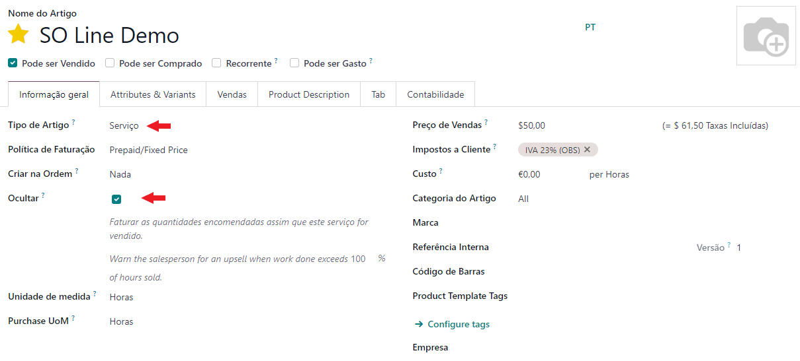

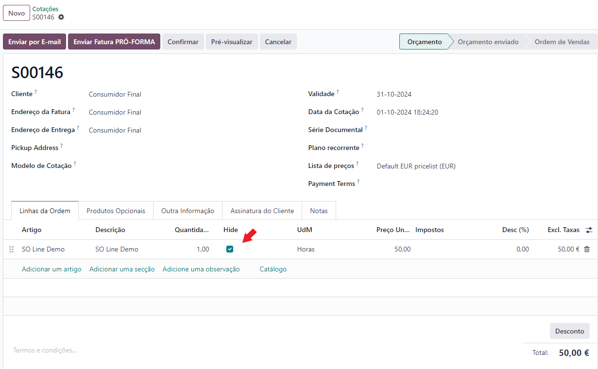

.. tip::
    É altamente aconselhado que a **Unidade de Medida** para os artigos a utilizar em Registo de Horas seja **Horas**,
    apesar de o Odoo conseguir internamente fazer a conversão de tempos desde que pertença à mesma Categoria de Unidade
    de Medida, essa conversão não aparece visivél em todas as vistas

Para que funcione em **Apoio ao Cliete** tem de ativar duas opções nas definições da equipa e para funcionar em
**Projetos** ou **Field Service** tem de ativar as mesmas definições nas configurações do projeto:

- **Registos de Horas**, vai permitir registar horas em tickets ou tarefas
- **Cobrança de Tempo**, vai permitir ligar esses registos de horas a linhas de notas de encomenda para faturação

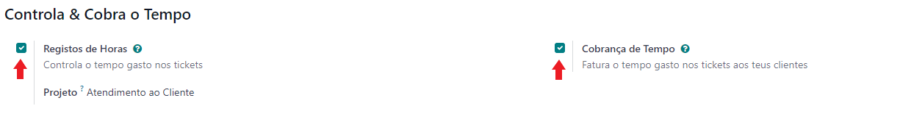

Utilização
----------
Nos registos de horas vai poder selecionar, ou não, a linha de nota de encomenda dependendo se, a opção está **inativa**
ou **ativa** respetivamente

Se a opção de ocultar estiver **inativa**

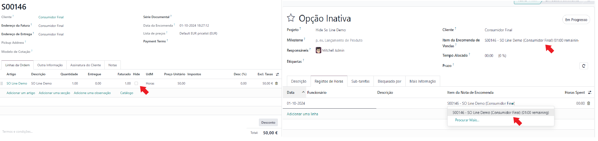

Se a opção de ocultar estiver **ativa**

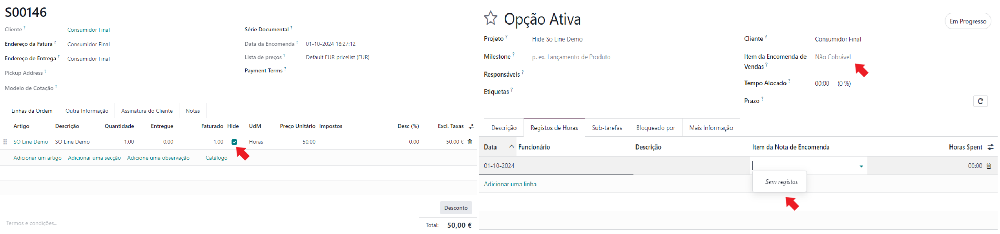

.. tip::
    Ocultar ou não uma linha de nota de encomenda, é algo que pode fazer mesmo depois do documento estar confirmado e
    faturado, pois não tem impacto fiscal, é apenas uma melhoria operacional

Na app de **Vendas** tem acesso a uma nova funcionalidade em :menuselection:`Relatórios --> Controlo Registo Horas`

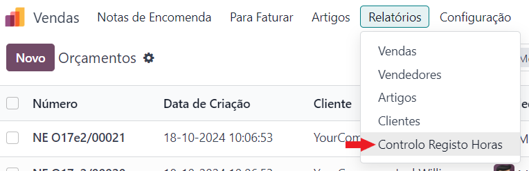

Esta vista já vem com um filtro aplicado para lhe mostrar apenas as Linhas de Notas de Encomenda Ativas para uso em
Registo de Horas, e com isso ajudar ao seu controlo

.. note::
    - Tem um resumo rápido de horas encomendadas, entregues e restantes
    - As horas restantes têm uma formação condicional quando esgotadas ou ultrapassadas
    - Barra de progresso para ajuda visual no controlo
    - Pode ocultar as linhas gastas diretamente deste relatório
    - Tem um resumo rápido de horas faturadas e por faturar
    - As horas a faturar têm uma formatação condicional quando disponíveis, para que não se esqueça

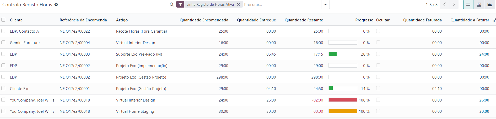

Nas apps que lidam com registos de horas (**Projeto**, **Field Service**, **Apoio ao Ciente**), vai ter acesso a um novo
Smart Button para acesso direto às linhas de notas de encomenda do cliente em questão

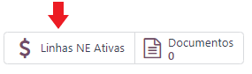

.. important::
    Lembre-se que a política do Odoo para faturação de Registos de Horas:

    - Se a linha com o Item de Nota de Encomenda estiver **preenchido**, **é para faturar**
    - Se a linha com o Item de Nota de Encomenda estiver **vazio**, **não é para faturar**

Acrescentamos também uma nova coluna em todos os registos de horas para que possa diferenciar os tipos de linhas:

- **Faturável**, tal como a regra Odoo estes registos já têm linha de NE associada
- **Não Faturável**, tal como na regra Odoo estes registos não têm linha de NE associada porque efetivamente não são para associar
- **Para Faturar**, não têm linha de NE associada porque a mesma está gasta ou ainda não existe mas queremos efetivamente vir a faturar este registo

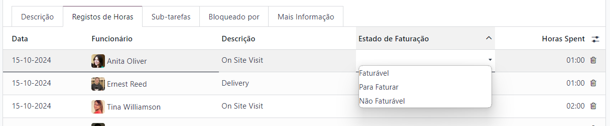
