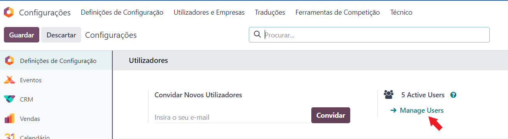
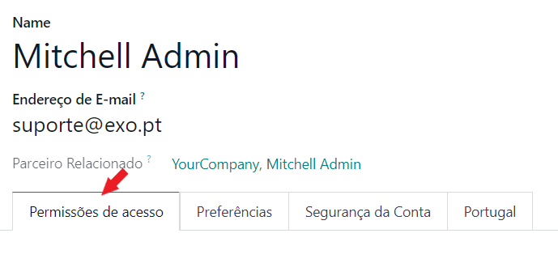
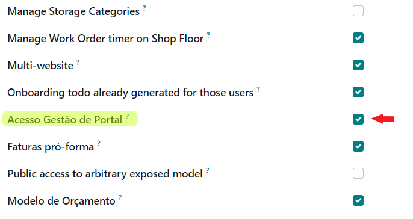
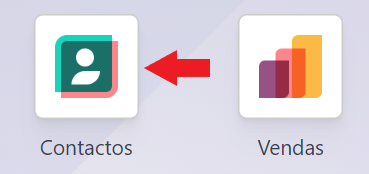
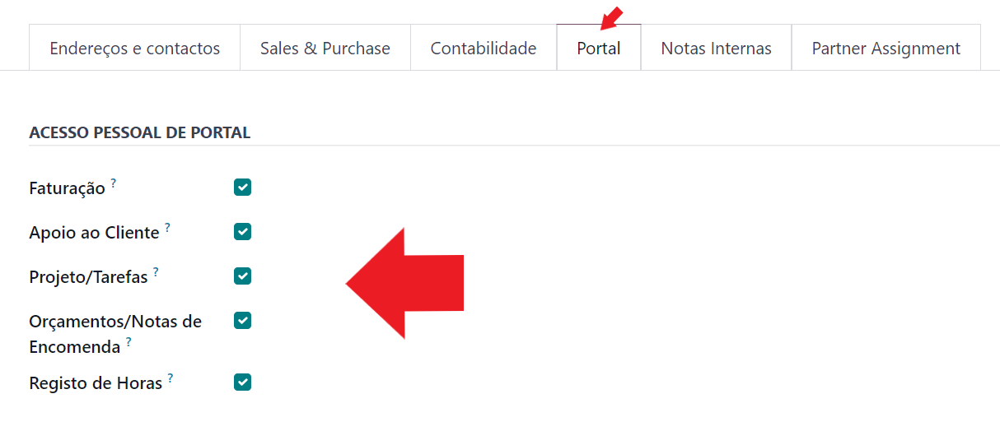

:show-content:

=======
Website
=======

.. _otherApps_Portal_Personal_Data:

Portal Personal Data
====================
Com a crescente preocupação com a segurança dos dados e da informação, a **Exo Software** desenvolveu uma app que lhe
permite controlar em cada utilizador de portal o grau de acesso que o mesmo tem.

.. raw:: html

    

        ─── ✦ ───
    

.. important::
    Esta app não está disponível na loja Odoo, para ter acesso à mesma terá de pedir aos nossos serviços que façam a sua
    instalação e ativação na sua base de dados

    Depois pode começar a seguir os passos que se seguem para a utilizar

Nativamente, o Odoo permite que qualquer utilizadr de portal tenha acesso a toda a informação, sua e da empresa a que
esteja associado.

Esta app está preparada para que facilmente possa cortar esse acesso utilizador a utilizador, de forma muito simples em
várias temáticas como:

- Faturas, Notas de Crédito/Débito
- Tickets de Helpdesk (Apoio ao cliente)
- Tarefas de Projetos
- Orçamentos e Notas de Encomenda
- Timesheets (Registo de Horas)

Configurar
==========
Na app de **Configurações** aceda à opção **Manage Users** e selecione o utilizador que vai fazer esta gestão. Em
seguida navegue para a aba **Permissões de Acesso** e ative a opção **Acesso Gestão de Portal**

.. image:: ../../install/initial_configuration/v17_appSettings.png
   :align: center

Utilizar
========
Na app de **Contactos** selecione um dos seus contactos, na aba **Portal** selecione uma vou várias das opções que
pretende restringir

A partir deste momento o utilizador **apenas** vai poder ver os documentos aos quais esteja especificamente associado

.. tip::
    Para que um documento ou registo seja considerado como pertencente ao utilizador de portal e o mesmo tenha acesso,
    basta ser o cliente ou seguidor do documento/registo.
