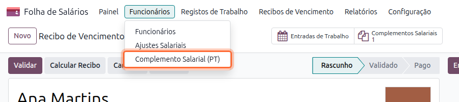
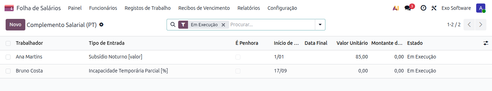
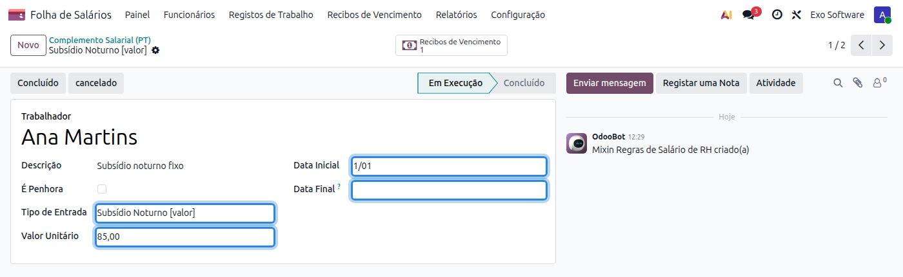
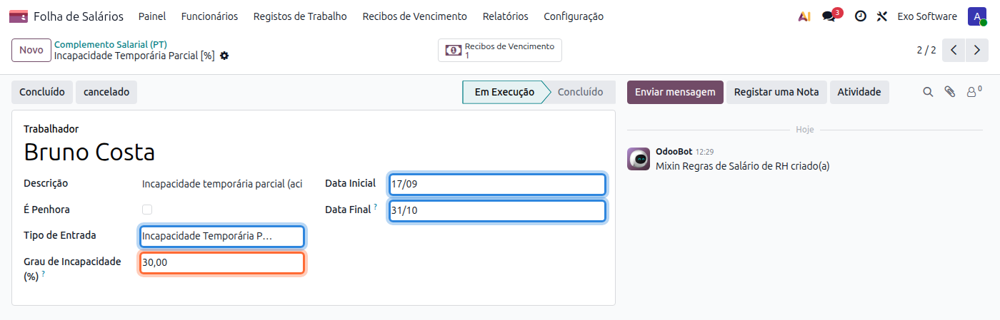
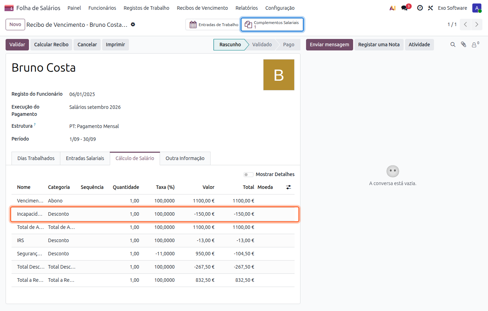

:show-content:

======================
Complementos Salariais
======================
Os **complementos salariais** são abonos ou descontos que se repetem todos os meses para um
funcionário, como um subsídio fixo, um prémio mensal ou uma penhora. Registados uma vez, entram
automaticamente em todos os recibos do período em que estão ativos.

.. raw:: html

    

        ─── ✦ ───
    

Criar um complemento
====================
Na app **Folha de Salários**, vá ao menu
:menuselection:`Funcionários --> Complemento Salarial (PT)`.

A lista abre com os complementos **Em Execução**. Use os filtros para ver os concluídos ou
cancelados, ou para separar penhoras de complementos, e agrupe por funcionário ou tipo.

Carregue em **Novo** e preencha:

.. list-table::
   :header-rows: 1
   :widths: 25 75

   * - Campo
     - Descrição
   * - **Trabalhador**
     - Funcionário a quem o complemento se aplica.
   * - **Descrição**
     - Texto livre para identificar o complemento.
   * - **Tipo de Entrada**
     - Abono ou desconto a lançar no recibo, por exemplo **Subsídio Noturno [valor]**,
       **Prémio de Prevenção [valor]** ou **Dedução Seguro de Saúde [valor]**.
   * - **Valor Unitário**
     - Valor mensal do complemento.
   * - **Data Inicial**
     - Data a partir da qual o complemento entra nos recibos.
   * - **Data Final**
     - Último mês em que o complemento entra nos recibos. Vazio significa sem fim.

.. note::
    O mesmo funcionário não pode ter dois complementos em execução do mesmo tipo com períodos
    sobrepostos. Para mudar o valor, preencha a **Data Final** do complemento atual e crie um novo a
    partir do mês seguinte.

Como entram no recibo
=====================
Ao gerar ou calcular um recibo, cada complemento em execução cujo período abrange o mês do recibo
é lançado como uma entrada salarial, no separador **Entradas Salariais**. O botão
**Complementos Salariais** no topo do recibo mostra os complementos aplicados.

- Se alterar o valor da entrada no recibo, o valor alterado mantém-se nesse recibo e não é
  substituído pelo do complemento.
- Se apagar a entrada do recibo, o complemento fica excluído desse recibo e não volta a ser
  adicionado ao recalcular.
- Os recibos independentes de subsídio de férias e de Natal não recebem complementos.

Quando é validado o recibo do mês da **Data Final**, o complemento passa a **Concluído**. Se esse
recibo for cancelado, o complemento volta a **Em Execução**. Um complemento já usado em recibos não
pode ser apagado; cancele-o com o botão **cancelado**.

Penhoras
========
Marque **É Penhora** para registar uma penhora de vencimento. Nesse caso, em vez do valor mensal,
indique o **Montante da Penhora** (valor total em dívida) e a
**Data de Comunicação da Penhora**. Em cada recibo é descontada a parte penhorável do vencimento,
até atingir o montante total; o formulário mostra o **Montante Já Penhorado** e o que falta
penhorar. Quando a dívida fica paga, a penhora passa a **Concluído**.

Incapacidade temporária parcial
===============================
Um funcionário em **incapacidade temporária parcial** após um acidente de trabalho continua a
trabalhar e recebe pela capacidade restante; a seguradora paga-lhe o resto diretamente, fora dos
salários.

Registar a incapacidade
-----------------------
Crie um complemento salarial com o **Tipo de Entrada**
**Incapacidade Temporária Parcial [%]** e preencha o **Grau de Incapacidade (%)** indicado pela
seguradora, a **Data Inicial** e a **Data Final** do período de incapacidade.

O grau tem de ser superior a 0% e inferior a 100%. Uma incapacidade absoluta lança-se como uma
ausência do tipo **Falta por Acidente de Trabalho**.

Quando o grau muda, preencha a **Data Final** do complemento atual e crie um novo com o grau novo a
partir do dia seguinte.

Cálculo no recibo
-----------------
O recibo mostra a linha de desconto **Incapacidade Temporária Parcial**, calculada assim:

.. code-block:: text

    Desconto = Base × Grau % × Horas do período ÷ Horas do mês

- **Base**: soma das rubricas que entram no salário-hora (por omissão o vencimento base, as
  diuturnidades e a isenção de horário).
- **Horas do período**: horas de trabalho do horário do funcionário entre o início e o fim da
  incapacidade.
- **Horas do mês**: horas de trabalho do horário no mês.

Num mês completo o desconto é igual ao grau aplicado à base. Se houver dois graus no mesmo mês,
os dois descontos somam-se.

.. list-table:: Exemplo — vencimento de 1100,00 €, 30% de 17/09/2026 a 31/10/2026, recibo de setembro
   :widths: 40 60

   * - Horas do período (17 a 30/09)
     - 80 h
   * - Horas do mês de setembro
     - 176 h
   * - Desconto
     - 1100,00 × 30% × 80 ÷ 176 = **−150,00 €**

Definir o valor à mão
---------------------
Para usar outro valor, junte ao recibo uma entrada do tipo
**Incapacidade Temporária Parcial [valor]** com o montante a descontar. Esse valor substitui o
calculado. Para o aplicar em vários meses, crie um complemento salarial desse tipo com o valor
mensal.
