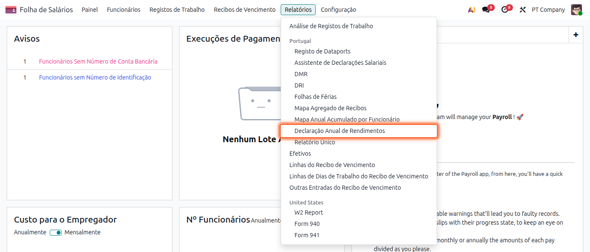
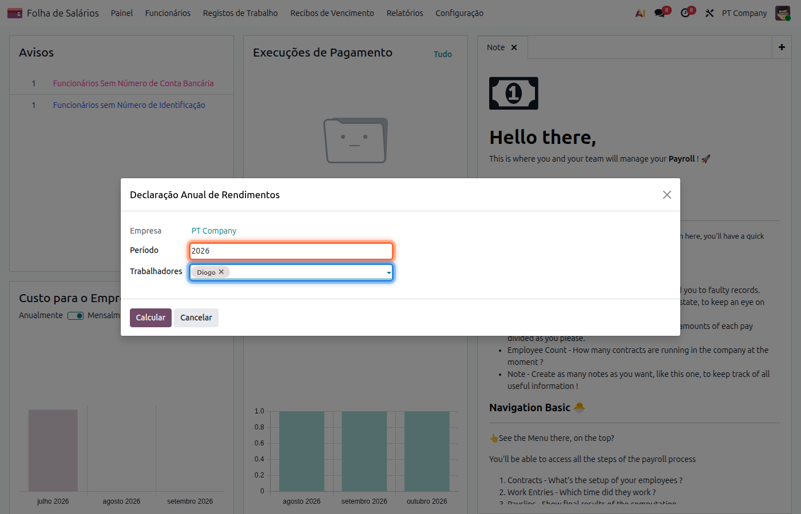
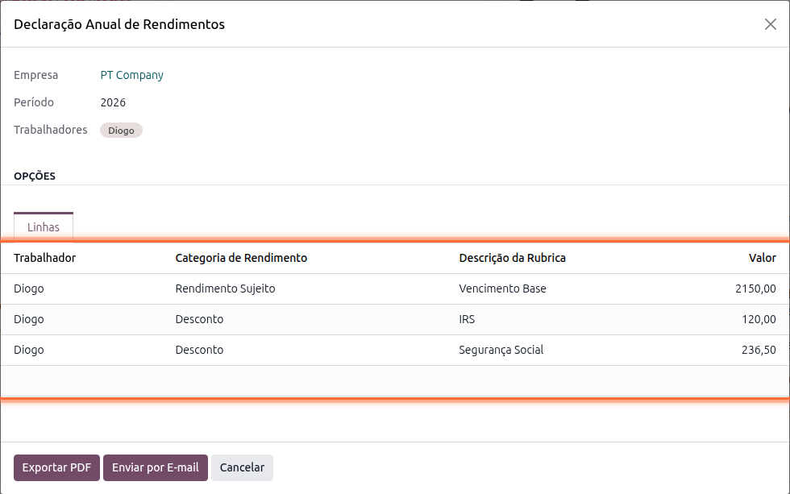
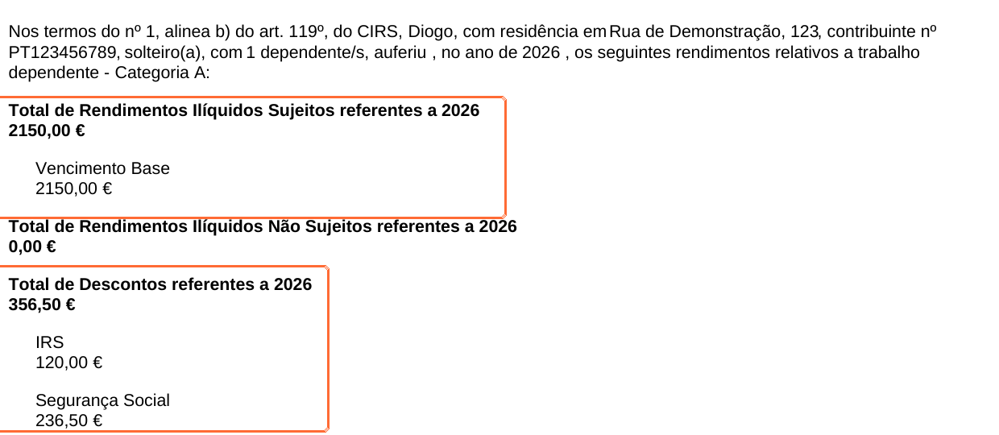

:show-content:

===============================
Declaração Anual de Rendimentos
===============================
A Declaração Anual de Rendimentos é o documento que a entidade empregadora entrega a cada trabalhador
com o resumo dos rendimentos de trabalho dependente (Categoria A) pagos num determinado ano, dos
descontos de IRS e de Segurança Social efetuados, nos termos do artigo 119º, nº 1, alínea b) do CIRS

.. important::
    Para que o assistente consiga emitir a declaração, o trabalhador tem de ter a **morada**
    preenchida na sua ficha. Se faltar, o assistente avisa antes de calcular quais os trabalhadores
    em falta

Para a gerar aceda à app **Salários**, vá ao menu :menuselection:`Relatórios --> Declaração Anual de
Rendimentos`

Escolha o **Período** (ano) a que se refere a declaração e selecione os **Trabalhadores** para os
quais pretende emitir o documento

Carregue em **Calcular** para que o assistente reúna, a partir dos recibos de vencimento
processados nesse ano, os valores de rendimento sujeito, rendimento não sujeito e descontos de cada
trabalhador. Estes valores ficam disponíveis no separador **Linhas** para revisão antes de emitir o
documento final

.. tip::
    Pode rever e alterar manualmente estas linhas antes de exportar, por exemplo para corrigir um
    valor pontual sem ter de voltar a alterar o recibo de vencimento de origem

Terminada a revisão tem duas opções:

- **Exportar PDF**, para obter uma declaração por trabalhador pronta a arquivar ou entregar
- **Enviar por E-mail**, para que o Odoo envie automaticamente a cada trabalhador selecionado o seu
  próprio documento, usando o e-mail pessoal registado na sua ficha

.. important::
    Para o envio automático por e-mail é necessário que o trabalhador tenha o campo **E-mail
    Pessoal** preenchido; caso contrário o assistente aponta os trabalhadores em falta

O documento gerado resume, por trabalhador, o total de rendimentos ilíquidos sujeitos, o total de
rendimentos não sujeitos e o total de descontos (IRS e Segurança Social) do período escolhido

