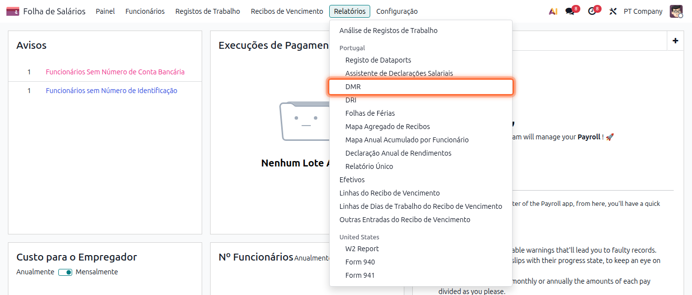
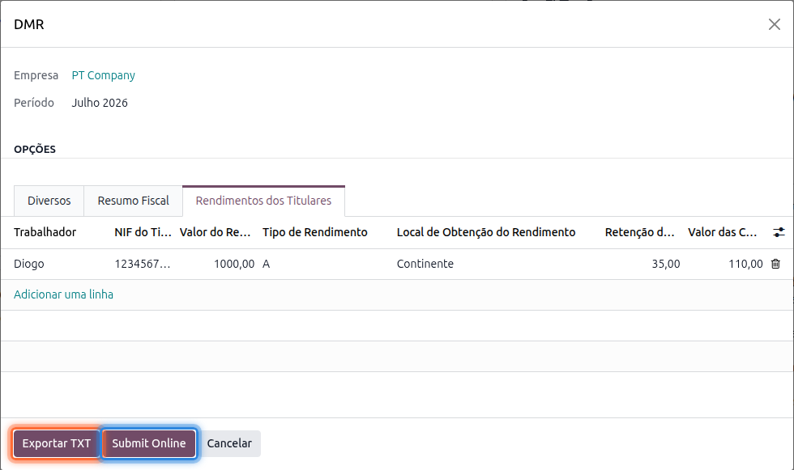
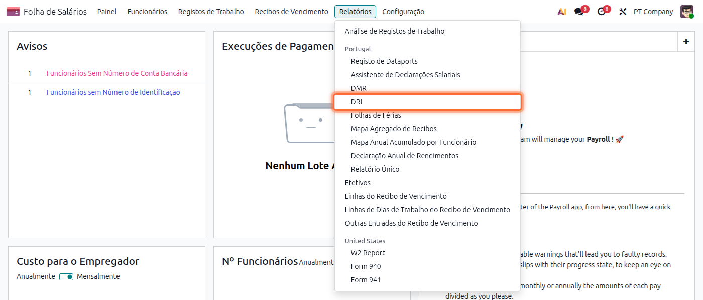
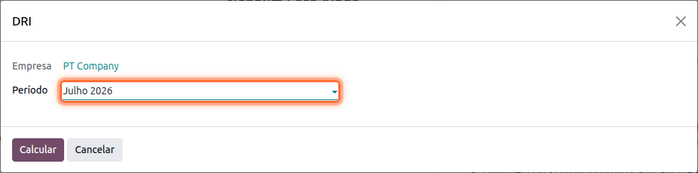
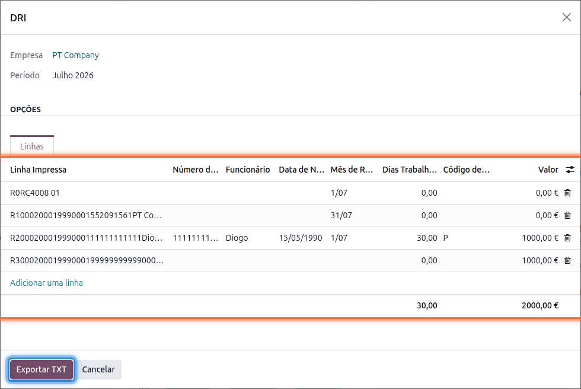

:show-content:

=========
DMR e DRI
=========
A DMR e a DRI são duas declarações periódicas, com base nos recibos de vencimento processados, que
a entidade empregadora tem de submeter às entidades oficiais. Veja como as preparar a partir da app
**Salários**

.. raw:: html

    

        ─── ✦ ───
    

DMR
===
A Declaração Mensal de Remunerações (DMR-AT) é a declaração mensal que reporta à Autoridade
Tributária os rendimentos de cada trabalhador, as retenções de IRS e as contribuições obrigatórias
desse mês

Para a preparar aceda à app **Salários**, vá ao menu :menuselection:`Relatórios --> DMR`

Escolha o **Período** (mês) a que se refere a declaração

Carregue em **Calcular**. O assistente organiza a informação em três separadores:

- **Diversos**: serviço de finanças, NIF, tipo de declaração e identificação dos responsáveis pela
  declaração
- **Resumo Fiscal**: totais de rendimentos sujeitos, isentos e não sujeitos, com as respetivas
  retenções de IRS e contribuições obrigatórias

  .. image:: dmr_dri/v19_dmr_fiscal_summary.png
     :align: center

- **Rendimentos dos Titulares**: uma linha por trabalhador e tipo de rendimento, com o valor, a
  retenção de IRS e as contribuições obrigatórias

  .. image:: dmr_dri/v19_dmr_lines.png
     :align: center

.. tip::
    Pode rever e ajustar manualmente estes valores antes de exportar, por exemplo para corrigir o
    NIF de um titular ou o código de rendimento de uma linha

Terminada a revisão tem duas opções:

- **Exportar TXT**, para obter o ficheiro no formato oficial DMR-AT e submetê-lo manualmente no
  Portal das Finanças
- **Submit Online** *(nome ainda por traduzir na interface)*, para submeter a declaração
  diretamente à Autoridade Tributária a partir do Odoo

.. important::
    A submissão direta exige as credenciais de acesso ao Portal das Finanças de um utilizador com
    poderes de representação da empresa. Confirme sempre os valores nos separadores **Resumo
    Fiscal** e **Rendimentos dos Titulares** antes de submeter, já que a submissão online é
    equivalente a entregar a declaração oficial na AT

DRI
===
A Declaração de Remunerações Individual (DRI) utiliza o mesmo formato de registos (Cabeçalho,
Estabelecimento, um registo por Funcionário e Totais) que a :doc:`Folha de Férias <mapa_seguros>`,
mas em vez de ser dirigida a uma seguradora é dirigida à Segurança Social Direta e abrange todos os
trabalhadores da empresa nesse mês, não apenas os cobertos por uma apólice de seguro

Para a preparar aceda à app **Salários**, vá ao menu :menuselection:`Relatórios --> DRI`

Escolha o **Período** (mês) a que se refere a declaração

Carregue em **Calcular** para obter a pré-visualização dos registos, com um registo por
trabalhador, incluindo os dias trabalhados e o valor de vencimento desse mês

Carregue em **Exportar TXT** para obter o ficheiro pronto a entregar à Segurança Social
