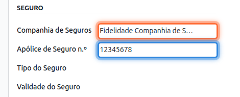
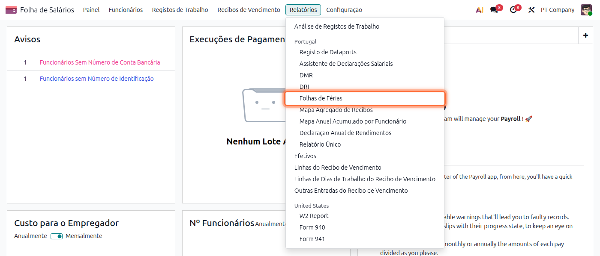
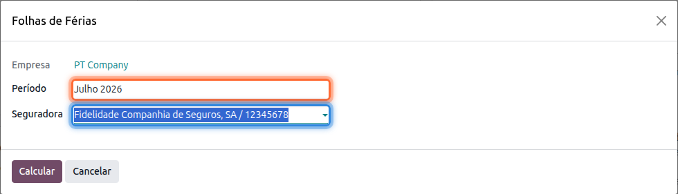
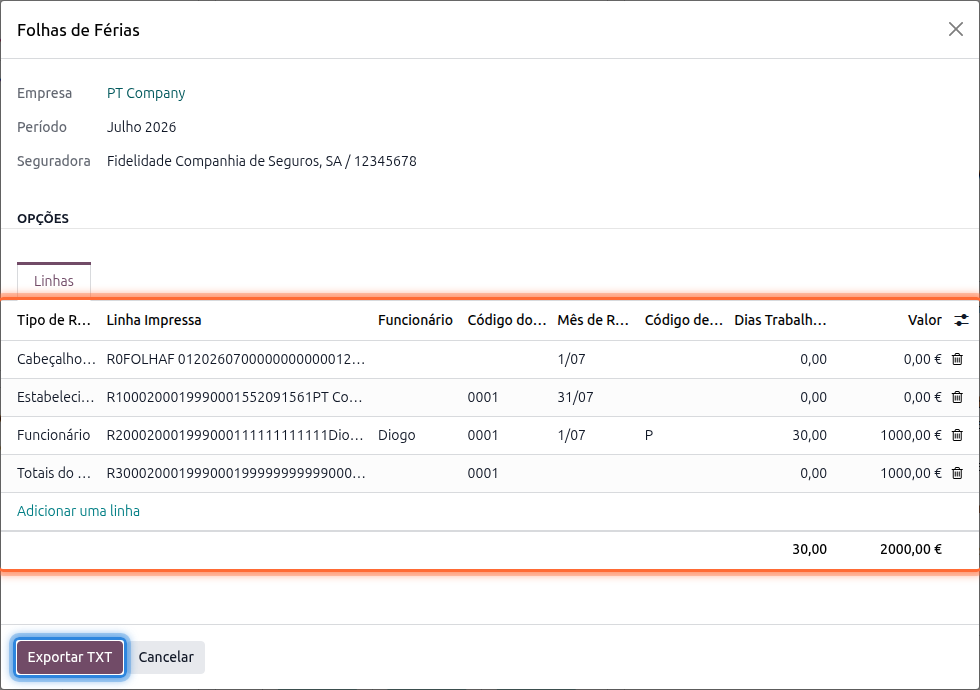

:show-content:

===============
Mapa de Seguros
===============
O seguro de acidentes de trabalho obriga a entidade empregadora a comunicar periodicamente à
seguradora os dias de trabalho e de férias de cada trabalhador seguro, para efeitos de cálculo do
prémio. Veja como gerar essa comunicação (Folha de Férias) a partir da app **Salários**

.. raw:: html

    

        ─── ✦ ───
    

Configuração
============
Para que um trabalhador apareça neste mapa, tem de ter a sua apólice de seguro identificada na
ficha. Aceda à app **Funcionários**, abra o registo do trabalhador, aba **Pessoal**, secção
**Seguro**, e preencha os campos **Companhia de Seguros** e **Apólice de Seguro n.º**

.. tip::
    Se ainda não existir nenhuma seguradora disponível para escolher, pode criá-la diretamente
    neste campo

Folha de Férias
===============
Para gerar o mapa aceda à app **Salários**, vá ao menu :menuselection:`Relatórios --> Folhas de
Férias`

Escolha o **Período** (mês) e a **Seguradora** para a qual pretende gerar o mapa; só aparecem aqui
as seguradoras já associadas a pelo menos um trabalhador

Carregue em **Calcular**. O assistente monta o ficheiro no formato DRI (registos de Cabeçalho,
Estabelecimento, um registo por Funcionário segurado por essa apólice, e Totais), já com os dias
trabalhados e o valor de vencimento de cada trabalhador nesse mês

.. tip::
    Cada linha da pré-visualização corresponde a um registo do ficheiro final; pode conferir aqui
    os dias trabalhados e o valor antes de exportar

Carregue em **Exportar TXT** para obter o ficheiro pronto a entregar à seguradora
