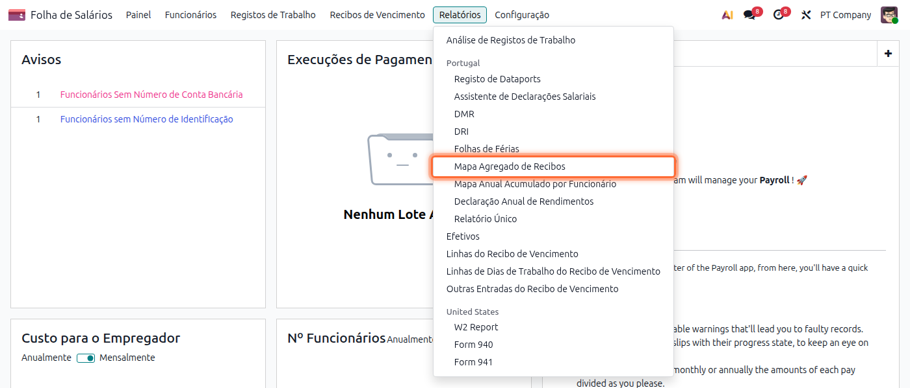
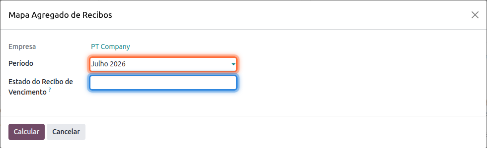
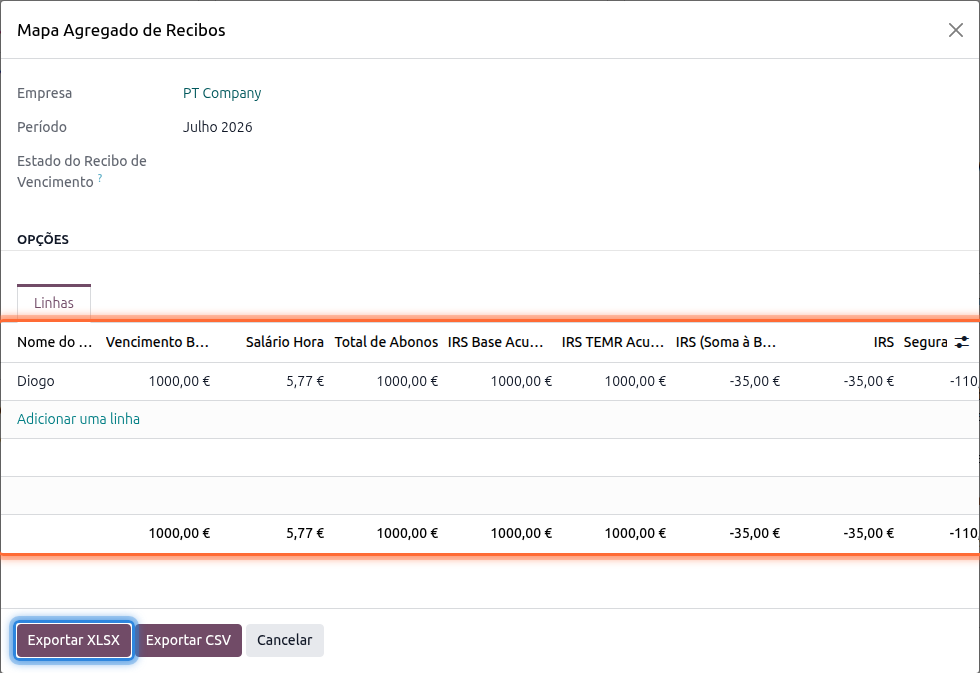

:show-content:

========================
Mapa Agregado de Recibos
========================
Este mapa junta, num único ficheiro, os valores de todos os recibos de vencimento de um período,
um por linha por trabalhador, incluindo vencimento base, salário/hora, total de abonos, bases e
valores de IRS, Segurança Social, horas extra e dias de férias/feriados

.. raw:: html

    

        ─── ✦ ───
    

Para o obter aceda à app **Salários**, vá ao menu :menuselection:`Relatórios --> Mapa Agregado de
Recibos`

Escolha o **Período** e, opcionalmente, o **Estado do Recibo de Vencimento** para restringir o mapa
a recibos num estado específico (por omissão são considerados os recibos **Validados** e **Pagos**)

Carregue em **Calcular** para obter uma pré-visualização com uma linha por trabalhador

.. tip::
    A tabela de pré-visualização tem mais colunas do que as visíveis inicialmente; percorra-a
    horizontalmente para consultar as horas extra e os dias de férias/feriados de cada trabalhador

Pode depois exportar o mapa em **Exportar XLSX** ou **Exportar CSV**, consoante o formato que
pretenda usar para análise posterior
