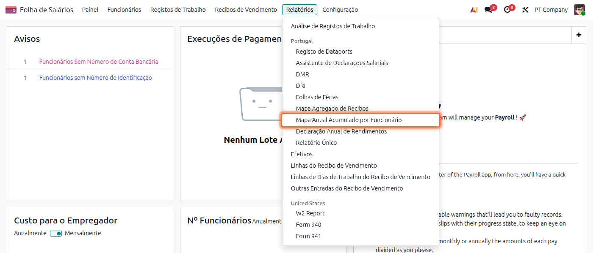
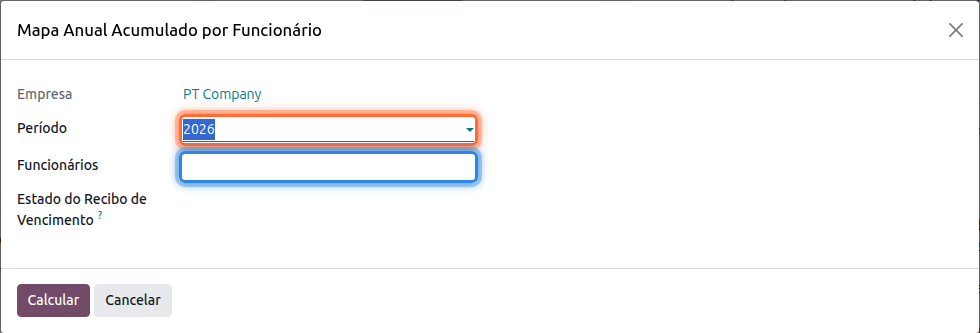
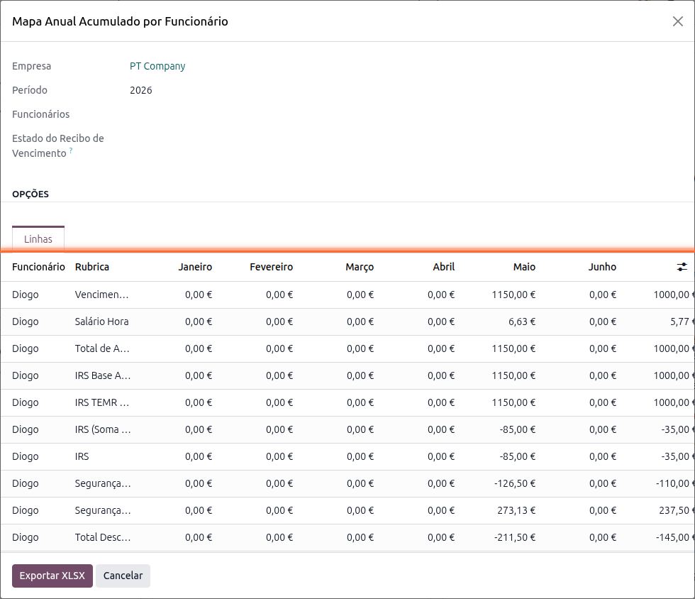

:show-content:

====================================
Mapa Anual Acumulado por Funcionário
====================================
Este mapa mostra, para cada trabalhador e cada rubrica salarial, o valor processado em cada mês do
ano, com o respetivo total anual, o que é útil para conferir a evolução de vencimentos e descontos
ao longo do ano

.. raw:: html

    

        ─── ✦ ───
    

Para o obter aceda à app **Salários**, vá ao menu :menuselection:`Relatórios --> Mapa Anual
Acumulado por Funcionário`

Escolha o **Período** (ano), opcionalmente os **Funcionários** a incluir (se não selecionar nenhum,
são considerados todos) e o **Estado do Recibo de Vencimento**

Carregue em **Calcular** para obter a matriz de valores mensais por trabalhador/rubrica

.. tip::
    Percorra a tabela horizontalmente para ver todos os meses do ano e a coluna de **Total** no
    final

Carregue em **Exportar XLSX** para obter o ficheiro completo, organizado com um bloco por
trabalhador e uma coluna por mês
