:show-content:

========================
Processamento de Recibos
========================
Os recibos de vencimento de todos os funcionários de um mês são processados de uma só vez numa
**execução de pagamento** (lote). Veja como criar, calcular, validar e enviar os recibos em lote,
como processar um recibo individual, e como emitir recibos independentes.

.. raw:: html

    

        ─── ✦ ───
    

Processar recibos em lote
=========================

Criar a execução de pagamento
-----------------------------
Na app **Folha de Salários**, vá ao menu
:menuselection:`Recibos de Vencimento --> Execuções de Pagamento`.

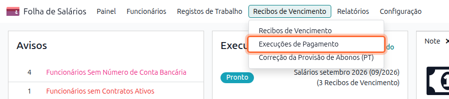

A lista mostra as execuções agrupadas por estado (**Pronto**, **Concluído**, **Pago**), com o custo
para a entidade patronal, o bruto e o líquido de cada uma. Carregue em **Novo**.

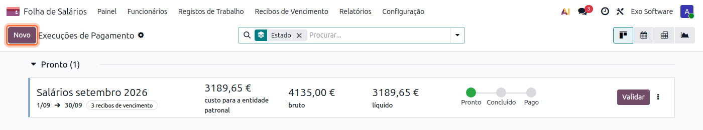

Preencha a **Nova Execução de Pagamento**:

.. list-table::
   :header-rows: 1
   :widths: 25 75

   * - Campo
     - Descrição
   * - **Recibo Independente**
     - Deixe vazio para processar os salários do mês. Escolha **Subsídio de Férias** ou
       **Subsídio de Natal** para emitir, em lote, os recibos independentes desse subsídio (ver
       `Recibos independentes`_).
   * - **Estrutura do Salário**
     - Vazio processa todas as estruturas. Para os salários portugueses é usada a estrutura
       **PT: Pagamento Mensal**.
   * - **Periodicidade de Pagamento**
     - Normalmente **mês**.
   * - **Período**
     - Primeiro e último dia do mês a processar.

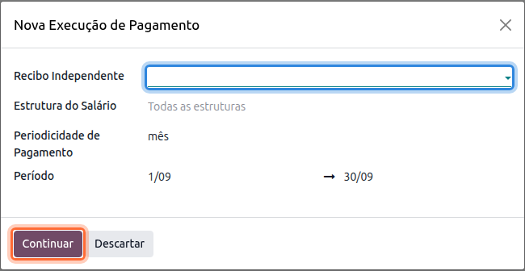

Carregue em **Continuar**.

Gerar os recibos
----------------
Na janela **Selecionar Funcionários** aparecem os funcionários com contrato ativo no período.
Selecione os funcionários a processar e carregue em **Selecionar**.

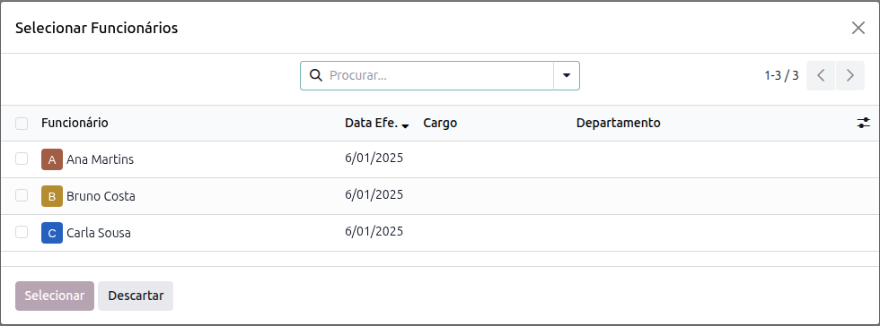

Para acrescentar mais funcionários a uma execução já criada, use o menu **⋮** do cartão da execução
e escolha **Gerar Recibos de Vencimento**.

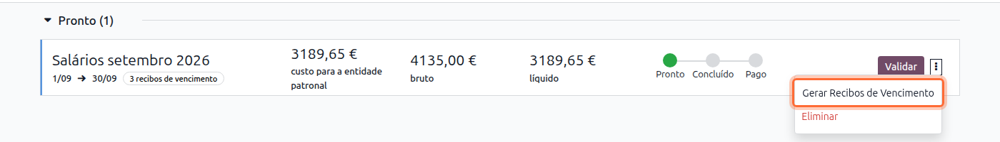

Ao gerar os recibos, o Odoo:

- gera as entradas de trabalho do período (assiduidade, ausências, faltas);
- ajusta o período de cada recibo às datas de início e de fim do contrato, quando o funcionário
  entra ou sai a meio do mês;
- junta os complementos salariais ativos de cada funcionário (ver :doc:`abonos_descontos`);
- calcula os recibos (vencimento, subsídios, IRS, Segurança Social e líquido).

.. note::
    Se houver conflitos nas entradas de trabalho, por exemplo uma ausência sobreposta a outra, os
    recibos não são gerados. Resolva os conflitos em **Registos de Trabalho** e gere de novo.

Rever e validar
---------------
Abra a execução para ver os recibos gerados, com o salário base, o bruto, o líquido e o estado de
cada um.

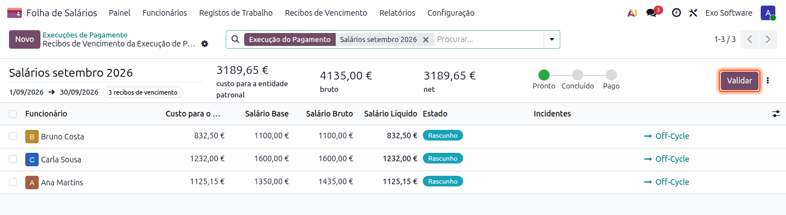

Abra um recibo para conferir o detalhe no separador **Cálculo de Salário**. Se alterar alguma
informação do funcionário, das ausências ou das entradas salariais, carregue em **Calcular Recibo**
para o recalcular.

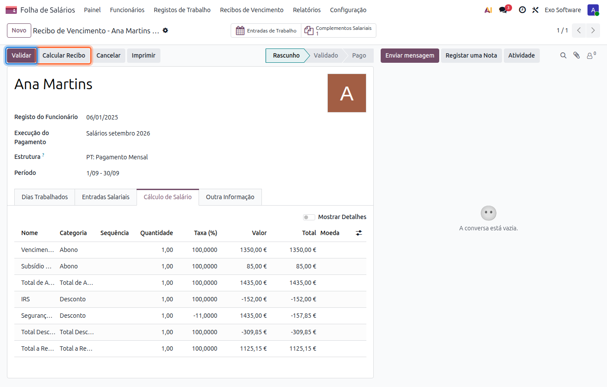

Quando todos os recibos estiverem corretos, carregue em **Validar** na execução. Os recibos passam a
**Validado**, é gerado o PDF de cada recibo e é criado o lançamento contabilístico no diário de
salários. A execução passa a **Concluído**. Depois de efetuar os pagamentos, carregue em
**Marcar como pago**.

.. important::
    Os recibos de vencimento portugueses não podem ser estornados. Para corrigir um recibo validado,
    cancele-o e processe-o de novo.

Enviar os recibos por email
---------------------------
Na lista de recibos, selecione os recibos a enviar e escolha
:menuselection:`Ações --> Enviar Recibo(s) por Email PT`.

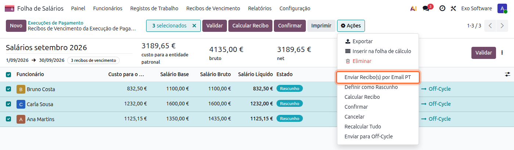

Os recibos ficam marcados para envio e são enviados em segundo plano, de 30 em 30, para o email de
cada funcionário. Só são enviados recibos validados ou pagos.

Processar um recibo individual
==============================
Para processar o recibo de um só funcionário, fora de uma execução de pagamento (por exemplo, uma
admissão ou uma correção depois de o lote estar fechado), vá ao menu
:menuselection:`Recibos de Vencimento --> Recibos de Vencimento` e carregue em
**Novo Off-Cycle**.

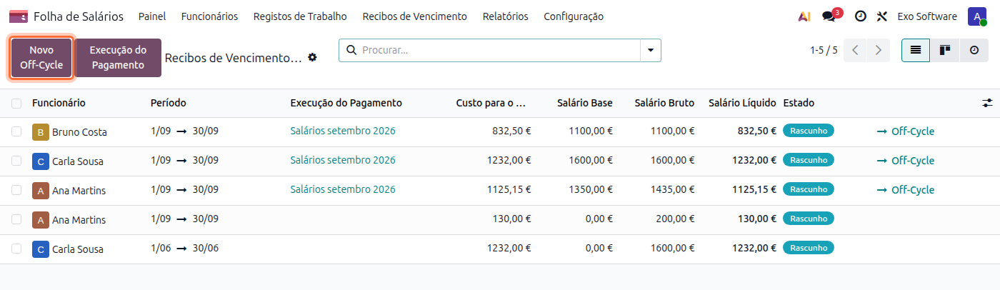

1. Escolha o **funcionário**. A **Estrutura** (**PT: Pagamento Mensal**) e o **Período** (mês
   atual) são preenchidos a partir do contrato; ajuste o período se o recibo for de outro mês.

2. Confira o separador **Dias Trabalhados**, com a assiduidade e as ausências do período, vindas
   das entradas de trabalho.

3. Confira o separador **Entradas Salariais**. Os complementos salariais ativos do funcionário já
   aparecem (ver :doc:`abonos_descontos`). Carregue em **Adicionar uma linha** para lançar outras
   remunerações ou descontos do mês, por exemplo um prémio ou horas extra.

   .. image:: recibos_derclaracoes/v19_recibos_individual_novo.png
      :align: center

4. Carregue em **Calcular Recibo** e confira o separador **Cálculo de Salário**.

5. Carregue em **Validar**. O recibo passa a **Validado**, é gerado o PDF e é criado o lançamento
   contabilístico. Use **Imprimir** para obter o PDF ou
   :menuselection:`Ações --> Enviar Recibo(s) por Email PT` para o enviar ao funcionário.

.. note::
    Se o funcionário já tiver outro recibo no mesmo mês, os recibos ficam ligados (campos
    **Recibo Anterior** / **Recibo Posterior** e botão **Periodo de Referência**). O IRS é calculado
    sobre o total do mês e cada recibo desconta o IRS já retido nos anteriores.

Recibos independentes
=====================
Um recibo independente é um recibo separado do recibo de salário do mês, com os respetivos
descontos. Há três tipos, escolhidos no campo **Recibo Independente**:

.. list-table::
   :header-rows: 1
   :widths: 25 75

   * - Tipo
     - Para que serve
   * - **Subsídio de Férias**
     - Pagar o subsídio de férias num recibo próprio.
   * - **Subsídio de Natal**
     - Pagar o subsídio de Natal num recibo próprio.
   * - **Normal**
     - Pagar uma remuneração à parte do salário, por exemplo um prémio, uma gratificação ou horas
       extra (ver `Recibo independente normal`_).

Configurar no contrato
----------------------
A forma de pagamento dos subsídios define-se no contrato de cada funcionário, no separador
**Folha de Salários** da ficha do funcionário, nas secções **Subsídio de Férias** e
**Subsídio de Natal**:

.. list-table::
   :header-rows: 1
   :widths: 25 75

   * - Campo
     - Descrição
   * - **Método de Pagamento**
     - **Sem duodécimos** (pago de uma vez no mês de pagamento), **Com duodécimos a 50%** ou
       **Com duodécimos a 100%** (pago em parcelas mensais, no recibo de cada mês).
   * - **Mês de Pagamento**
     - Mês em que o subsídio é pago, quando é pago sem duodécimos.
   * - **Recibo Independente**
     - Marque para que o subsídio saia num recibo próprio, e não no recibo de salário desse mês.

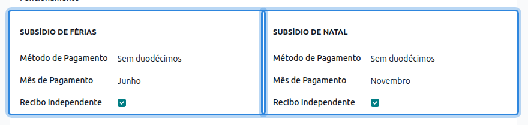

.. tip::
    Os valores por omissão destes campos, para os novos contratos, definem-se nas definições da
    **Folha de Salários**.

Com **Recibo Independente** marcado, o recibo de salário do mês de pagamento deixa de incluir o
subsídio, e é preciso emitir o recibo independente.

Emitir em lote
--------------
Crie uma execução de pagamento, como em `Criar a execução de pagamento`_, e escolha no campo
**Recibo Independente** o subsídio a pagar. Todos os recibos gerados nessa execução são recibos
independentes desse subsídio.

Emitir recibo a recibo
----------------------
Crie o recibo como em `Processar um recibo individual`_ e, antes de calcular, preencha no separador
**Outra Informação** o campo **Recibo Independente** com o subsídio a pagar. Carregue em
**Calcular Recibo**.

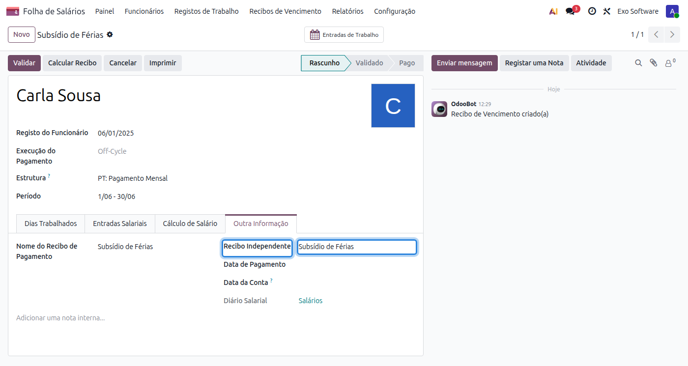

O recibo independente não tem dias trabalhados nem complementos salariais. Tem apenas o subsídio,
o IRS e a Segurança Social correspondentes, e o líquido.

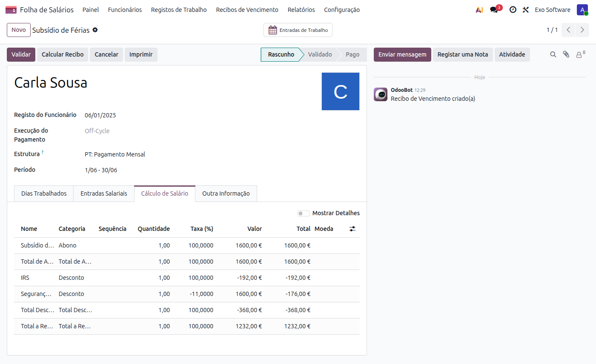

.. note::
    O IRS do subsídio é retido por taxa autónoma, separada da do salário do mês. Quando há mais de
    um recibo no mesmo mês, o recibo seguinte desconta o IRS já retido nos anteriores, para não
    haver retenção em duplicado.

Recibo independente normal
--------------------------
O recibo independente **Normal** serve para pagar uma remuneração à parte, num recibo separado do
recibo de salário do mês: um prémio, uma gratificação, horas extra ou outro abono pontual.

1. Em :menuselection:`Recibos de Vencimento --> Recibos de Vencimento`, carregue em
   **Novo Off-Cycle** e escolha o funcionário e o período.

2. No separador **Outra Informação**, escolha **Normal** no campo **Recibo Independente**.

   .. image:: recibos_derclaracoes/v19_recibos_normal_info.png
      :align: center

3. No separador **Entradas Salariais**, carregue em **Adicionar uma linha** e lance a remuneração
   a pagar, com o tipo e o valor.

   .. image:: recibos_derclaracoes/v19_recibos_normal_entradas.png
      :align: center

4. Carregue em **Calcular Recibo**.

O recibo tem apenas as remunerações lançadas nas **Entradas Salariais**, o IRS, a Segurança Social e
o líquido. O vencimento base não é pago de novo: só é usado como referência para calcular o
salário-hora, por exemplo no valor das horas extra. Os complementos salariais também não entram.

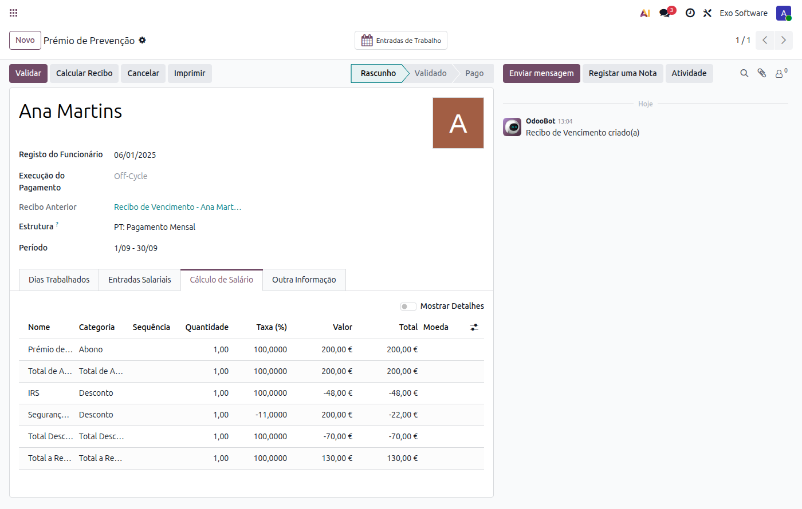

O IRS é calculado sobre o total das remunerações do mês: o recibo normal soma-se ao recibo de salário
desse mês para encontrar a taxa, e desconta o IRS já retido no recibo anterior.

.. note::
    Na execução de pagamento em lote só é possível escolher **Subsídio de Férias** ou
    **Subsídio de Natal**. O recibo independente normal é emitido recibo a recibo.
