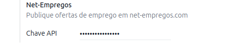
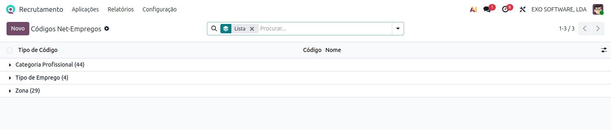
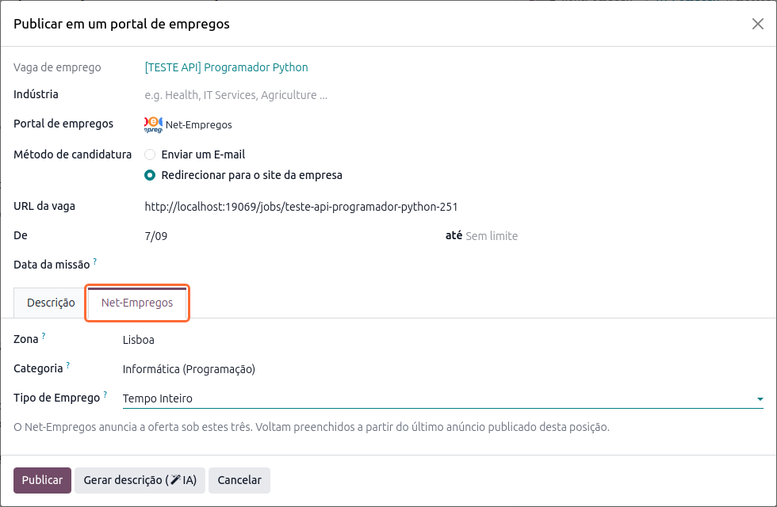

:show-content:

============
Recrutamento
============
Explore mais sobre as nossas integrações com os portais de emprego portugueses

.. _payroll_recrutamento_net_empregos:

Net-Empregos
============
A localização da **Exo Software** publica as vagas de emprego do Odoo no `Net-Empregos
<https://www.net-empregos.com>`_, um dos maiores portais de emprego em Portugal, diretamente a
partir da app **Recrutamento**

O anúncio é publicado, alterado e removido sem sair do Odoo, e cada vaga guarda aquilo com que foi
anunciada

.. raw:: html

    

        ─── ✦ ───
    

Configuração
------------

Chave API
~~~~~~~~~
Gere a chave na área de empresa do net-empregos.com, na secção **Chave API**, e cole-a no Odoo: app
**Recrutamento**, menu :menuselection:`Configuração --> Definições`, secção **Net-Empregos**

.. important::
    A chave pertence à empresa em que é introduzida. Numa base de dados multiempresa, coloque-a na
    empresa a que pertencem as vagas a anunciar: o anúncio sai sempre pela conta Net-Empregos da
    **empresa da vaga** e, numa vaga sem empresa (partilhada por todas), pela conta da empresa
    ativa

Listas do Net-Empregos
~~~~~~~~~~~~~~~~~~~~~~
O Net-Empregos anuncia cada oferta sob uma zona, uma categoria profissional e um tipo de emprego
das suas próprias listas. Estas vêm já preenchidas com o módulo e podem ser consultadas no menu
:menuselection:`Configuração --> Portais de empregos --> Códigos Net-Empregos`

Valores propostos
~~~~~~~~~~~~~~~~~
Para poupar escrita no primeiro anúncio de cada vaga, indique o campo
:guilabel:`Tipo de Emprego Net-Empregos` uma única vez em
:menuselection:`Funcionários --> Configuração --> Recrutamento --> Tipos de contratação`. A partir
daí, as ofertas a tempo inteiro, a tempo parcial e os estágios chegam já com o tipo de emprego
preenchido

Publicar uma oferta
-------------------
Abra a vaga na app **Recrutamento** e carregue em :guilabel:`Publicar em portais de vagas`. No
assistente, escolha **Net-Empregos** no campo :guilabel:`Portal de empregos`: aparece o separador
:guilabel:`Net-Empregos` com os três campos sob os quais a oferta é anunciada

- :guilabel:`Zona` — a zona do país onde a oferta é anunciada
- :guilabel:`Categoria` — a categoria profissional da oferta
- :guilabel:`Tipo de Emprego` — tempo inteiro, part-time, estágio ou teletrabalho

.. tip::
    Os campos vivem no anúncio e não na vaga, pelo que a vaga se mantém livre de um bloco de campos
    por cada portal e dois anúncios da mesma vaga podem ser diferentes

.. important::
    Os três campos são exigidos pelo Net-Empregos, tal como uma descrição com um mínimo de
    10 caracteres. O Odoo verifica-os antes de publicar e indica o que faltar

O texto do anúncio vem da descrição da vaga, com a ênfase e as ligações que ela tiver. No fim é
acrescentada uma ligação **Candidate-se**, construída a partir do método de candidatura escolhido
no assistente — a página da vaga no seu site, no caso do redirecionamento, ou o endereço de e-mail
indicado

.. note::
    O Net-Empregos não tem um campo próprio para o endereço de candidatura; o próprio portal indica
    aos anunciantes que este deve ser escrito no texto da oferta, e é isso que o Odoo faz por si

Segundo anúncio da mesma vaga
~~~~~~~~~~~~~~~~~~~~~~~~~~~~~
Publicar novamente a mesma vaga parte do **último anúncio publicado nela no Net-Empregos**, pelo que
só o primeiro anúncio de cada vaga dá trabalho a preencher

Depois de publicar
------------------
A publicação fica registada no menu
:menuselection:`Aplicações --> Publicações no portal de empregos`, com o estado que o Net-Empregos
devolveu. O separador :guilabel:`Net-Empregos` da publicação mostra a zona, a categoria e o tipo de
emprego com que a oferta foi anunciada, e é onde se alteram para um novo envio

- :guilabel:`Atualizar` substitui o conteúdo do anúncio no portal
- :guilabel:`Parar campanhas` remove o anúncio do Net-Empregos
