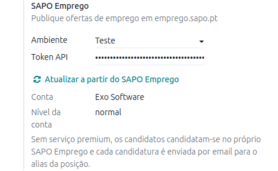
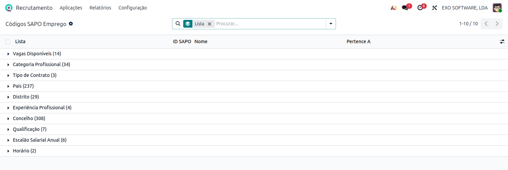
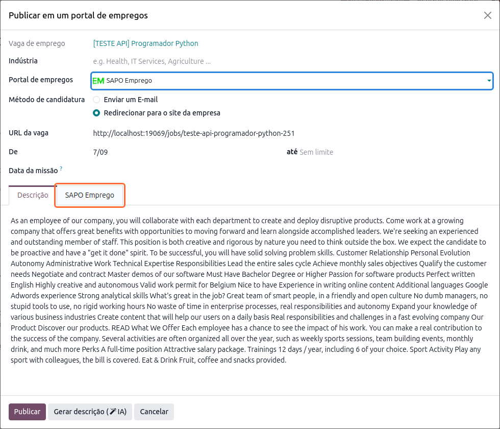
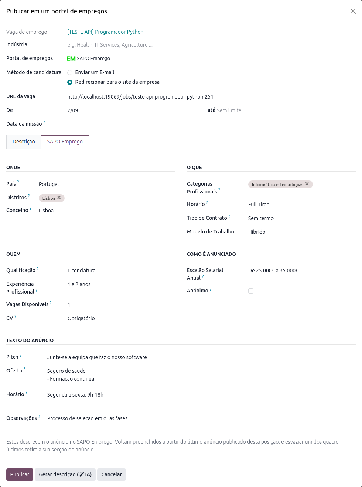
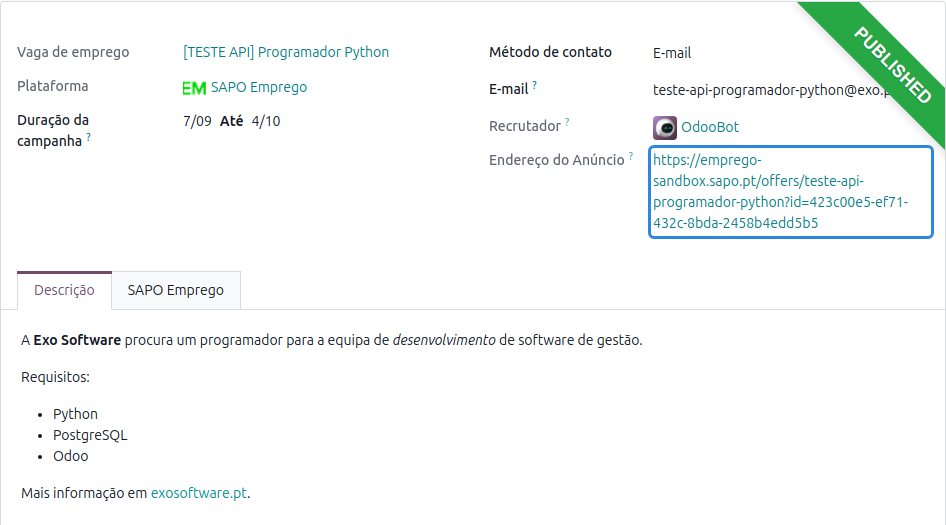
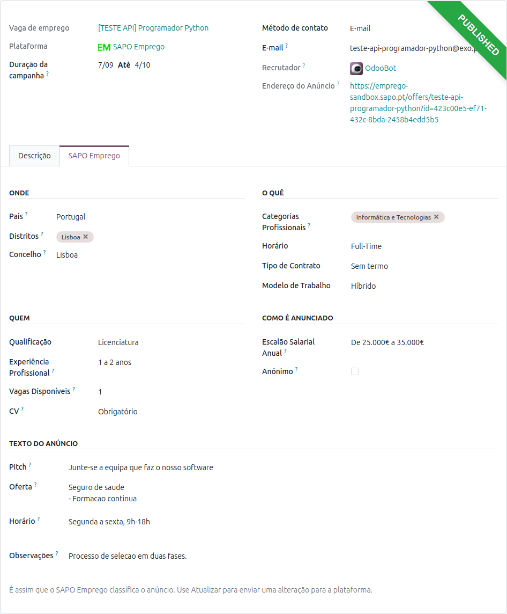

:show-content:

============
Recrutamento
============
Explore mais sobre as nossas integrações com os portais de emprego portugueses

.. _payroll_recrutamento_sapo_emprego:

SAPO Emprego
============
A localização da **Exo Software** publica as vagas de emprego do Odoo no `SAPO Emprego
<https://emprego.sapo.pt>`_, um dos maiores portais de emprego em Portugal, diretamente a partir da
app **Recrutamento**

O anúncio é publicado, alterado e retirado das listagens sem sair do Odoo, cada vaga guarda o que
foi publicado (incluindo o endereço público do anúncio) e as candidaturas regressam ao Odoo como
candidatos dessa vaga

.. raw:: html

    

        ─── ✦ ───
    

Configuração
------------

Token de acesso
~~~~~~~~~~~~~~~
O SAPO Emprego dá acesso à sua API em dois passos: primeiro emite um token de **teste** e só depois
de aprovar um anúncio publicado por essa via é que emite o token de **produção**

Peça o token na área de empresa do portal, na secção **API**, e cole-o no Odoo: app
**Recrutamento**, menu :menuselection:`Configuração --> Definições`, secção **SAPO Emprego**

- :guilabel:`Ambiente` — **Teste** enquanto usa o token de teste, **Produção** depois de o SAPO
  aprovar o anúncio
- :guilabel:`Token API` — o token do ambiente escolhido

O botão :guilabel:`Atualizar a partir do SAPO Emprego` lê a conta e as listas da plataforma. O nome
da conta, o seu nível e os serviços premium contratados passam a ser apresentados abaixo do token,
tal como o SAPO Emprego os reporta

.. important::
    O token pertence à empresa em que é introduzido. Numa base de dados multiempresa, coloque-o na
    empresa a que pertencem as vagas a anunciar: o anúncio sai sempre pela conta SAPO Emprego da
    **empresa da vaga** e, numa vaga sem empresa (partilhada por todas), pela conta da empresa ativa

Listas do SAPO Emprego
~~~~~~~~~~~~~~~~~~~~~~
O SAPO Emprego só aceita um anúncio descrito pelas suas próprias listas — países, distritos,
concelhos, categorias profissionais, horários, tipos de contrato, qualificações, experiência
profissional, escalões salariais e vagas disponíveis. O mesmo botão
:guilabel:`Atualizar a partir do SAPO Emprego` lê essas dez listas da plataforma e, a partir daí,
elas atualizam-se sozinhas uma vez por dia

Para as consultar vá ao menu
:menuselection:`Configuração --> Portais de empregos --> Códigos SAPO Emprego`

.. important::
    Enquanto esta primeira atualização não for feita não é possível publicar: o SAPO Emprego exige
    o país, os distritos, as categorias profissionais, o horário e o escalão salarial anual, e sem
    as listas não há nada para escolher

Alias de e-mail da vaga
~~~~~~~~~~~~~~~~~~~~~~~
Sem serviço premium, os candidatos candidatam-se no próprio SAPO Emprego e cada candidatura é
enviada por e-mail. Para que essa candidatura se transforme sozinha num candidato no Odoo, dê à
vaga o seu **próprio alias de e-mail**: abra a vaga na app **Recrutamento** e preencha o campo
:guilabel:`E-mail de candidatura` (é preciso ter um domínio de alias configurado para o poder
escolher)

.. important::
    Uma vaga sem alias e sem responsável com e-mail profissional não pode ser publicada no SAPO
    Emprego, e o Odoo di-lo antes de gastar qualquer chamada à plataforma

Valores propostos
~~~~~~~~~~~~~~~~~
Para poupar escrita no primeiro anúncio de cada vaga, os equivalentes SAPO Emprego podem ser
indicados uma única vez na configuração:

- em :menuselection:`Funcionários --> Configuração --> Recrutamento --> Tipos de contratação`,
  os campos :guilabel:`Horário SAPO Emprego` e :guilabel:`Tipo de Contrato SAPO Emprego`
- em :menuselection:`Recrutamento --> Configuração --> Aplicações --> Graus`, o campo
  :guilabel:`Qualificação SAPO Emprego`

A partir daí, o primeiro anúncio de uma vaga chega já com o horário e o tipo de contrato do tipo de
contratação da vaga, e com a qualificação do grau esperado

Publicar uma oferta
-------------------
Abra a vaga na app **Recrutamento** e carregue em :guilabel:`Publicar em portais de vagas`. No
assistente, escolha **SAPO Emprego** no campo :guilabel:`Portal de empregos`

Escolher o portal faz aparecer o separador :guilabel:`SAPO Emprego`, que reúne tudo o que a
plataforma precisa de saber sobre o anúncio

.. tip::
    Os campos vivem no anúncio e não na vaga, pelo que a vaga se mantém livre de um bloco de campos
    por cada portal e dois anúncios da mesma vaga podem ser diferentes

O separador está organizado em cinco blocos:

.. list-table::
   :header-rows: 1
   :widths: 25 75

   * - Bloco
     - O que contém
   * - **Onde**
     - O :guilabel:`País`, os :guilabel:`Distritos` e o :guilabel:`Concelho` do anúncio
   * - **O quê**
     - As :guilabel:`Categorias Profissionais`, o :guilabel:`Horário`, o
       :guilabel:`Tipo de Contrato` e o :guilabel:`Modelo de Trabalho` (presencial, híbrido ou
       remoto)
   * - **Quem**
     - A :guilabel:`Qualificação` mínima, a :guilabel:`Experiência Profissional`, o número de
       :guilabel:`Vagas Disponíveis` e se o :guilabel:`CV` é obrigatório, opcional ou não aceite
   * - **Como é anunciado**
     - O :guilabel:`Escalão Salarial Anual` e se o anúncio é :guilabel:`Anónimo` (sem o nome da
       empresa)
   * - **Texto do anúncio**
     - O :guilabel:`Pitch` (a linha sob o título), a :guilabel:`Oferta`, o :guilabel:`Horário` e as
       :guilabel:`Observações`, cada um a alimentar a secção com o mesmo nome no anúncio

.. important::
    O SAPO Emprego exige o :guilabel:`País`, os :guilabel:`Distritos`, as
    :guilabel:`Categorias Profissionais`, o :guilabel:`Horário` e o
    :guilabel:`Escalão Salarial Anual`, e publica sempre por um período fixo, pelo que a
    :guilabel:`Duração da campanha` tem de ter data de fim. O Odoo verifica tudo isto antes de
    publicar e nomeia o que faltar

O que já está no Odoo não é pedido outra vez: a descrição do anúncio vem da descrição da vaga, os
seus **requisitos** preenchem a secção *Perfil* (um requisito por linha) e as suas **competências**
preenchem *Competências*

.. note::
    O SAPO Emprego não publica endereços web nem de e-mail dentro de um anúncio. Os que a descrição
    da vaga tiver são retirados do texto e indicados na publicação, para que se saiba exatamente o
    que ficou de fora

Segundo anúncio da mesma vaga
~~~~~~~~~~~~~~~~~~~~~~~~~~~~~
Publicar novamente a mesma vaga parte do **último anúncio publicado nela no SAPO Emprego**, pelo
que só o primeiro anúncio de cada vaga dá trabalho a escrever. Esvaziar um dos quatro campos de
texto retira a respetiva secção do anúncio

Depois de publicar
------------------
A publicação fica registada no menu
:menuselection:`Aplicações --> Publicações no portal de empregos`, com o estado que o SAPO Emprego
devolveu

O campo :guilabel:`Endereço do Anúncio` é o endereço público do anúncio no SAPO Emprego, lido de
volta da plataforma. É este endereço que o SAPO pede para aprovar o acesso à produção

O separador :guilabel:`SAPO Emprego` da publicação mostra tudo aquilo com que o anúncio foi
publicado, e é onde se alteram os dados para um novo envio

- :guilabel:`Atualizar` envia as alterações para a plataforma
- :guilabel:`Parar campanhas` retira o anúncio das listagens. O SAPO Emprego não permite apagar um
  anúncio, apenas colocá-lo em pausa, pelo que é isso que retirar significa aqui — e publicar
  novamente retoma o mesmo anúncio em vez de pagar um segundo

.. important::
    O título, o país e os distritos ficam fixos no momento em que o anúncio é criado. Se forem
    alterados no Odoo depois disso, a publicação avisa que a plataforma continua a mostrar os
    originais, em vez de a alteração se perder em silêncio

Candidaturas
------------
Existem dois caminhos para as candidaturas, e o Odoo usa o que a conta permitir:

- **Sem serviço premium** — os candidatos candidatam-se no próprio SAPO Emprego e cada candidatura
  é enviada para o alias de e-mail da vaga, onde o Odoo a arquiva como candidato dessa vaga
- **Com o serviço premium correspondente** — escolhendo o método de candidatura
  :guilabel:`Redirecionar para o site da empresa`, o anúncio leva os candidatos diretamente à
  página da vaga no seu site

.. warning::
    O redirecionamento é um serviço premium do SAPO Emprego. Numa conta sem esse serviço a
    plataforma aceita o endereço e ignora-o sem avisar, pelo que o Odoo verifica os serviços da
    conta e, quando o redirecionamento não é possível, diz na publicação qual é a conta em causa e
    para que endereço as candidaturas chegam realmente

Do teste para a produção
------------------------
#. Com o :guilabel:`Ambiente` em **Teste**, publique um anúncio
#. Envie ao SAPO Emprego o :guilabel:`Endereço do Anúncio` que a publicação mostra
#. Depois de o SAPO aprovar, peça o token de produção na área de empresa do portal
#. No Odoo, mude o :guilabel:`Ambiente` para **Produção**, cole o novo token e carregue em
   :guilabel:`Atualizar a partir do SAPO Emprego`
