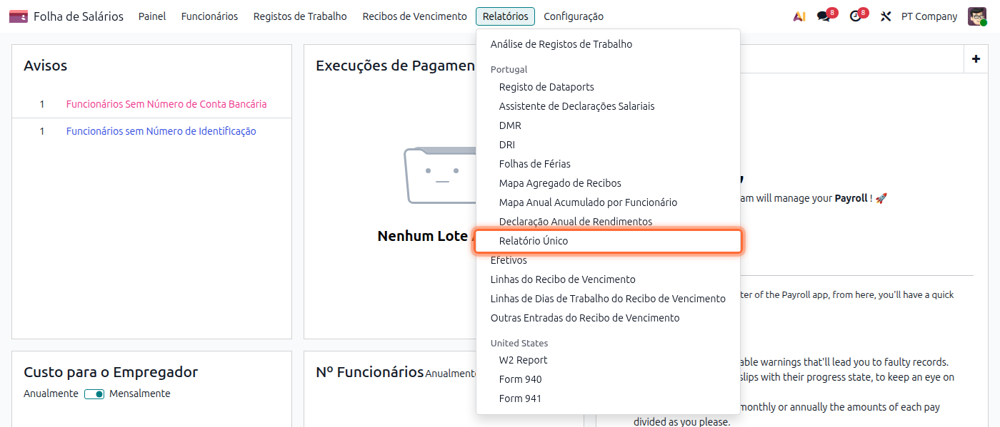
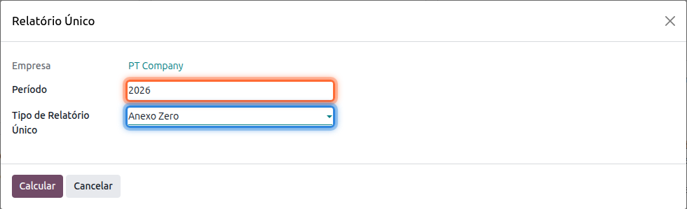
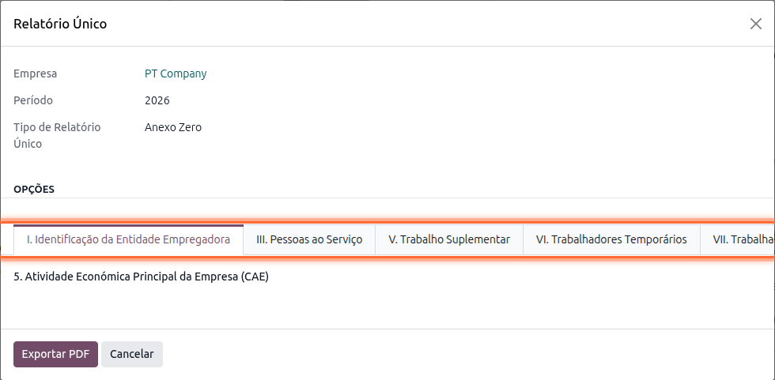

:show-content:

===============
Relatório Único
===============
O Relatório Único (RU) é a declaração anual, obrigatória para todas as entidades empregadoras,
que reúne informação sobre a empresa e os seus trabalhadores para o Ministério do Trabalho,
Solidariedade e Segurança Social. Veja como preparar o documento a partir da app **Salários**

.. raw:: html

    

        ─── ✦ ───
    

O RU divide-se em vários anexos, cada um com o seu próprio formulário oficial. Este assistente
prepara três deles:

.. list-table::
   :header-rows: 1

   * - Anexo
     - Conteúdo
   * - **Anexo Zero**
     - Identificação da entidade empregadora, pessoal ao serviço, trabalho suplementar,
       trabalhadores temporários, trabalhadores com deficiência e dados económicos da empresa
   * - **Anexo A**
     - Identificação da(s) unidade(s) local(is) (estabelecimentos) e das pessoas que aí trabalham
   * - **Anexo B**
     - Identificação da entidade empregadora e dos seus trabalhadores

Para o preparar aceda à app **Salários**, vá ao menu :menuselection:`Relatórios --> Relatório Único`

Selecione o **Período** (ano a que se refere o relatório) e o **Tipo de Relatório Único** (o anexo
que pretende preparar)

Carregue em **Calcular**. O assistente organiza a informação do anexo escolhido em várias páginas,
uma por secção do formulário oficial, já preenchidas com os dados que consegue obter da empresa e
dos recibos de vencimento do período

.. tip::
    Percorra as várias páginas para completar os campos que o Odoo não consegue preencher
    automaticamente, por exemplo os relativos a filiação sindical ou a formação profissional

.. important::
    Alguns campos, como a **Atividade Económica Principal (CAE)**, têm de ser preenchidos
    manualmente antes de exportar, caso não estejam já configurados na empresa

Terminada a revisão carregue em **Exportar PDF** para obter o formulário oficial já preenchido,
pronto a submeter na plataforma da Segurança Social
