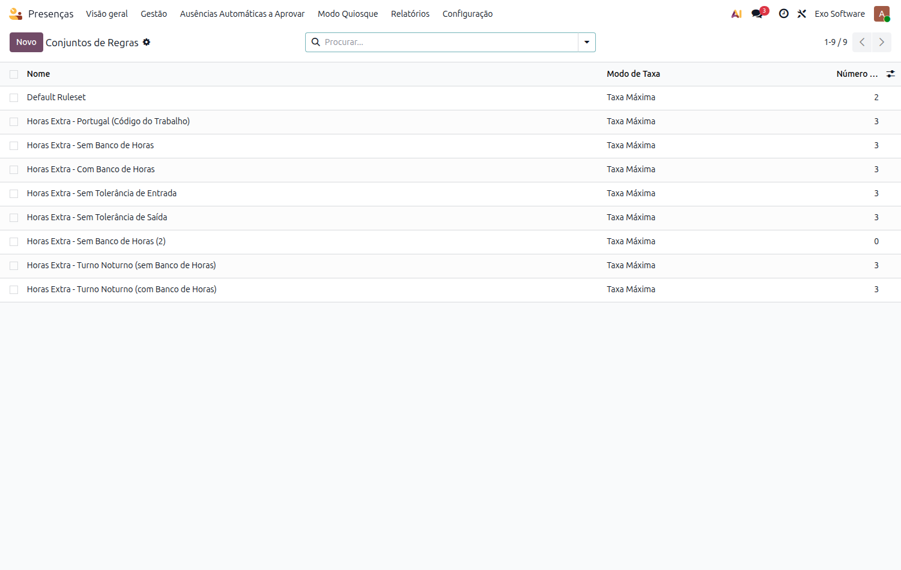
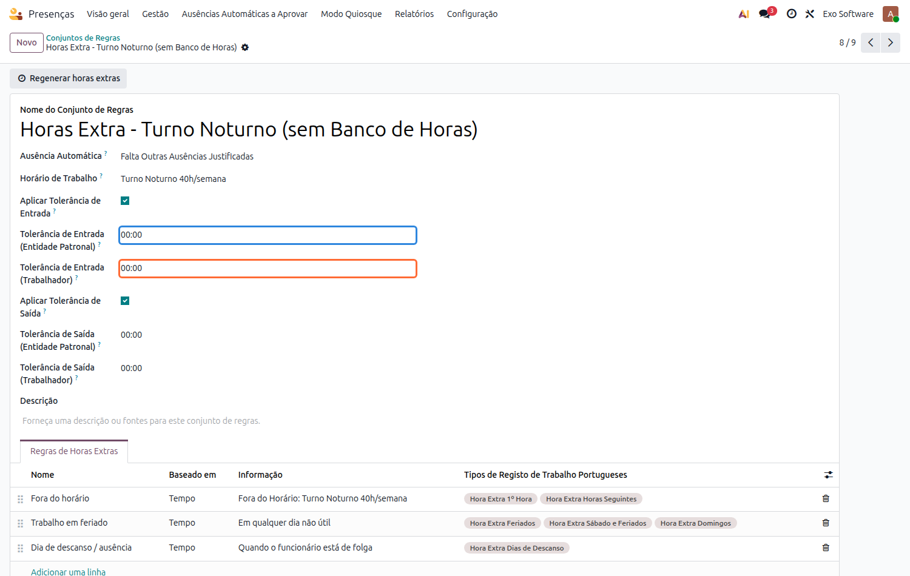
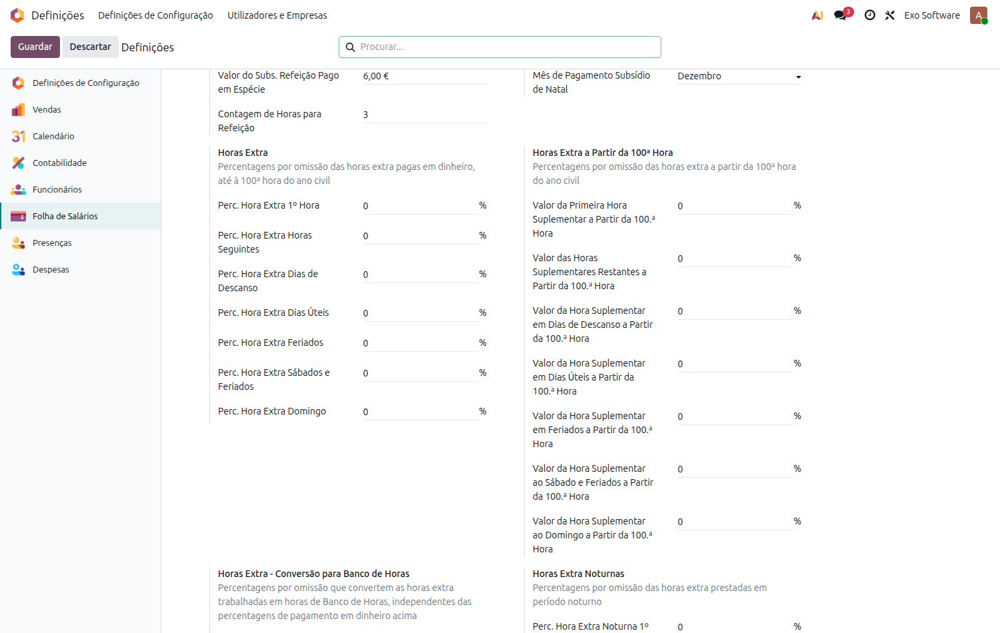
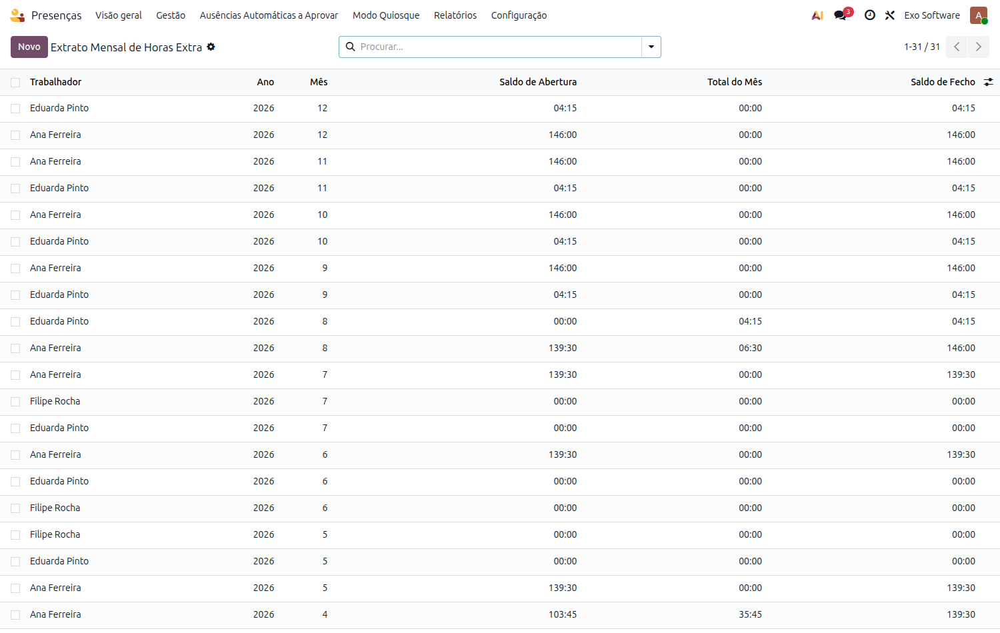
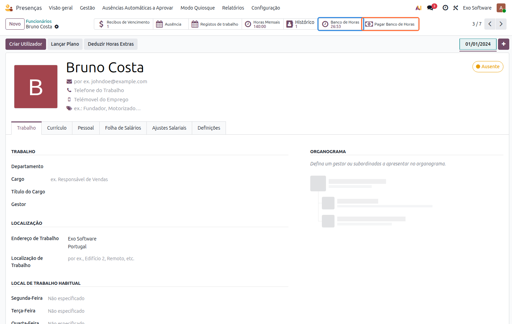
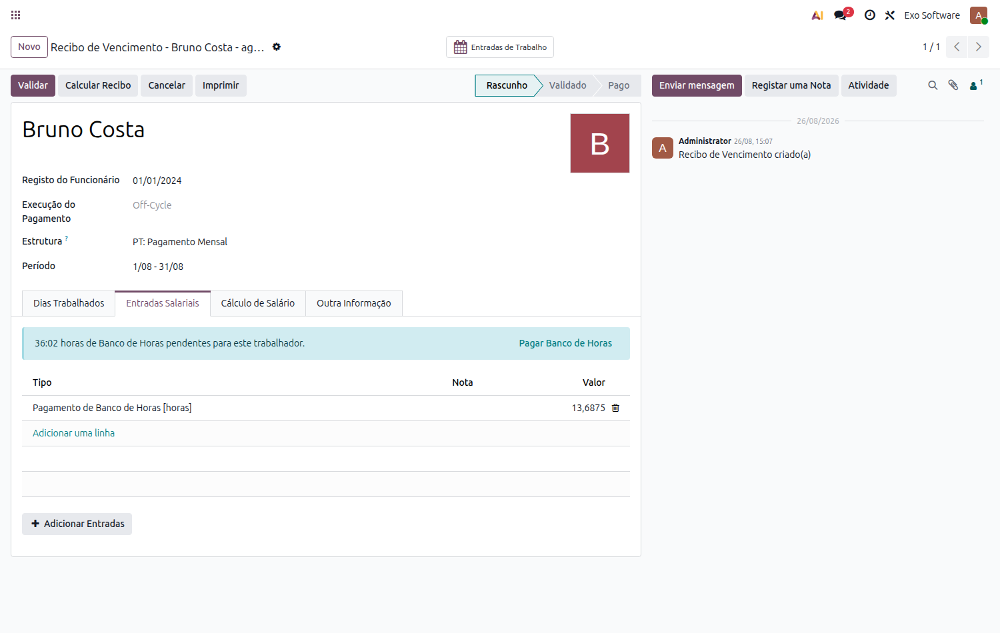
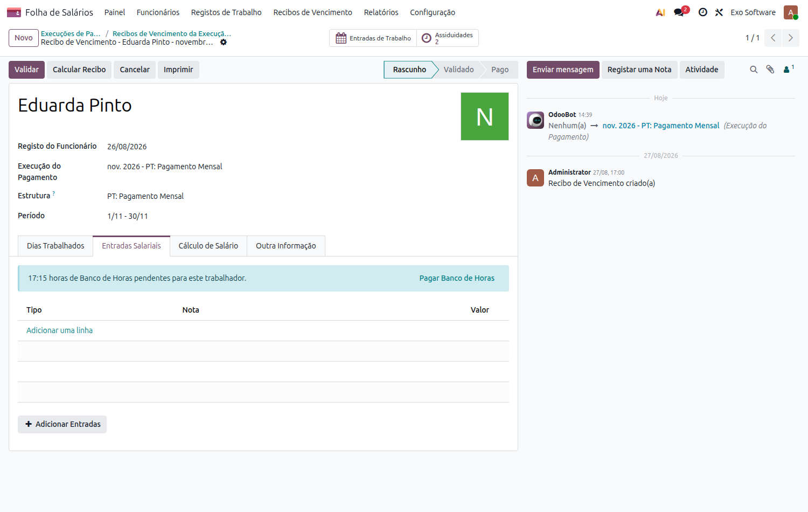
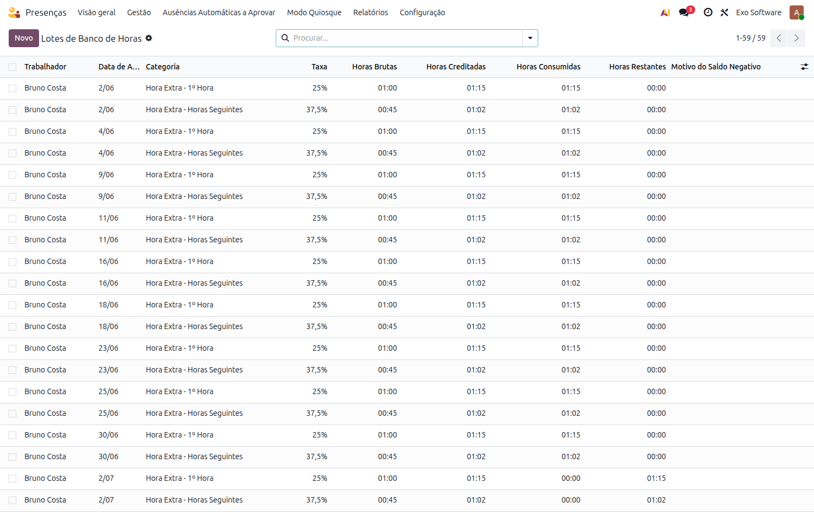

:nosearch:

================
Relógio de Ponto
================
Cruza os registos de presença dos trabalhadores com a legislação laboral
portuguesa: deteta faltas automaticamente, classifica as horas extra nas
categorias que a lei distingue e permite acumulá-las num Banco de Horas, para
serem gozadas como folga ou pagas em dinheiro.

.. raw:: html

    

        ─── ✦ ───
    

.. important::
    Esta funcionalidade não está disponível na loja Odoo. Para ter acesso à
    mesma, terá de solicitar a sua instalação e ativação à **Exo Software**.

Configuração
============

Conjunto de regras de horas extra
----------------------------------
Já vem instalado um conjunto de regras pré-configurado, **Horas Extra -
Portugal (Código do Trabalho)**, em :menuselection:`Presenças --> Configuração
--> Conjuntos de Regras`.

Cada conjunto traz uma regra por situação que a lei portuguesa distingue, e
cada regra mostra — só para leitura — em que tipos de registo de trabalho as
suas horas vão ficar classificadas:

.. list-table::
   :header-rows: 1
   :widths: 30 70

   * - Regra
     - Resolve para
   * - **Fora do horário**
     - Hora Extra 1ª Hora, Hora Extra Horas Seguintes
   * - **Trabalho em feriado** (qualquer dia não útil)
     - Hora Extra Feriados, Sábado e Feriados, ou Domingos, consoante a data
   * - **Dia de descanso / ausência**
     - Hora Extra Dias de Descanso

Tolerâncias
~~~~~~~~~~~
Cada fronteira do dia — entrada e saída — tem o seu próprio interruptor
**Aplicar Tolerância**, e cada interruptor cobre duas margens independentes:

- **(Entidade Patronal)** — abaixo desta margem, o tempo antes ou depois do
  horário não conta como hora extra.
- **(Trabalhador)** — uma falta diária até esta margem não gera a ausência
  automática.

.. note::
    As margens seguem a mesma regra do motor genérico do Odoo: uma vez
    ultrapassada a margem, conta o desvio **por inteiro**, não apenas a parte
    que a excede. Até à margem, inclusive, é ignorado.

.. important::
    Se precisar de percentagens ou tolerâncias diferentes, **duplique** o
    conjunto de regras em vez de editar o que vem instalado.

.. warning::
    A opção **Pagar Horas Extra** deve ficar sempre desativada nas regras
    usadas por este motor. O Odoo tem um mecanismo próprio que, com essa opção
    ligada, cria um registo de trabalho paralelo — em conflito com a
    classificação portuguesa, que precisa de repartir as horas de uma mesma
    regra (por exemplo, 1ª hora e horas seguintes) em vez de as registar todas
    sob um único tipo.

Atribuir o conjunto de regras
------------------------------
Na ficha do trabalhador, separador **Definições de RH**, escolha o conjunto no
campo **Conjunto de Regras de Horas Extra**. É esta atribuição que ativa, para
esse trabalhador, tanto a deteção automática de faltas como a classificação de
horas extra — um contrato sem conjunto atribuído não é afetado.

.. tip::
    A lista mostra apenas os conjuntos compatíveis com o Horário de Trabalho do
    trabalhador. Um conjunto que declare um horário exige que o contrato use
    esse mesmo horário, pelo que os restantes não são propostos.

.. note::
    Ao atribuir o conjunto, os meses do ano civil corrente anteriores ao atual
    que ainda não tenham registo no extrato são preenchidos automaticamente com
    saldo zero. Sem isto, uma entrada em produção a meio do ano bloquearia o
    primeiro processamento diário.

Percentagens
------------
As percentagens de pagamento vivem no contrato de cada trabalhador, e os valores
por omissão para novos contratos em :menuselection:`Definições --> Folha de
Salários`, agrupados por natureza. A conversão para Banco de Horas é a exceção:
é uma política de empresa, pelo que vive apenas nas Definições e aplica-se a
todos os trabalhadores.

.. list-table::
   :header-rows: 1
   :widths: 42 58

   * - Grupo
     - O que define
   * - **Horas Extra**
     - Pagamento em dinheiro, até à 100.ª hora do ano civil.
   * - **Horas Extra a Partir da 100.ª Hora**
     - Pagamento em dinheiro acima desse limiar.
   * - **Horas Extra - Conversão para Banco de Horas**
     - Quantas horas são creditadas ao Banco de Horas por cada hora
       trabalhada. Independente das percentagens de pagamento, e igual para
       toda a empresa.
   * - **Horas Extra Noturnas**
     - Horas extra prestadas em período noturno.

Banco de Horas
--------------
Para que um trabalhador possa gozar horas extra como folga, ative a opção
**Compensável como Ausência** na regra que deve alimentar o Banco de Horas. As
horas passam a ser creditadas em vez de pagas.

O campo **Saldo Inicial de Banco de Horas**, nas Definições, define com quantas
horas começa um trabalhador recém-integrado — para quem já tinha saldo antes da
entrada em produção.

Utilização
==========

Faltas automáticas
-------------------
Todos os dias, os trabalhadores que deveriam ter trabalhado e não têm presença
registada (ou não têm o suficiente) recebem automaticamente um pedido de
ausência, pronto a ser aprovado. Dias consecutivos totalmente em falta juntam-se
ao mesmo pedido, em vez de gerar um por dia.

Consulte-os em :menuselection:`Presenças --> Ausências Automáticas a Aprovar`.

.. note::
    Editar ou recusar uma destas ausências devolve automaticamente a presença
    correspondente, recortada pelo horário do trabalhador — uma presença por
    bloco real de trabalho, sem incluir a hora de almoço.

Classificação das horas extra
-------------------------------
Cada presença mostra, na sua própria ficha, como as horas extra foram
classificadas em cada categoria portuguesa, com o período correspondente.

Pode corrigir as horas de uma categoria ali mesmo. Reduzir o valor pede sempre
um motivo. Aumentar acima do que foi naturalmente trabalhado não é permitido —
se realmente deve contar mais tempo, corrija a entrada/saída da presença, o que
também pede um motivo, guardado no histórico da ficha.

.. tip::
    Aprovar ou recusar a hora extra continua a fazer-se com os botões junto a
    **Horas Extra Validadas**.

Uma lista de leitura em :menuselection:`Presenças --> Relatórios --> Correções
de Horas Extra` mostra todas as correções feitas.

.. important::
    O processamento de um recibo fica bloqueado enquanto houver horas extra
    desse trabalhador, nesse período, a aguardar aprovação.

Extrato mensal
---------------
Em :menuselection:`Presenças --> Configuração --> Extrato Mensal de Horas
Extra`, cada trabalhador tem um registo por mês com o total de trabalho
suplementar e o saldo acumulado do ano.

É este saldo acumulado que determina quando a 100.ª hora do ano é atingida e as
percentagens do tier **+100** passam a aplicar-se.

.. note::
    As horas que vão para o Banco de Horas contam para este total como qualquer
    outro trabalho suplementar: o limiar conta o que foi **prestado**,
    independentemente de ter sido pago ou creditado.

O extrato é atualizado assim que a presença ou a classificação mudam — não é
necessário esperar pelo processamento diário nem clicar em **Recalcular**.

Banco de Horas
--------------
Na ficha do trabalhador, dois botões dão acesso direto ao Banco de Horas:

- **Banco de Horas** (azul) mostra o saldo disponível e abre o extrato
  consolidado de todos os movimentos.
- **Pagar Banco de Horas** (laranja) abre os pagamentos já feitos a este
  trabalhador, ou permite criar um novo.

Gozar como folga
~~~~~~~~~~~~~~~~~
O trabalhador pede o tipo de ausência configurado como compensável. As horas são
drenadas dos lotes mais antigos primeiro, até cobrir o pedido.

Pagar em dinheiro
~~~~~~~~~~~~~~~~~
1. No trabalhador, clique em **Pagar Banco de Horas**, escolha a **Data de
   Referência** até à qual quer liquidar o saldo e clique em **Confirmar
   Pagamento**. O pagamento passa a listar os lotes que drenou.

   .. image:: relogio_ponto/v19_payout_form.png
      :align: center

2. Escolha um **Recibo de Vencimento** em rascunho e clique em **Inserir no
   Recibo de Vencimento**.

.. tip::
    Um pagamento confirmado mas ainda não inserido num recibo pode ser desfeito
    com **Reverter Pagamento** — as horas voltam aos respetivos lotes.

.. note::
    Apagar um recibo que já pagou Banco de Horas devolve automaticamente essas
    horas ao saldo do trabalhador, em vez de as deixar descontadas sem
    pagamento por trás.

Pagar a partir do recibo de vencimento
~~~~~~~~~~~~~~~~~~~~~~~~~~~~~~~~~~~~~~
Não é preciso passar pela ficha do trabalhador. Em qualquer recibo **em
rascunho**, separador **Entradas Salariais**, se o trabalhador tiver saldo
pendente à data de fim do recibo aparece um aviso com esse saldo e o botão
**Pagar Banco de Horas**:

O botão faz de uma vez o que o caminho manual faz em três passos: cria o
pagamento, confirma-o — drenando os lotes mais antigos primeiro — e insere-o
neste mesmo recibo como input **Pagamento de Banco de Horas**, que é a linha
visível na imagem acima.

O botão é exatamente o mesmo num recibo que pertence a uma execução de
pagamento. Em :menuselection:`Folha de Salários --> Recibos de Vencimento -->
Execuções de Pagamento`, abra o lote, abra o recibo do trabalhador e use o
botão no separador **Entradas Salariais**:

.. note::
    O pagamento é sempre por recibo: não existe uma ação de lote que pague o
    Banco de Horas de todos os trabalhadores de uma só vez. O saldo de cada
    trabalhador é calculado à data de fim do respetivo recibo.

Lotes
~~~~~
Cada dia de horas extra compensáveis gera o seu próprio lote, em
:menuselection:`Presenças --> Configuração --> Lotes de Banco de Horas`.

As **Horas Creditadas** são as horas trabalhadas já majoradas pela percentagem
de conversão da empresa — no exemplo acima, uma hora trabalhada a 25% credita
1h15 ao banco.

.. warning::
    Se uma presença ou correção for editada **depois** de já ter sido gasto
    desse lote, o saldo do lote pode ficar negativo — a edição em si nunca é
    bloqueada. Um lote nessas condições aparece a vermelho na lista e a coluna
    **Motivo do Saldo Negativo** explica o que já o consumiu e porquê. Use o
    filtro **Saldo Negativo** para os encontrar, e reconcilie revertendo o
    pagamento ou a ausência em causa.
