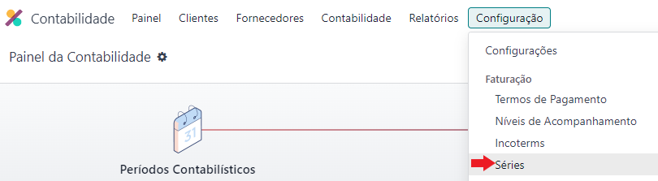

:show-content:

==================
Documentos Fiscais
==================

A localização Exo está preparada para o cumprimento e emissão de diversos documentos fiscais exigidos pela Autoridade Tributária e Aduaneira.

Para aceder aos documentos fiscais aceda à app **Faturação / Contabilidade** (dependendo respetivamente se tem versão Community ou Enterprise do Odoo), vá ao menu de **Configuração** e no separador Faturação selecione a opção **Séries**.

.. image:: documentos_fiscais/appFaturacaoContabilidade.png
   :align: center

.. note::
   - A coluna Ativo define se essa série vai estar disponível aos utilizadores, a coluna Usada significa se essa série está em uso, ou não
   - A coluna Filtro de Operações pode ser preenchida em cada série em que for necessária e corresponde aos Tipos de Operações que estão configurados na app Inventário
   - Por recomendação deve associar-se a Guia de Remessa à operação de Entregas e a Guia de Devolução a Devoluções (pode utilizar outros nomes para os tipos de operações)

Orçamento
=========

Documento informativo da cotação de serviços ou produtos. Depois de aprovado pelo cliente, é convertido em nota de encomenda.

Para emitir o pdf do orçamento basta ir ao menu **Ação** do documento e selecionar a opção :menuselection:`Imprimir --> Orçamento / Encomenda`

.. image:: documentos_fiscais/imprimirOrcamento.png
   :align: center

.. seealso::
   :doc:`Como fazer... <faturacao/faturacao>`

Fatura pró-forma
----------------

Documento informativo frequentemente utilizado na cotação de produtos e na justificação da transacção internacional de produtos. Após aprovação do cliente pode ser convertida em nota de encomenda.

Para que este tipo de documento fique disponível, primeiro terá de ir à app **Vendas** ir ao menu :menuselection:`Configuração --> Configurações`, no bloco **Orçamentos e Encomendas** ativar a opção **Fatura Pró-Forma**

Para emitir o pdf da fatura pró-forma basta ir ao menu **Ação** do documento e selecionar a opção :menuselection:`Imprimir --> Fatura PRÓ-FORMA`

.. seealso::
   :doc:`Como fazer... <faturacao/faturacao>`

Nota de encomenda
-----------------

A nota de encomenda é um documento que é gerado automaticamente, sempre que um orçamento ou fatura pró-forma são confirmados depois da aprovação do cliente.

Este documento tem uma série de numeração independente dos anteriores.

Para emitir o pdf da nota de encomenda basta ir ao menu **Ação** do documento e selecionar a opção :menuselection:`Imprimir --> Orçamento / Encomenda`

.. image:: documentos_fiscais/imprimirNotaEncomenda.png
   :align: center

Contem:
   - Número da nota de encomenda
   - Data de vencimento
   - Comerciante
      - Nome ou denominação social
      - Morada
      - NIF
   - Cliente
      - Nome ou denominação social
      - NIF (se pretendido, pode ser só como consumidor final)
   - Denominação e quantidade dos bens ou serviços
   - Valor da prestação de serviços ou da transmissão de bens
   - Taxas aplicáveis

Folha de obra
-------------

Fatura de consignação
---------------------

Crédito de consignação
----------------------

Consulta de mesa ou encomenda (POS)
-----------------------------------

Fatura
======
Documento que deve ser emitido sempre que se adquire um bem ou serviço sujeito a IVA

Contem:
   - Data de emissão
   - Número da fatura
   - Comerciante
      -   Nome ou denominação social
      -   Morada
      -   NIF
   - Cliente
     - Nome ou denominação social
     - NIF (se pretendido, pode ser só como consumidor final)
     - Denominação e quantidade dos bens ou serviços
   - Valor da prestação de serviços ou da transmissão de bens
   - Taxas aplicáveis
   - Montante de IVA liquidado
   - Motivo que justifique a não aplicação do imposto (se aplicável)

Para emitir o pdf da fatura basta ir ao menu **Ação** do documento e selecionar a opção :menuselection:`Imprimir --> Faturas ou Faturas (multi-via)`

.. image:: documentos_fiscais/imprimirFatura.png
   :align: center

.. seealso::
   :doc:`Como fazer... <faturacao/faturacao>`
.. note::
   A forma correta de corrigir qualquer tipo de documento de fatura, é anular a mesma usando uma nota de crédito

Existem outros documentos com validade fiscal que poderão ser utilizados como substituto da fatura.

Fatura-recibo
-------------
Documento que agrega a fatura e o recibo, podendo apenas ser emitida quando a data da fatura e do pagamento coincidem (pronto pagamento).

Para emitir o pdf da fatura-recibo basta ir ao menu **Ação** do documento e selecionar a opção :menuselection:`Imprimir --> Faturas ou Faturas (multi-via)`

.. seealso::
   :doc:`Como fazer... <faturacao/faturacao>`

Fatura-simplificada
-------------------
Documento emitido apenas para operações em território nacional, sujeito a condições:

   - Venda de bens por parte de retalhistas/vendedores ambulantes a um consumidor final, não sujeito passivo de IVA
   - O montante total da transação de um bem não pode ser superior a 1.000,00€
   - O montante total da prestação de um serviço não pode ser superior a 100€

Para emitir o pdf da fatura simplificada basta ir ao menu **Ação** do documento e selecionar a opção :menuselection:`Imprimir --> Faturas ou Faturas (multi-via)`

.. seealso::
   :doc:`Como fazer... <faturacao/faturacao>`

Fatura eletrónica
-----------------

Documento emitido por software de faturação certificado e enviado por email. A esta fatura está associada uma assinatura digital que permite validar a autenticidade do documento.

Para que esta funcionalidade esteja disponível é preciso aceder à app **Faturação / Contabilidade** (dependendo respetivamente se tem versão Community ou Enterprise do Odoo), vá ao menu de :menuselection:`Configuração --> Configurações` e na secção **Portugal** ative a opção **Faturação Eletrónica**.

.. image:: documentos_fiscais/appFaturacaoContabilidade.png
   :align: center

.. seealso::
   :doc:`Saiba mais... <faturacao/faturacao_eletronica>`

Autofaturação
-------------

Documento emitido por software de faturação certificado e enviado por email. A esta fatura está associada uma assinatura digital que permite validar a autenticidade do documento.

.. seealso::
   :doc:`Saiba mais... <faturacao/autofaturacao>`

Nota de crédito
---------------
Documento que se emite quando há necessidade de efetuar uma retificação à fatura original.

A Autoridade Tributária e Aduaneira aconselha a emissão de nota de crédito nas seguintes situações:

   - **Erro na fatura**: emissão de nota de crédito na totalidade do valor da fatura e emissão de nova fatura com os novos dados
   - **Troca de Produtos**: emissão da nota de crédito apenas dos produtos a trocar e processamento de uma nova fatura
   - **Devolução de Produtos**: emissão de nota de crédito do valor parcial ou total dos produtos devolvidos

Para emitir o pdf da nota de crédito basta ir ao menu **Ação** do documento e selecionar a opção :menuselection:`Imprimir --> Faturas ou Faturas (multi-via)`

.. seealso::
   :doc:`Como fazer... <faturacao/faturacao>`

Nota de débito
--------------

.. seealso::
   :doc:`Como fazer... <faturacao/faturacao>`

Recibo
======
Documento que comprova pagamento efetuado. A sua emissão comprova que o pagamento foi efetivamente recebido pelo emissor.

A emissão de recibos permite controlar a conta corrente de um cliente, através de uma verificação entre faturação e recibos.

Deve conter:
   - Data de transação
   - Número do recibo
   - Comerciante
      - Nome ou denominação social
      - Morada
      - NIF
   - Cliente
      - Nome ou denominação social
      - NIF (se pretendido, pode ser só como consumidor final)
   - Valor do recibo

Para emitir o pdf do recibo basta ir ao menu **Ação** do documento e selecionar a opção :menuselection:`Imprimir --> Recibo de Pagamento`

.. image:: documentos_fiscais/imprimirRecibo.png
   :align: center

.. seealso::
   :doc:`Como fazer... <faturacao/faturacao>`

Recibo de IVA de caixa
----------------------

.. seealso::
   :doc:`Como fazer... <faturacao/faturacao>`

Guia de remessa / Guia de transporte
====================================

.. seealso::
   :doc:`Como fazer... <faturacao/faturacao>`

Guias de Remessa para fora de Portugal
--------------------------------------

Guias de transporte de ativos
-----------------------------

.. seealso::
   :doc:`Como fazer... <faturacao/faturacao>`

Guias de consignação
--------------------

.. seealso::
   :doc:`Como fazer... <faturacao/faturacao>`

Guias de devolução
------------------

.. seealso::
   :doc:`Como fazer... <faturacao/faturacao>`

Código QR e ATCUD
=================
O Código QR é um código de barras bidimensional que contém informação pertinente sobre o conteúdo do documento.

O ATCUD é um código único que permite identificar univocamente um documento, independentemente do seu emitente, do tipo de documento e da série utilizada.

São ambos gerados no momento da emissão do documento, pelo software, e adicionados ao mesmo tempo no documento.

Pode configurar a posição acedendo à app **Faturação / Contabilidade** (dependendo respetivamente se tem versão Community ou Enterprise do Odoo), vá ao menu de :menuselection:`Configuração --> Configurações` e na secção **Portugal** selecione a opção que deseja para **Posição do Código QR**.

As opções disponíveis são:
   - Topo da primeira página
   - Fim da última página

.. image:: documentos_fiscais/appFaturacaoContabilidade.png
   :align: center
.. image:: documentos_fiscais/ATCUDcodigoQR.png
   :align: center
