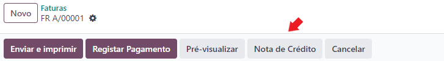

:show-content:

=========
Faturação
=========

Em Odoo
=======

Brevemente

Notas de crédito
----------------
A nota de crédito deve ser emitida a partir do documento da fatura para que se mantenha a informação necessária

Por API
=======
É possível fazer a comunicação de documentos através de API em vez de serem gerados pelo utilizador no Odoo.

Para essa finalidade são instalados módulos ou apps específicos que lhe permitirão continuar a usar o seu sistema atual, mas ter o Odoo como a ferramenta de backend.

Estes módulos ou apps podem já existir ou ser personalizados às necessidades do utilizador pela nossa equipa técnica.

As configurações de API são feitas numa fase inicial, entre os departamentos técnicos da Exo e da sua entidade, para que tudo fique a funcionar corretamente e como utilizador não tenha de se preocupar com o processo.

.. seealso::
   - :doc:`index/insalacao/api`
