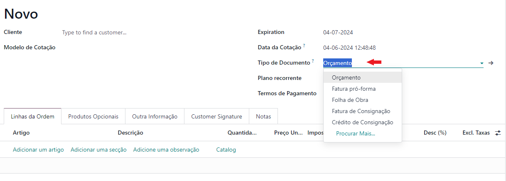
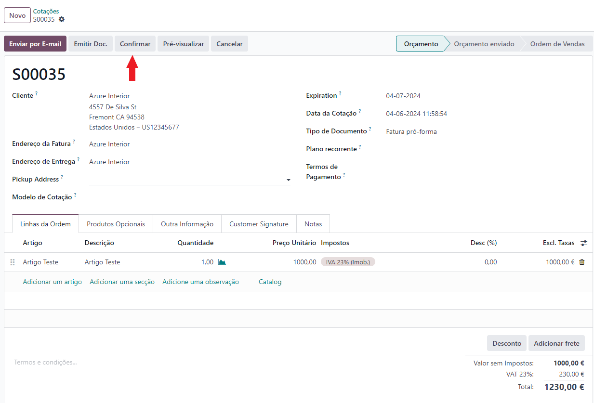
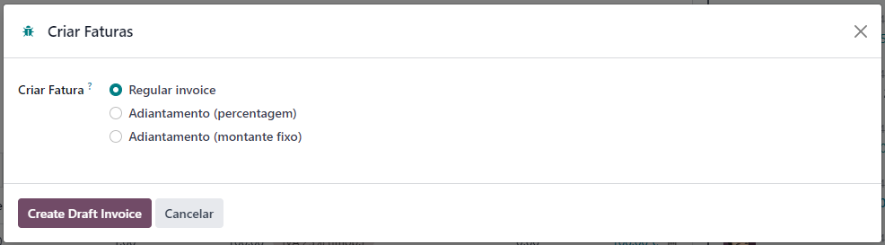
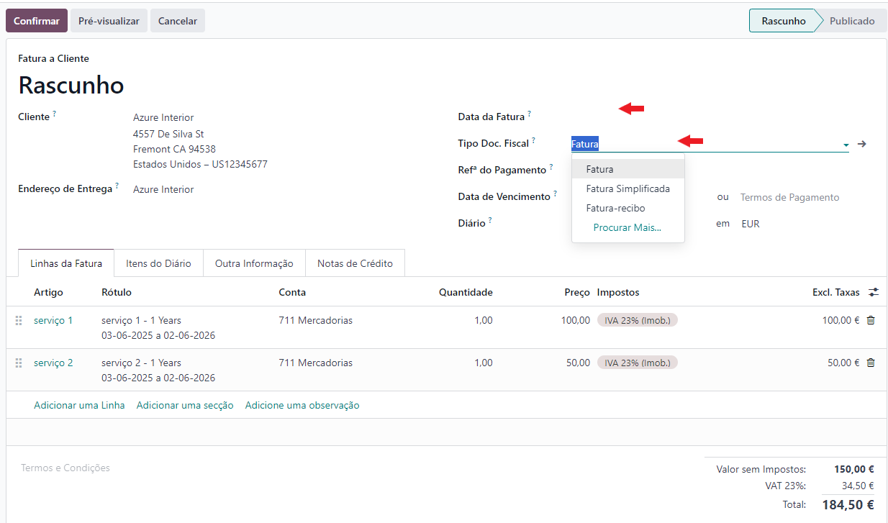
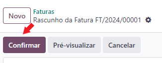

:show-content:

=========
Faturação
=========

Em Odoo
=======

O processo de faturação em Odoo foi pensado para seguir sempre a mesma sequência:

    - Orçamentação
    - Emissão de Fatura
    - Emissão do Recibo
    - Reconciliação de documentos
    - Correções

        - Nota de crédito
        - Nota de Débito

.. _processo_faturacao_orcamentacao:

Orçamentação
------------
A orçamentação em Odoo pode ser feita em diversas apps **Vendas**, **Compras**, **Subscrições** e **CRM**

Nas apps de **Vendas**, **Compras** e **Subscrições** basta aceder à app respetiva e carregar no botão **Novo**

.. image:: faturacao/criarOrcamento.png
   :align: center

Depois deve preencher os campos necessários e selecionar o tipo de documento a ser usado na orçamentação

.. note::
    No caso das **Subscrições** terá também de selecionar o **Plano de Recorrência** que determina de quanto em quanto tempo serão feitas novas faturas de forma automática, bem como pode especificar uma data para término da subscrição.

    .. image:: faturacao/planoRecorrente.png
       :align: center

    .. example::
    Se cobra uma vez a um cliente por um serviço de 2 anos, o Plano de Recorrencia deve ser 2 anos e quantidade do serviço 1, não deve ser Plano de Recorrência anual mas quantidade a 2

    .. example::
    Se cobra mensalmente durante 2 anos por um serviço, o plano de recorrência deve ser mensal mas com uma data de término 2 anos no futuro

Depois de aprovação do cliente/fornecedor, pode confirmar o documento e será gerada uma **Nota de encomenda**

.. tip::
    Para as empresas que gostam/precisam de enviar um orçamento não confirmado para o cliente fica o seguinte alerta.

    A legislação portuguesa proíbe a emissão de documentos não confirmados, pelo que se tentarem fazer impressão do documento o mesmo sairá invalidado.
    No entanto podem partilhar o orçamento no portal com o vosso cliente.

    Basta ir ao menu :menuselection:`Ação --> Partilhar` e vai abrir uma nova janela onde pode inserir o contacto do parceiro

    .. image:: faturacao/partilharOrcamento1.png
        :align: center
    .. image:: faturacao/partilharOrcamento2.png
        :align: center

    Em seguida o parceiro pode aceder ao link do orçamento para verificar o mesmo e deixar algum comentário que será adicionado ao chatter do Odoo
    Também tem acesso a outras funcionalidades. Esta é a vista do lado do parceiro

    .. image:: faturacao/partilharOrcamento3.png
        :align: center

    Toda a informação do envio e visionamento fica registada no chatter do próprio documento.

    .. image:: faturacao/partilharOrcamento4.png
        :align: center

.. _processo_faturacao_emitir_fatura:

Emissão de Fatura
-----------------
.. important::
    Existem 3 processos para se emitir uma fatura.

    O **processo recomendado** é emitir sempre a fatura a partir da Nota de encomenda. Que vai gerar um novo documento de fatura em rascunho.

    No entanto pode ser feita uma fatura sem esta ligação se realmente for necessário.

    O 3º processo é o **automático**, em que o próprio Odoo gera de forma autónoma a fatura para certo tipo de artigos vendidos, como as **subscrições**.

O processo de emissão da fatura deve então ser iniciado na **Nota de encomenda** e carregar no botão **Criar Fatura**

    .. image:: faturacao/criarFatura1.png
        :align: center

Na janela que abre decida o tipo de fatura que pretende criar de entre as opções:

    - Fatura real
    - Fatura de adiantamento

        - Percentagem do valor total da encomenda
        - Valor nominal à escolha

.. note::
    No caso de ser uma fatura de adiantamento o aspeto será diferente e terá mais informação para preencher

    .. image:: faturacao/criarFatura3.png
        :align: center

Depois de ter a fatura em modo de rascunho, deve preencher os campos necessários e escolher o tipo de documento de fatura que pretende.

A maioria dos campos já vão estar preenchidos pois são herdados da Nota de encomenda.

Em seguida confirme a fatura

.. tip::
    O processo de criação de farura sem ligação a Nota de encomenda é bastante parecido, exceto em 2 pontos:

        - Onde se inicia o processo
        - A necessidade de preencher quase todos os campos de raíz

    Para iniciar o processo aceda à app **Faturação / Contabilidade** (dependendo respetivamente se tem versão Community ou Enterprise do Odoo), vá ao menu :menuselection:`Clientes --> Faturas` ou :menuselection:`Fornecedores --> Faturas de Foenecedores`

    Clique na opção **Novo**

    .. image:: faturacao/novaFatura.png
        :align: center

    Como os campos não são herdados de uma Nota de encomenda terão de ser preenchidos manualmente como se estivesse a criar um orçamento.

.. _processo_faturacao_emitir_recibo:

Emissão de Recibos
------------------

Documentação em breve

Reconciliação de documentos
---------------------------

Documentação em breve

Correções
---------

.. _processo_faturacao_emitir_nota_credito:

Notas de crédito
^^^^^^^^^^^^^^^^
A nota de crédito deve ser emitida a partir do documento da fatura para que se mantenha a informação necessária

.. image:: faturacao/criarNotaCredito.png
   :align: center

.. _processo_faturacao_emitir_nota_debito:

Notas de debito
^^^^^^^^^^^^^^^^

Documentação em breve

Mais informação
---------------
.. seealso::
    Se pretender formação mais detalhada sobre o processo Oddo contacte a `ExoSoftware <https://exosoftware.pt/appointment/2>`_.

Por API
=======
É possível fazer a comunicação de documentos através de API em vez de serem gerados pelo utilizador no Odoo.

Para essa finalidade são instalados módulos ou apps específicos que lhe permitirão continuar a usar o seu sistema atual, mas ter o Odoo como a ferramenta de backend.

Estes módulos ou apps podem já existir ou ser personalizados às necessidades do utilizador pela nossa equipa técnica.

As configurações de API são feitas numa fase inicial, entre os departamentos técnicos da Exo e da sua entidade, para que tudo fique a funcionar corretamente e como utilizador não tenha de se preocupar com o processo.

.. seealso::
    :doc:`Saiba mais... <../../instalacao/api>`
