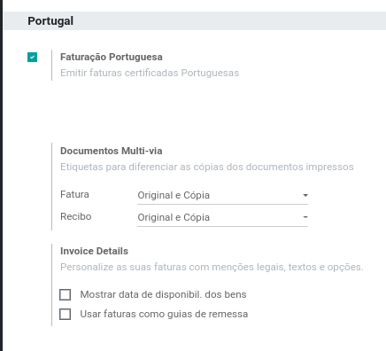
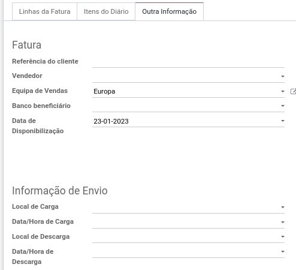
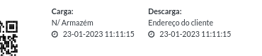

:show-content:

=========
Documento
=========

Posso usar a fatura como guia de remessa?
=========================================
Sim, desde que os elementos obrigatórios sejam adicionados aos da fatura regular. Para isso, deve ir a secção Portugal nas configurações de Faturação / Contabilidade:

e ativar a opção **Usar faturas como guias de remessa**.

Poderá assim, em cada fatura, controlar os Locais e Horas de Carga e Descarga conforme a imagem seguinte. Poderá saber mais sobre o comportamento de cada um dos campos colocando o cursor do rato por cima destes.

A fatura passará a incluir a informação relacionada:

Como incluir nas faturas a menção "Os artigos/serviços faturados foram colocados à disposição do adquirente (...)"
==================================================================================================================
Em primeiro lugar, é necessário ativar a opção **Mostrar data de disponibilização dos bens** nas configurações da Faturação / Contabilidade:

.. image:: documento/documento4.png
   :align: center

A partir desse momento, todas as faturas incluirão a menção "Os artigos/serviços faturados foram colocados à disposição do adquirente na data do documento (Alínea f do nº 5 do Artº 36 CIVA)".

Se quiser personalizar a data, preencha o respetivo campo **Data de Disponibilização** na fatura em questão:

.. image:: documento/documento5.png
   :align: center

Neste caso, a menção será então "Os artigos/serviços faturados foram colocados à disposição do adquirente em 23-01-2023 (Alínea f do nº 5 do Artº 36 CIVA)"
